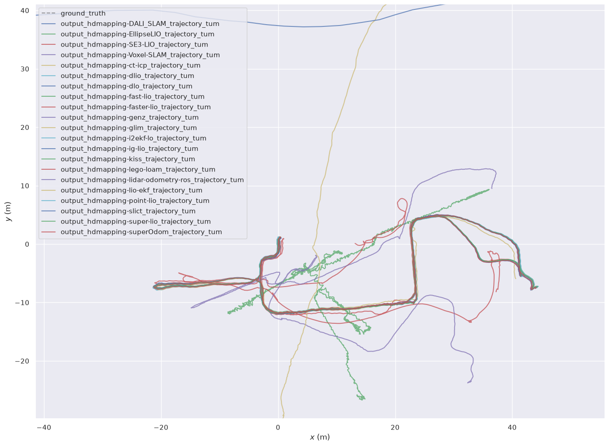

# benchmark-HDMapping-Orchestration

# Option 1 (Full automation)

### Available dataset:

Download the dataset `reg-1.bag` by clicking [link](https://cloud.cylab.be/public.php/dav/files/7PgyjbM2CBcakN5/reg-1.bag) (it is part of [Bunker DVI Dataset](https://charleshamesse.github.io/bunker-dvi-dataset)).

File 'reg-1.bag' is an input for further calculations.
It should be located in '~/hdmapping-benchmark/data'.

## Create worskpace folder
```shell
mkdir -p ~/hdmapping-benchmark/data
```

### Prerequisites for Running the Scripts:
Before running the scripts below, build the required Docker images according to the instructions provided in:

GitHub repository [mandeye_to_bag](https://github.com/MapsHD/mandeye_to_bag)

GitHub repository [livox_bag_aggregate](https://github.com/MapsHD/livox_bag_aggregate)

The following scripts assume that these Docker images have already been built.

## Create worskpace folder
```shell
mkdir -p ~/hdmapping-benchmark
```
## Go to your workspace folder:

```shell
cd ~/hdmapping-benchmark
```

## Clone the orchestration repository:
```shell
git clone https://github.com/MapsHD/benchmark-HDMapping-Orchestration.git
```

### Change branch
```shell
cd benchmark-HDMapping-Orchestration
git checkout Bunker-DVI-Dataset-reg-1
```
```shell
chmod +x ~/hdmapping-benchmark/benchmark-HDMapping-Orchestration/prepare_data_step1/prepare_data_step1.sh 
chmod +x ~/hdmapping-benchmark/benchmark-HDMapping-Orchestration/prepare_data_step1/mandeye-convert.sh 
chmod +x ~/hdmapping-benchmark/benchmark-HDMapping-Orchestration/prepare_data_step1/livox_bag.sh 
chmod +x ~/hdmapping-benchmark/benchmark-HDMapping-Orchestration/clone_github_repositories_step2/clone_github_repositories_step2.sh
chmod +x ~/hdmapping-benchmark/benchmark-HDMapping-Orchestration/run_benchmark_step3/run_benchmark_step3.sh
chmod +x ~/hdmapping-benchmark/benchmark-HDMapping-Orchestration/conversion_tum_step4/run_tum_step4.sh
chmod +x ~/hdmapping-benchmark/benchmark-HDMapping-Orchestration/evo_step5/tum-to-latex_step5.sh
```

```shell
chmod +x ~/hdmapping-benchmark/benchmark-HDMapping-Orchestration/start_benchmark.sh
```

```shell
~/hdmapping-benchmark/benchmark-HDMapping-Orchestration/start_benchmark.sh
```

# Option 2 (Step by step)
# Step 1 Prepare data

## Create worskpace folder
```shell
mkdir -p ~/hdmapping-benchmark
```

## Go to your workspace folder:

```shell
cd ~/hdmapping-benchmark
```

## Clone the orchestration repository:
```shell
git clone https://github.com/MapsHD/benchmark-HDMapping-Orchestration.git
```

### Change branch
```shell
cd benchmark-HDMapping-Orchestration
git checkout Bunker-DVI-Dataset-reg-1
```
### Available dataset:

Download the dataset `reg-1.bag` by clicking [link](https://cloud.cylab.be/public.php/dav/files/7PgyjbM2CBcakN5/reg-1.bag) (it is part of [Bunker DVI Dataset](https://charleshamesse.github.io/bunker-dvi-dataset)).

File 'reg-1.bag' is an input for further calculations.
It should be located in '~/hdmapping-benchmark/data'.

### Prerequisites for Running the Scripts:
Before running the scripts below, build the required Docker images according to the instructions provided in:

GitHub repository [mandeye_to_bag](https://github.com/MapsHD/mandeye_to_bag)

GitHub repository [livox_bag_aggregate](https://github.com/MapsHD/livox_bag_aggregate)

The following scripts assume that these Docker images have already been built.

## Make the script executable (if not done yet):

```shell
chmod +x ~/hdmapping-benchmark/benchmark-HDMapping-Orchestration/prepare_data_step1/prepare_data_step1.sh 
chmod +x ~/hdmapping-benchmark/benchmark-HDMapping-Orchestration/prepare_data_step1/mandeye-convert.sh 
chmod +x ~/hdmapping-benchmark/benchmark-HDMapping-Orchestration/prepare_data_step1/livox_bag.sh 
chmod +x ~/hdmapping-benchmark/benchmark-HDMapping-Orchestration/clone_github_repositories_step2/clone_github_repositories_step2.sh
chmod +x ~/hdmapping-benchmark/benchmark-HDMapping-Orchestration/run_benchmark_step3/run_benchmark_step3.sh
chmod +x ~/hdmapping-benchmark/benchmark-HDMapping-Orchestration/conversion_tum_step4/run_tum_step4.sh
chmod +x ~/hdmapping-benchmark/benchmark-HDMapping-Orchestration/evo_step5/tum-to-latex_step5.sh
```
### Run the script:

```shell
cd ~/hdmapping-benchmark/data
```

```shell
~/hdmapping-benchmark/benchmark-HDMapping-Orchestration/prepare_data_step1/prepare_data_step1.sh reg-1.bag .
```

# Step 2 Clone repositores

## Make the script executable (if not done yet):

```shell
cd ~/hdmapping-benchmark/data
```

```shell
chmod +x ~/hdmapping-benchmark/benchmark-HDMapping-Orchestration/clone_github_repositories_step2/clone_github_repositories_step2.sh
```

## Run the script:
```shell
~/hdmapping-benchmark/benchmark-HDMapping-Orchestration/clone_github_repositories_step2/clone_github_repositories_step2.sh
```
After running the script, you will be prompted to enter the branch name to be cloned for the repositories. For the Bunker DVI dataset, enter:
```shell
Bunker-DVI-Dataset-reg-1
```
The script will then clone the repositories using the specified branch.

## Result:

The repositories will be cloned into:

~/hdmapping-benchmark

The Docker images required for the benchmark will be built.

# Step 3 run benchmark

## Make the script executable (if not done yet):
```shell
chmod +x ~/hdmapping-benchmark/benchmark-HDMapping-Orchestration/run_benchmark_step3/run_benchmark_step3.sh
```

## Change directory to the data folder:

```shell
cd ~/hdmapping-benchmark/data
```

## Run the benchmark script with your ROS1 bag and ROS2 folder:
 
 ```shell
~/hdmapping-benchmark/benchmark-HDMapping-Orchestration/run_benchmark_step3/run_benchmark_step3.sh reg-1.bag reg-1-ros2 .
```

# Step 4 conversion tum

## Make the script executable (if not done yet):
```shell
chmod +x ~/hdmapping-benchmark/benchmark-HDMapping-Orchestration/conversion_tum_step4/run_tum_step4.sh
```

## Change directory to the data folder:

```shell
cd ~/hdmapping-benchmark/data
```

## Run the benchmark script with your ROS1 bag and ROS2 folder:
 
 ```shell
~/hdmapping-benchmark/benchmark-HDMapping-Orchestration/conversion_tum_step4/run_tum_step4.sh
```
# Step 5 evo 

## Make the script executable (if not done yet):
```shell
chmod +x ~/hdmapping-benchmark/benchmark-HDMapping-Orchestration/evo_step5/tum-to-latex_step5.sh
```

## Change directory to the data folder:

```shell
cd ~/hdmapping-benchmark/data
```

## Run the benchmark script with your ROS1 bag and ROS2 folder:
 
 ```shell
~/hdmapping-benchmark/benchmark-HDMapping-Orchestration/evo_step5/tum-to-latex_step5.sh
```

## Result:
 
### After running the script, you will get the following folder:

~/hdmapping-benchmark/data/output_hdmapping-ALGONAME/

You should see following data

lio_initial_poses.reg

poses.reg

scan_lio_*.laz

session.json

trajectory_lio_*.csv

~/hdmapping-benchmark/data/tum

## Benchmark Result (04.07.2026)

# APE (Absolute Pose Error)

| Algorithm          | max           | mean          | median        | min           | rmse          | sse           | std          | 
| -------------      | ------------- | ------------- | ------------- | ------------- | ------------- | ------------- |------------- |
| DALI_SLAM          | 0.279919      | 0.059078      | 0.054942      | 0.001700      | 0.066879      | 14.64836      | 0.031347     |
| EllipseLIO         | 50731.07      | 17026.43      | 16947.07      | 993.6160      | 20118.00      | 4655e9        | 10716.09     |
| SE3-LIO            | 1.620294      | 0.370770      | 0.292033      | 0.043150      | 0.435212      | 620.1278      | 0.227903     |
| Voxel-SLAM         | 0.267470      | 0.060419      | 0.054630      | 0.009624      | 0.067062      | 14.72855      | 0.029100     |
| c3p-voxelmap       | -             | -             | -             | -             | -             | -             | -            |
| ct-icp             | 0.666498      | 0.211220      | 0.175000      | 0.041057      | 0.242839      | 193.0120      | 0.119821     |
| dlio               | 0.478156      | 0.166532      | 0.154207      | 0.002322      | 0.177358      | 1029.712      | 0.061016     |
| dlo                | 0.382805      | 0.160669      | 0.143141      | 0.012040      | 0.176459      | 94.68973      | 0.072959     |  
| fast-lio           | 0.357415      | 0.131993      | 0.124538      | 0.000715      | 0.145818      | 69.61487      | 0.061974     |
| faster-lio         | 0.482698      | 0.198734      | 0.164280      | 0.020587      | 0.227663      | 169.6930      | 0.111064     |
| form               | -             | -             | -             | -             | -             | -             | -            |
| genz               | 0.488600      | 0.169862      | 0.119618      | 0.004524      | 0.209700      | 123.0832      | 0.122967     |
| glim               | 1.960465      | 0.649042      | 0.536567      | 0.175737      | 0.775368      | 1031.049      | 0.424193     |
| i2ekf-lo           | 0.296202      | 0.089640      | 0.092097      | 0.006715      | 0.098859      | 24.04193      | 0.041686     |
| ig-lio             | 0.456636      | 0.175891      | 0.165463      | 0.029458      | 0.192147      | 120.8772      | 0.077349     |
| kiss               | 57.23707      | 21.27740      | 17.92434      | 6.450654      | 25.04732      | 2054004       | 13.21515     |
| lego-loam          | 33.77794      | 10.38812      | 10.40473      | 2.245275      | 11.87376      | 113070.9      | 5.750917     |
| lidar-odometry-ros | 36.17151      | 13.96469      | 12.37448      | 2.146044      | 16.29368      | 868133.1      | 8.394731     |
| lio-ekf            | 361.0543      | 174.1566      | 179.7232      | 15.12096      | 194.9722      | 124e6         | 87.65639     |
| nv-liom            | -             | -             | -             | -             | -             | -             | -            |
| point-lio          | 0.389443      | 0.151187      | 0.128216      | 0.006289      | 0.170728      | 95.43038      | 0.079313     |
| slict              | 1303.775      | 572.2494      | 487.0588      | 48.67365      | 677.5686      | 499e6         | 362.8082     |
| super-lio          | 0.363316      | 0.130605      | 0.105076      | 0.015051      | 0.148728      | 72.42142      | 0.071152     |
| superOdom          | 0.466169      | 0.165234      | 0.141587      | 0.006384      | 0.186180      | 566.2887      | 0.085795     |
       

# RPE (Relative Pose Error)

| Algorithm          | max           | mean          | median        | min           | rmse          | sse           | std          | 
| -------------      | ------------- | ------------- | ------------- | ------------- | ------------- | ------------- |------------- |
| DALI_SLAM          | 0.149366      | 0.003698      | 0.003185      | 0.000176      | 0.006023      | 0.118760      | 0.004754     |
| EllipseLIO         | 33.37266      | 6.043214      | 5.283876      | 0.001949      | 7.829510      | 705025.3      | 4.978031     |
| SE3-LIO            | 0.157137      | 0.009274      | 0.007586      | 0.000406      | 0.012515      | 0.512630      | 0.008403     |
| Voxel-SLAM         | 0.155729      | 0.004005      | 0.003206      | 0.000143      | 0.006374      | 0.133006      | 0.004959     |
| c3p-voxelmap       | -             | -             | -             | -             | -             | -             | -            |
| ct-icp             | 0.170148      | 0.023061      | 0.020382      | 0.001367      | 0.026755      | 2.342111      | 0.013565     |
| dlio               | 0.230342      | 0.022074      | 0.012692      | 0.000000      | 0.036845      | 44.43800      | 0.029501     |
| dlo                | 0.232915      | 0.014936      | 0.011599      | 0.000404      | 0.020226      | 1.243591      | 0.013638     |
| fast-lio           | 0.154157      | 0.006580      | 0.005684      | 0.000405      | 0.008558      | 0.239701      | 0.005471     |
| faster-lio         | 0.168040      | 0.005648      | 0.005027      | 0.000379      | 0.007660      | 0.192054      | 0.005175     |
| form               | -             | -             | -             | -             | -             | -             | -            |
| genz               | 0.162090      | 0.009768      | 0.008770      | 0.000160      | 0.011779      | 0.388194      | 0.006583     |
| glim               | 0.209876      | 0.009378      | 0.005453      | 0.000263      | 0.018937      | 0.614637      | 0.016451     |
| i2ekf-lo           | 0.153804      | 0.010036      | 0.009036      | 0.000481      | 0.012256      | 0.369339      | 0.007033     |
| ig-lio             | 0.156896      | 0.012559      | 0.010574      | 0.000727      | 0.015252      | 0.761328      | 0.008653     |
| kiss               | 0.760740      | 0.102342      | 0.086817      | 0.005766      | 0.123705      | 50.08650      | 0.069491     |
| lego-loam          | 0.716083      | 0.311434      | 0.310104      | 0.010291      | 0.342172      | 93.78264      | 0.141742     |
| lidar-odometry-ros | 0.985048      | 0.009143      | 0.007562      | 0.000268      | 0.020595      | 1.386596      | 0.018455     |
| lio-ekf            | 1.125873      | 0.233184      | 0.188362      | 0.004624      | 0.278770      | 253.9657      | 0.152768     |
| nv-liom            | -             | -             | -             | -             | -             | -             | -            |
| point-lio          | 0.158866      | 0.010723      | 0.009878      | 0.000534      | 0.012579      | 0.517904      | 0.006576     |
| slict              | 4.615143      | 2.881231      | 3.052006      | 0.133595      | 2.976394      | 9638.509      | 0.746615     |
| super-lio          | 0.157089      | 0.009095      | 0.007817      | 0.000290      | 0.011271      | 0.415787      | 0.006658     |
| superOdom          | 0.124187      | 0.020763      | 0.014370      | 0.000299      | 0.027753      | 12.58254      | 0.018415     |

# Trajectories


