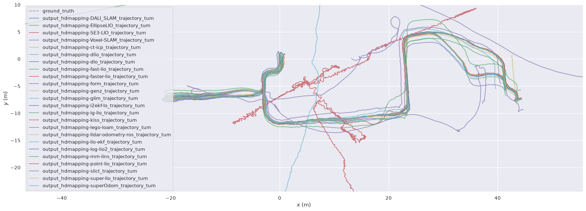

# benchmark-HDMapping-Orchestration

# Option 1 (Full automation)

### Available dataset:

Download the dataset `reg-1.bag` by clicking [link](https://cloud.cylab.be/public.php/dav/files/7PgyjbM2CBcakN5/reg-1.bag) (it is part of [Bunker DVI Dataset](https://charleshamesse.github.io/bunker-dvi-dataset)).

File 'reg-1.bag' is an input for further calculations.
It should be located in '~/hdmapping-benchmark/data'.

## Create worskpace folder
```shell
mkdir -p ~/hdmapping-benchmark/data
```

### Prerequisites for Running the Scripts:
Before running the scripts below, build the required Docker images according to the instructions provided in:

GitHub repository [mandeye_to_bag](https://github.com/MapsHD/mandeye_to_bag)

GitHub repository [livox_bag_aggregate](https://github.com/MapsHD/livox_bag_aggregate)

The following scripts assume that these Docker images have already been built.

## Create worskpace folder
```shell
mkdir -p ~/hdmapping-benchmark
```
## Go to your workspace folder:

```shell
cd ~/hdmapping-benchmark
```

## Clone the orchestration repository:
```shell
git clone https://github.com/MapsHD/benchmark-HDMapping-Orchestration.git
```

### Change branch
```shell
cd benchmark-HDMapping-Orchestration
git checkout Bunker-DVI-Dataset-reg-1
```
```shell
chmod +x ~/hdmapping-benchmark/benchmark-HDMapping-Orchestration/prepare_data_step1/prepare_data_step1.sh 
chmod +x ~/hdmapping-benchmark/benchmark-HDMapping-Orchestration/prepare_data_step1/mandeye-convert.sh 
chmod +x ~/hdmapping-benchmark/benchmark-HDMapping-Orchestration/prepare_data_step1/livox_bag.sh 
chmod +x ~/hdmapping-benchmark/benchmark-HDMapping-Orchestration/clone_github_repositories_step2/clone_github_repositories_step2.sh
chmod +x ~/hdmapping-benchmark/benchmark-HDMapping-Orchestration/run_benchmark_step3/run_benchmark_step3.sh
chmod +x ~/hdmapping-benchmark/benchmark-HDMapping-Orchestration/conversion_tum_step4/run_tum_step4.sh
chmod +x ~/hdmapping-benchmark/benchmark-HDMapping-Orchestration/evo_step5/tum-to-latex_step5.sh
```

```shell
chmod +x ~/hdmapping-benchmark/benchmark-HDMapping-Orchestration/start_benchmark.sh
```

```shell
~/hdmapping-benchmark/benchmark-HDMapping-Orchestration/start_benchmark.sh
```

# Option 2 (Step by step)
# Step 1 Prepare data

## Create worskpace folder
```shell
mkdir -p ~/hdmapping-benchmark
```

## Go to your workspace folder:

```shell
cd ~/hdmapping-benchmark
```

## Clone the orchestration repository:
```shell
git clone https://github.com/MapsHD/benchmark-HDMapping-Orchestration.git
```

### Change branch
```shell
cd benchmark-HDMapping-Orchestration
git checkout Bunker-DVI-Dataset-reg-1
```
### Available dataset:

Download the dataset `reg-1.bag` by clicking [link](https://cloud.cylab.be/public.php/dav/files/7PgyjbM2CBcakN5/reg-1.bag) (it is part of [Bunker DVI Dataset](https://charleshamesse.github.io/bunker-dvi-dataset)).

File 'reg-1.bag' is an input for further calculations.
It should be located in '~/hdmapping-benchmark/data'.

### Prerequisites for Running the Scripts:
Before running the scripts below, build the required Docker images according to the instructions provided in:

GitHub repository [mandeye_to_bag](https://github.com/MapsHD/mandeye_to_bag)

GitHub repository [livox_bag_aggregate](https://github.com/MapsHD/livox_bag_aggregate)

The following scripts assume that these Docker images have already been built.

## Make the script executable (if not done yet):

```shell
chmod +x ~/hdmapping-benchmark/benchmark-HDMapping-Orchestration/prepare_data_step1/prepare_data_step1.sh 
chmod +x ~/hdmapping-benchmark/benchmark-HDMapping-Orchestration/prepare_data_step1/mandeye-convert.sh 
chmod +x ~/hdmapping-benchmark/benchmark-HDMapping-Orchestration/prepare_data_step1/livox_bag.sh 
chmod +x ~/hdmapping-benchmark/benchmark-HDMapping-Orchestration/clone_github_repositories_step2/clone_github_repositories_step2.sh
chmod +x ~/hdmapping-benchmark/benchmark-HDMapping-Orchestration/run_benchmark_step3/run_benchmark_step3.sh
chmod +x ~/hdmapping-benchmark/benchmark-HDMapping-Orchestration/conversion_tum_step4/run_tum_step4.sh
chmod +x ~/hdmapping-benchmark/benchmark-HDMapping-Orchestration/evo_step5/tum-to-latex_step5.sh
```
### Run the script:

```shell
cd ~/hdmapping-benchmark/data
```

```shell
~/hdmapping-benchmark/benchmark-HDMapping-Orchestration/prepare_data_step1/prepare_data_step1.sh reg-1.bag .
```

# Step 2 Clone repositores

## Make the script executable (if not done yet):

```shell
cd ~/hdmapping-benchmark/data
```

```shell
chmod +x ~/hdmapping-benchmark/benchmark-HDMapping-Orchestration/clone_github_repositories_step2/clone_github_repositories_step2.sh
```

## Run the script:
```shell
~/hdmapping-benchmark/benchmark-HDMapping-Orchestration/clone_github_repositories_step2/clone_github_repositories_step2.sh
```
After running the script, you will be prompted to enter the branch name to be cloned for the repositories. For the Bunker DVI dataset, enter:
```shell
Bunker-DVI-Dataset-reg-1
```
The script will then clone the repositories using the specified branch.

## Result:

The repositories will be cloned into:

~/hdmapping-benchmark

The Docker images required for the benchmark will be built.

# Step 3 run benchmark

## Make the script executable (if not done yet):
```shell
chmod +x ~/hdmapping-benchmark/benchmark-HDMapping-Orchestration/run_benchmark_step3/run_benchmark_step3.sh
```

## Change directory to the data folder:

```shell
cd ~/hdmapping-benchmark/data
```

## Run the benchmark script with your ROS1 bag and ROS2 folder:
 
 ```shell
~/hdmapping-benchmark/benchmark-HDMapping-Orchestration/run_benchmark_step3/run_benchmark_step3.sh reg-1.bag reg-1-ros2 .
```

# Step 4 conversion tum

## Make the script executable (if not done yet):
```shell
chmod +x ~/hdmapping-benchmark/benchmark-HDMapping-Orchestration/conversion_tum_step4/run_tum_step4.sh
```

## Change directory to the data folder:

```shell
cd ~/hdmapping-benchmark/data
```

## Run the benchmark script with your ROS1 bag and ROS2 folder:
 
 ```shell
~/hdmapping-benchmark/benchmark-HDMapping-Orchestration/conversion_tum_step4/run_tum_step4.sh
```
# Step 5 evo 

## Make the script executable (if not done yet):
```shell
chmod +x ~/hdmapping-benchmark/benchmark-HDMapping-Orchestration/evo_step5/tum-to-latex_step5.sh
```

## Change directory to the data folder:

```shell
cd ~/hdmapping-benchmark/data
```

## Run the benchmark script with your ROS1 bag and ROS2 folder:
 
 ```shell
~/hdmapping-benchmark/benchmark-HDMapping-Orchestration/evo_step5/tum-to-latex_step5.sh
```

# Step 6 overlap

## Make the script executable (if not done yet):

## Change directory to the data folder:

```shell
cd ~/hdmapping-benchmark/data
```

## Run the benchmark script with your ROS1 bag and ROS2 folder:
 
 ```shell
python3 ~/hdmapping-benchmark/benchmark-HDMapping-Orchestration/overlap_step6/overlap.py
```


## Result:
 
### After running the script, you will get the following folder:

~/hdmapping-benchmark/data/output_hdmapping-ALGONAME/

You should see following data

lio_initial_poses.reg

poses.reg

scan_lio_*.laz

session.json

trajectory_lio_*.csv

~/hdmapping-benchmark/data/tum

## Benchmark Result (04.07.2026)

# APE (Absolute Pose Error)

| method | max | mean | median | min | rmse | sse | std |
| ------------- | ------------- | ------------- | ------------- | ------------- | ------------- | ------------- | ------------- |
| D-LIO | - | - | - | - | - | - | - |
| DALI_SLAM | 0.279920 | 0.059078 | 0.054942 | 0.001700 | 0.066879 | 14.648375 | 0.031347 |
| EllipseLIO | 10124.959153 | 1471.223507 | 880.797075 | 31.353425 | 2287.966300 | 68528633159.036255 | 1752.224638 |
| SE3-LIO | 1.620294 | 0.370770 | 0.292033 | 0.043150 | 0.435212 | 620.127814 | 0.227903 |
| Voxel-SLAM | 0.264964 | 0.060449 | 0.054765 | 0.008664 | 0.067080 | 14.736648 | 0.029081 |
| c3p-voxelmap | - | - | - | - | - | - | - |
| ct-icp | 0.666498 | 0.211220 | 0.175000 | 0.041057 | 0.242839 | 193.012033 | 0.119821 |
| dlio | 0.670056 | 0.187874 | 0.169016 | 0.005090 | 0.211462 | 1464.236162 | 0.097055 |
| dlo | 0.766140 | 0.109452 | 0.094532 | 0.014103 | 0.127612 | 49.522472 | 0.065614 |
| fast-lio | 0.357417 | 0.131993 | 0.124538 | 0.000713 | 0.145818 | 69.614518 | 0.061974 |
| faster-lio | 0.333702 | 0.119811 | 0.116855 | 0.005579 | 0.133886 | 58.687995 | 0.059756 |
| form | 4.478268 | 2.026201 | 1.591995 | 0.345731 | 2.369285 | 18378.643493 | 1.228016 |
| genz | 0.488600 | 0.169862 | 0.119618 | 0.004527 | 0.209700 | 123.083812 | 0.122967 |
| glim | 4.468791 | 1.614557 | 1.149799 | 0.321125 | 1.940579 | 12329.383752 | 1.076593 |
| i2ekf-lo | 0.296202 | 0.089640 | 0.092098 | 0.006714 | 0.098859 | 24.041734 | 0.041686 |
| ig-lio | 0.485426 | 0.214691 | 0.195822 | 0.012793 | 0.240635 | 189.581936 | 0.108688 |
| kiss | 57.237090 | 21.277413 | 17.924351 | 6.450650 | 25.047331 | 2054005.467250 | 13.215161 |
| lego-loam | 33.777943 | 10.388128 | 10.404738 | 2.245275 | 11.873763 | 113070.971855 | 5.750917 |
| lidar-odometry-ros | 8.316032 | 0.734022 | 0.474294 | 0.082118 | 1.270032 | 5277.676940 | 1.036433 |
| lio-ekf | 361.054300 | 174.156617 | 179.723217 | 15.120959 | 194.972230 | 124268323.322022 | 87.656393 |
| log-lio2 | 0.518082 | 0.317627 | 0.305625 | 0.073371 | 0.326389 | 348.671612 | 0.075118 |
| mm-lins | 3.001517 | 1.152233 | 0.952584 | 0.040657 | 1.346537 | 5936.295164 | 0.696794 |
| nv-liom | - | - | - | - | - | - | - |
| point-lio | 0.389445 | 0.151188 | 0.128217 | 0.006291 | 0.170729 | 95.431953 | 0.079313 |
| slict | 1383.236002 | 673.472068 | 665.692864 | 44.771521 | 777.555774 | 657797164.875822 | 388.623669 |
| super-lio | 0.363315 | 0.130605 | 0.105079 | 0.015049 | 0.148729 | 72.421892 | 0.071152 |
| superOdom | 0.468011 | 0.172795 | 0.146653 | 0.008313 | 0.193311 | 610.502377 | 0.086667 |
       

# RPE (Relative Pose Error)

| method | max | mean | median | min | rmse | sse | std |
| ------------- | ------------- | ------------- | ------------- | ------------- | ------------- | ------------- | ------------- |
| D-LIO | - | - | - | - | - | - | - |
| DALI_SLAM | 0.149366 | 0.003698 | 0.003185 | 0.000176 | 0.006023 | 0.118760 | 0.004754 |
| EllipseLIO | 9.760992 | 0.891265 | 0.028278 | 0.000189 | 1.968412 | 50719.109510 | 1.755076 |
| SE3-LIO | 0.157137 | 0.009274 | 0.007586 | 0.000406 | 0.012515 | 0.512630 | 0.008403 |
| Voxel-SLAM | 0.149377 | 0.003970 | 0.003138 | 0.000143 | 0.006346 | 0.131852 | 0.004951 |
| c3p-voxelmap | - | - | - | - | - | - | - |
| ct-icp | 0.170148 | 0.023061 | 0.020382 | 0.001367 | 0.026755 | 2.342111 | 0.013565 |
| dlio | 0.190420 | 0.021995 | 0.012625 | 0.000000 | 0.036677 | 44.046916 | 0.029350 |
| dlo | 0.677954 | 0.016800 | 0.011710 | 0.000406 | 0.029746 | 2.689892 | 0.024548 |
| fast-lio | 0.154157 | 0.006580 | 0.005684 | 0.000405 | 0.008558 | 0.239701 | 0.005471 |
| faster-lio | 0.166703 | 0.005395 | 0.004765 | 0.000305 | 0.007450 | 0.181656 | 0.005137 |
| form | 0.190886 | 0.014412 | 0.012106 | 0.000737 | 0.017781 | 1.034759 | 0.010414 |
| genz | 0.162090 | 0.009768 | 0.008770 | 0.000160 | 0.011779 | 0.388193 | 0.006583 |
| glim | 0.157670 | 0.008187 | 0.006238 | 0.000306 | 0.011962 | 0.468296 | 0.008720 |
| i2ekf-lo | 0.153804 | 0.010036 | 0.009036 | 0.000481 | 0.012256 | 0.369339 | 0.007033 |
| ig-lio | 0.169228 | 0.012802 | 0.010909 | 0.000398 | 0.015623 | 0.798883 | 0.008955 |
| kiss | 0.760740 | 0.102342 | 0.086817 | 0.005766 | 0.123705 | 50.086539 | 0.069491 |
| lego-loam | 0.716083 | 0.311434 | 0.310104 | 0.010291 | 0.342172 | 93.782649 | 0.141742 |
| lidar-odometry-ros | 8.334176 | 0.011730 | 0.007574 | 0.000361 | 0.146391 | 70.098288 | 0.145920 |
| lio-ekf | 1.125873 | 0.233184 | 0.188362 | 0.004624 | 0.278770 | 253.965742 | 0.152768 |
| log-lio2 | 0.147678 | 0.008844 | 0.007654 | 0.000307 | 0.010948 | 0.392161 | 0.006452 |
| mm-lins | 0.157535 | 0.008771 | 0.006465 | 0.000338 | 0.013886 | 0.631062 | 0.010765 |
| nv-liom | - | - | - | - | - | - | - |
| point-lio | 0.158866 | 0.010723 | 0.009878 | 0.000534 | 0.012579 | 0.517904 | 0.006576 |
| slict | 5.319361 | 3.010491 | 3.112360 | 0.104723 | 3.091531 | 10389.070110 | 0.703213 |
| super-lio | 0.157089 | 0.009095 | 0.007817 | 0.000290 | 0.011271 | 0.415787 | 0.006658 |
| superOdom | 0.115372 | 0.020815 | 0.014497 | 0.000330 | 0.027766 | 12.594416 | 0.018376 |

# Trajectories


