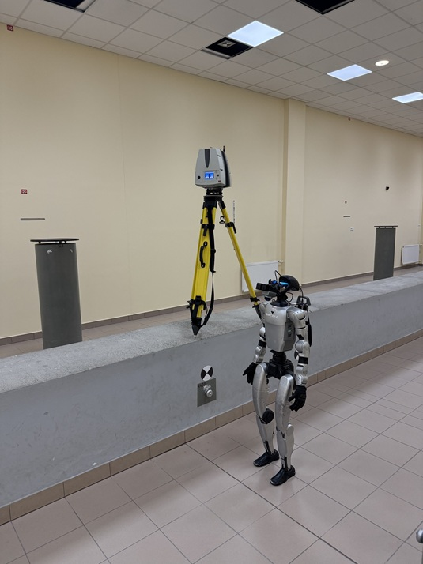
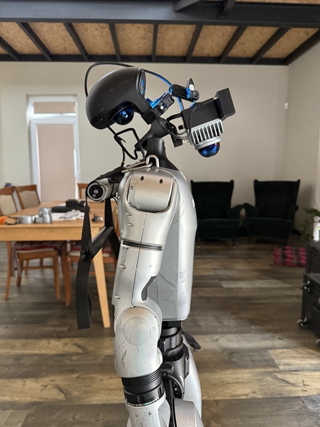
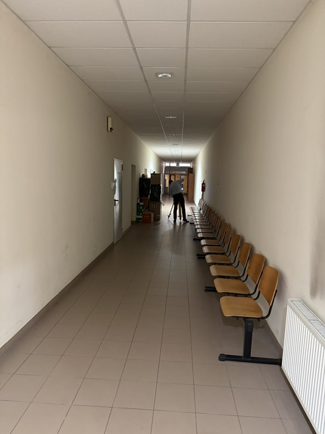
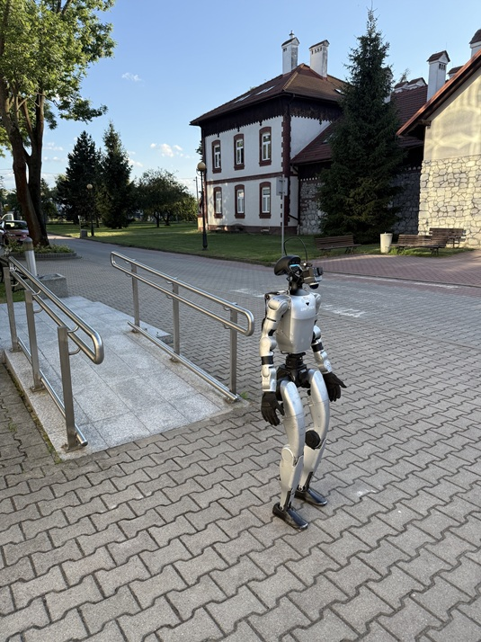
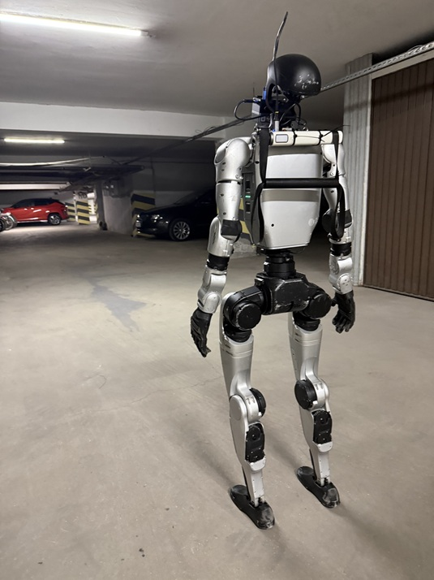
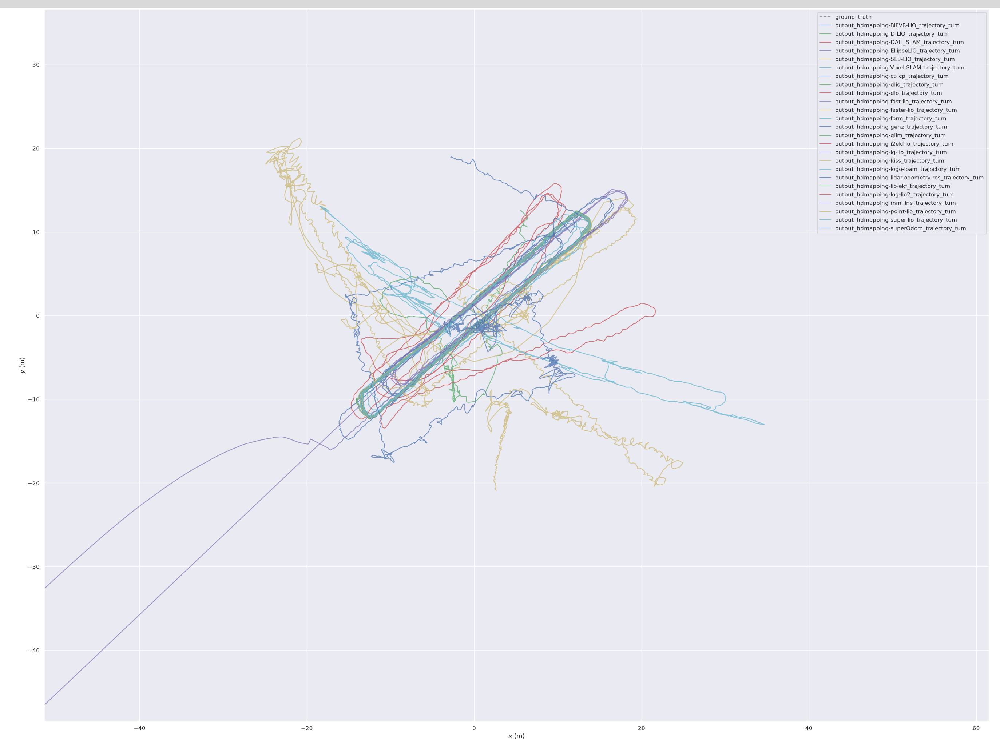
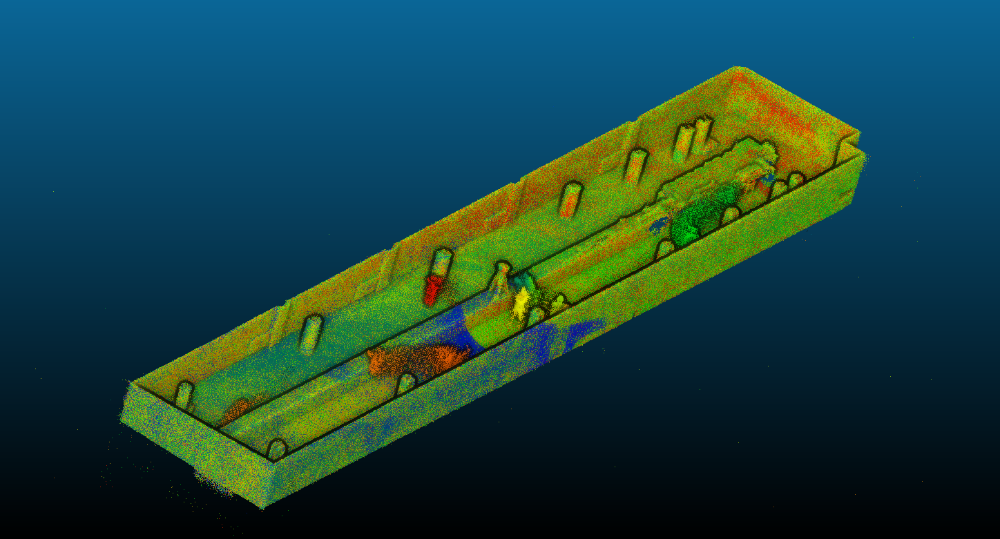
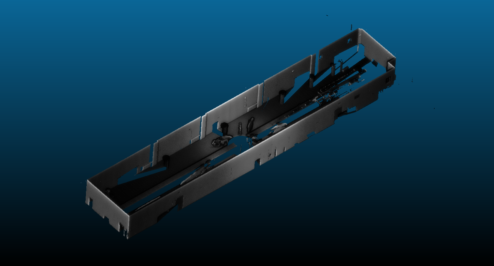

# benchmark-HDMapping-Orchestration

# branch HUMANOID-LIO-DATASET

### dataset source:
https://zenodo.org/records/21318128








# Step 1 (download data)
Download first trial https://zenodo.org/records/21318128/files/calibration-room.7z?download=1 (You can do similar step for all other trials) 

# Step 2 (prepare data)
Unpack calibration-room.7z (later on You can do similar for flat-room.7z, long-corridor.7z, outdoor-urk.7z, underground-garage.7z)

You should see following data structure for calibration-room data collection:

```HUMANOID-LIO-DATASET (single scenario) data structure
<calibration-room>/
├── TLS-ground-truth
│   ├── Leica_ScanStation_P30-P40_Civil_DS.pdf  (documentation for Terrestrial Laser Scanner)
│   └── TLS.laz (ground truth point cloud from Terrestrial Laser Scanner)
├── trial-1
│   ├──ground-truth
│   │  ├──ground_truth.tum (ground truth trajectory)
│   │  ├──ground_truth.txt (ground truth trajectory)
│   │  └──perspective_view.png (perspective view of trajectory)
│   └──hdmapping-raw (raw data in format of data https://github.com/MapsHD/HDMapping)
│      ├──imu0000.csv
│      ├──imu0001.csv
│      ├──imu0002.csv
│      ├──...
│      ├──imu0038.csv
│      ├──lidar0000.laz
│      ├──lidar0000.sn
│      ├──lidar0001.laz
│      ├──lidar0002.sn
│      ├──...
│      ├──lidar0038.laz
│      ├──lidar0038.sn
│      ├──status0000.json
│      ├──status0001.json
│      ├──status0002.json
│      ├──...
│      └──status0038.json
├── trial-2
│   ├──ground-truth
│   │  ├──ground_truth.tum (ground truth trajectory)
│   │  ├──ground_truth.txt (ground truth trajectory)
│   │  └──perspective_view.png (perspective view of trajectory)
│   └──hdmapping-raw (raw data in format of data https://github.com/MapsHD/HDMapping)
│      ├──imu0000.csv
│      ├──imu0001.csv
│      ├──imu0002.csv
│      ├──...
│      ├──imu0022.csv
│      ├──lidar0000.laz
│      ├──lidar0000.sn
│      ├──lidar0001.laz
│      ├──lidar0002.sn
│      ├──...
│      ├──lidar0022.laz
│      ├──lidar0022.sn
│      ├──status0000.json
│      ├──status0001.json
│      ├──status0002.json
│      ├──...
│      └──status0022.json
└── image.jpeg (situation view)
```
## Create worskpace folder and copy raw data (in HDMapping format)
open new terminal
```shell
mkdir -p ~/hdmapping-benchmark/data/raw
cd ~/hdmapping-benchmark/data/raw
cp ~/Downloads/calibration-room/trial-1/hdmapping-raw/* .
```

## Convert data to ROS1 format
open new terminal
```shell
cd ~/hdmapping-benchmark
git clone https://github.com/MapsHD/mandeye_to_bag.git --recursive
cd ~/hdmapping-benchmark/mandeye_to_bag
docker build -t mandeye-ws_noetic --target ros1 .
docker build -t mandeye-ws_humble --target ros2 .
./mandeye-convert.sh '/home/janusz/hdmapping-benchmark/data/raw' '/home/janusz/hdmapping-benchmark/data/raw/ros1' hdmapping-to-ros1
mv ~/hdmapping-benchmark/data/raw/ros1/raw ../data/reg-1.bag 
```

You should see following folders
```
<~hdmapping-benchmark/data>/
├── raw (folder with raw hdmapping data)
└── reg-1.bag (bugfile for ROS1 - Robot Operating System 1)
```

# Step 3 (run benchmark)
open new terminal
```shell
cd ~/hdmapping-benchmark
git clone https://github.com/MapsHD/benchmark-HDMapping-Orchestration.git
cd benchmark-HDMapping-Orchestration
git checkout HUMANOID-LIO-DATASET
chmod +x ~/hdmapping-benchmark/benchmark-HDMapping-Orchestration/prepare_data_step1/prepare_data_step1.sh 
chmod +x ~/hdmapping-benchmark/benchmark-HDMapping-Orchestration/prepare_data_step1/mandeye-convert.sh 
chmod +x ~/hdmapping-benchmark/benchmark-HDMapping-Orchestration/prepare_data_step1/livox_bag.sh 
chmod +x ~/hdmapping-benchmark/benchmark-HDMapping-Orchestration/clone_github_repositories_step2/clone_github_repositories_step2.sh
chmod +x ~/hdmapping-benchmark/benchmark-HDMapping-Orchestration/run_benchmark_step3/run_benchmark_step3.sh
chmod +x ~/hdmapping-benchmark/benchmark-HDMapping-Orchestration/conversion_tum_step4/run_tum_step4.sh
chmod +x ~/hdmapping-benchmark/benchmark-HDMapping-Orchestration/evo_step5/tum-to-latex_step5.sh
chmod +x ~/hdmapping-benchmark/benchmark-HDMapping-Orchestration/start_benchmark.sh
cp ~/Downloads/calibration-room/trial-1/ground-truth/ground_truth.tum ./conversion_tum_step4
```
Check if You have following data
```
<~/hdmapping-benchmark/benchmark-HDMapping-Orchestration/conversion_tum_step4>/
├──Dockerfile
├──ground_truth.tum (this one can be missing --> it should be copied from ~/Downloads/calibration-room/trial-1/ground-truth/)
├──run_tum_step4.sh
└──save_to_tum.py
```

open new terminal
```shell
cd ~/hdmapping-benchmark/benchmark-HDMapping-Orchestration
~/hdmapping-benchmark/benchmark-HDMapping-Orchestration/start_benchmark.sh
```

# Step 4 (results for qualitative and quantitative inetpretation)
You should expect following results
```
<~/hdmapping-benchmark/data/tum>/
├──ape_table_github.md (Absolute Pose Error for github readme)
├──ground_truth.tum (ground truth trajectory in TUM format, [ts x y z qx qy qz qw])
├──image.png (plot of all trajectories)
├──output_hdmapping-BIEVR-LIO_trajectory_tum.txt (trajectory BIEVR-LIO in TUM format)
├──output_hdmapping-c3p-voxelmap_trajectory_tum.txt (trajectory c3p-voxelmap in TUM format)
├──output_hdmapping-ct-icp_trajectory_tum.txt (trajectory ct-icp in TUM format)
├──output_hdmapping-DALI_SLAM_trajectory_tum.txt (...)
├──output_hdmapping-dlio_trajectory_tum.txt
├──output_hdmapping-D-LIO_trajectory_tum.txt
├──output_hdmapping-dlo_trajectory_tum.txt
├──output_hdmapping-EllipseLIO_trajectory_tum.txt
├──output_hdmapping-faster-lio_trajectory_tum.txt
├──output_hdmapping-fast-lio_trajectory_tum.txt
├──output_hdmapping-form_trajectory_tum.txt
├──output_hdmapping-genz_trajectory_tum.txt
├──output_hdmapping-glim_trajectory_tum.txt
├──output_hdmapping-i2ekf-lo_trajectory_tum.txt
├──output_hdmapping-ig-lio_trajectory_tum.txt
├──output_hdmapping-kiss_trajectory_tum.txt
├──output_hdmapping-lego-loam_trajectory_tum.txt
├──output_hdmapping-lidar-odometry-ros_trajectory_tum.txt
├──output_hdmapping-lio-ekf_trajectory_tum.txt
├──output_hdmapping-log-lio2_trajectory_tum.txt
├──output_hdmapping-mm-lins_trajectory_tum.txt
├──output_hdmapping-nv-liom_trajectory_tum.txt
├──output_hdmapping-point-lio_trajectory_tum.txt
├──output_hdmapping-SE3-LIO_trajectory_tum.txt
├──output_hdmapping-slict_trajectory_tum.txt
├──output_hdmapping-super-lio_trajectory_tum.txt
├──output_hdmapping-superOdom_trajectory_tum.txt
├──output_hdmapping-Voxel-SLAM_trajectory_tum.txt
├──overlap_results.md (trajectory completness for github readme)
├──overlap_results.tex (trajectory completness in latex)
├──rpe_table_github.md (Relative Pose Error for github readme)
├──table_ape.csv (Absolute Pose Error in csv table)
├──table_ape.tex (Absolute Pose Error for latex)
├──table_rpe.csv (Relative Pose Error in csv table)
└──table_rpe.tex (Relative Pose Error for latex)
```


## Video links of runs

- [00:00:00 — DLO](https://youtu.be/Xe0pvC-ml9A?t=0s)
- [00:02:00 — LOAM](https://youtu.be/Xe0pvC-ml9A?t=120s)
- [00:03:40 — CT-ICP](https://youtu.be/Xe0pvC-ml9A?t=220s)
- [00:05:08 — LEGO-LOAM](https://youtu.be/Xe0pvC-ml9A?t=308s)
- [00:12:32 — FORM](https://youtu.be/Xe0pvC-ml9A?t=752s)
- [00:20:37 — SE3-LIO](https://youtu.be/Xe0pvC-ml9A?t=1237s)
- [00:28:48 — VOXELSLAM](https://youtu.be/Xe0pvC-ml9A?t=1728s)
- [00:36:35 — DALISLAM](https://youtu.be/Xe0pvC-ml9A?t=2195s)
- [00:44:31 — LOG-LIO2](https://youtu.be/Xe0pvC-ml9A?t=2671s)
- [00:52:27 — LIO-EKF](https://youtu.be/Xe0pvC-ml9A?t=3147s)
- [01:02:30 — FAST-LIO](https://youtu.be/Xe0pvC-ml9A?t=3750s)
- [01:11:02 — SuperLIO](https://youtu.be/Xe0pvC-ml9A?t=4262s)
- [01:19:28 — Faster-LIO](https://youtu.be/Xe0pvC-ml9A?t=4768s)
- [01:27:03 — IG-LIO](https://youtu.be/Xe0pvC-ml9A?t=5223s)
- [01:39:12 — I2EKF-LO](https://youtu.be/Xe0pvC-ml9A?t=5952s)
- [01:46:35 — VoxelMap](https://youtu.be/Xe0pvC-ml9A?t=6395s)
- [01:54:05 — SLICT](https://youtu.be/Xe0pvC-ml9A?t=6845s)
- [02:06:32 — SuperOdom](https://youtu.be/Xe0pvC-ml9A?t=7592s)
- [02:16:40 — KISS-ICP](https://youtu.be/Xe0pvC-ml9A?t=8200s)
- [02:28:32 — GEN-Z](https://youtu.be/Xe0pvC-ml9A?t=8912s)
- [02:37:06 — LiDAR Odometry Wrapper](https://youtu.be/Xe0pvC-ml9A?t=9426s)
- [02:44:42 — EllipseLIO](https://youtu.be/Xe0pvC-ml9A?t=9882s)
- [02:52:33 — DLIO](https://youtu.be/Xe0pvC-ml9A?t=10353s)
- [02:55:45 — GLIM](https://youtu.be/Xe0pvC-ml9A?t=10545s)
- [02:59:42 — BIEVR-LIO](https://youtu.be/Xe0pvC-ml9A?t=10782s)
- [03:07:52 — Point-LIO](https://youtu.be/Xe0pvC-ml9A?t=11272s)
- [03:29:48 — C3P-VoxelMap](https://youtu.be/Xe0pvC-ml9A?t=12588s)
- [03:45:55 — MM-LINS](https://youtu.be/Xe0pvC-ml9A?t=13555s)

## Plot of trajectories from file ~/hdmapping-benchmark/data/tum/image.png


## Report from file ~/hdmapping-benchmark/data/tum/ape_table_github.md
### APE (Absolute Pose Error)

| method | max | mean | median | min | rmse | sse | std |
| ------------- | ------------- | ------------- | ------------- | ------------- | ------------- | ------------- | ------------- |
| BIEVR-LIO | 0.106898 | 0.034890 | 0.032601 | 0.003811 | 0.037027 | 5.215285 | 0.012398 |
| D-LIO | 25.467814 | 10.806713 | 10.389962 | 1.331776 | 12.139639 | 174634.448126 | 5.530442 |
| DALI_SLAM | 0.082471 | 0.039585 | 0.037418 | 0.015241 | 0.041185 | 3.692608 | 0.011369 |
| EllipseLIO | 11335.121549 | 922.252038 | 524.869940 | 211.831273 | 1841.773121 | 51587486095.467003 | 1594.233172 |
| SE3-LIO | 0.138139 | 0.056494 | 0.055642 | 0.004649 | 0.059759 | 13.320245 | 0.019481 |
| Voxel-SLAM | 0.121876 | 0.055523 | 0.053428 | 0.018840 | 0.057493 | 12.081303 | 0.014920 |
| c3p-voxelmap | - | - | - | - | - | - | - |
| ct-icp | 0.274563 | 0.054447 | 0.053487 | 0.001171 | 0.059539 | 9.851286 | 0.024092 |
| dlio | 0.266471 | 0.079815 | 0.075536 | 0.001412 | 0.087657 | 292.160121 | 0.036240 |
| dlo | 0.382537 | 0.150737 | 0.113033 | 0.020519 | 0.178293 | 47.174020 | 0.095220 |
| fast-lio | 0.110284 | 0.035780 | 0.033055 | 0.004212 | 0.038531 | 5.496261 | 0.014298 |
| faster-lio | 0.105536 | 0.043711 | 0.040875 | 0.014730 | 0.045982 | 7.083177 | 0.014272 |
| form | 5.565471 | 2.347021 | 2.498502 | 0.224781 | 2.601433 | 25614.802995 | 1.122027 |
| genz | 0.142160 | 0.052245 | 0.051654 | 0.002978 | 0.055947 | 11.844020 | 0.020013 |
| glim | 0.393037 | 0.125196 | 0.104350 | 0.004853 | 0.150124 | 82.058344 | 0.082845 |
| i2ekf-lo | 13.500012 | 3.677351 | 2.856488 | 0.482460 | 4.632488 | 81762.406006 | 2.817275 |
| ig-lio | 265703.745573 | 87943.287327 | 85805.269540 | 892.535791 | 104241.338175 | 41389571330394.390625 | 55966.372033 |
| kiss | 38.394906 | 14.252094 | 13.352192 | 0.136329 | 17.077351 | 1108508.126896 | 9.408174 |
| lego-loam | 31.990259 | 17.345087 | 16.766326 | 1.654733 | 18.749061 | 327623.437916 | 7.118654 |
| lidar-odometry-ros | 5.498510 | 4.147692 | 4.022569 | 3.582212 | 4.166222 | 65992.841044 | 0.392500 |
| lio-ekf | 1756.883285 | 1054.977096 | 1113.736527 | 72.509497 | 1170.520670 | 5199600236.826395 | 507.091675 |
| log-lio2 | 280982.383646 | 64111.653337 | 46006.333907 | 2601.047551 | 84704.524606 | 27278804370187.386719 | 55358.399500 |
| mm-lins | 296.892604 | 7.689352 | 5.452060 | 5.202542 | 19.662602 | 1470694.552135 | 18.096734 |
| nv-liom | - | - | - | - | - | - | - |
| point-lio | 2.684126 | 0.045722 | 0.043818 | 0.009906 | 0.063855 | 15.535185 | 0.044576 |
| slict | - | - | - | - | - | - | - |
| super-lio | 0.095293 | 0.035008 | 0.033594 | 0.009252 | 0.036519 | 5.081262 | 0.010396 |
| superOdom | 37.318335 | 12.172829 | 11.180716 | 0.474958 | 14.135319 | 3787546.251233 | 7.185366 |

## Report from file ~/hdmapping-benchmark/data/tum/rpe_table_github.md
### RPE (Relative Pose Error)

| method | max | mean | median | min | rmse | sse | std |
| ------------- | ------------- | ------------- | ------------- | ------------- | ------------- | ------------- | ------------- |
| BIEVR-LIO | 0.041778 | 0.006665 | 0.005702 | 0.000168 | 0.007938 | 0.239607 | 0.004310 |
| D-LIO | 2.456619 | 0.253381 | 0.215826 | 0.001446 | 0.323452 | 123.871831 | 0.201046 |
| DALI_SLAM | 0.033099 | 0.006522 | 0.005832 | 0.000410 | 0.007580 | 0.125033 | 0.003863 |
| EllipseLIO | 12.708121 | 0.796616 | 0.007427 | 0.000178 | 2.514622 | 96158.747354 | 2.385105 |
| SE3-LIO | 0.047043 | 0.012214 | 0.011500 | 0.000430 | 0.013611 | 0.690794 | 0.006006 |
| Voxel-SLAM | 0.040120 | 0.009842 | 0.008908 | 0.000195 | 0.011379 | 0.473122 | 0.005711 |
| c3p-voxelmap | - | - | - | - | - | - | - |
| ct-icp | 0.366916 | 0.028096 | 0.024475 | 0.001363 | 0.034506 | 3.307710 | 0.020033 |
| dlio | 0.186099 | 0.026650 | 0.015212 | 0.000000 | 0.044261 | 74.485076 | 0.035338 |
| dlo | 0.173226 | 0.019658 | 0.014707 | 0.000770 | 0.025779 | 0.985555 | 0.016678 |
| fast-lio | 0.044753 | 0.007841 | 0.006976 | 0.000318 | 0.009140 | 0.309180 | 0.004696 |
| faster-lio | 0.044526 | 0.008032 | 0.007156 | 0.000625 | 0.009252 | 0.286692 | 0.004592 |
| form | 0.264500 | 0.035583 | 0.028289 | 0.001365 | 0.044688 | 7.556676 | 0.027034 |
| genz | 0.104113 | 0.024872 | 0.021659 | 0.000347 | 0.029304 | 3.248610 | 0.015496 |
| glim | 0.044924 | 0.005212 | 0.004286 | 0.000201 | 0.006440 | 0.150961 | 0.003783 |
| i2ekf-lo | 0.196139 | 0.033495 | 0.030251 | 0.000540 | 0.038786 | 5.730074 | 0.019555 |
| ig-lio | 248.462050 | 92.603778 | 76.622519 | 0.000246 | 124.832237 | 59340396.337870 | 83.711573 |
| kiss | 6.746450 | 0.257374 | 0.181675 | 0.005798 | 0.433830 | 715.190569 | 0.349237 |
| lego-loam | 2.026665 | 0.439980 | 0.413406 | 0.015505 | 0.491041 | 224.484123 | 0.218035 |
| lidar-odometry-ros | 7.853071 | 0.042146 | 0.031184 | 0.000998 | 0.137571 | 71.937367 | 0.130957 |
| lio-ekf | 6.791499 | 1.547324 | 0.424310 | 0.005599 | 2.532101 | 24325.356563 | 2.004326 |
| log-lio2 | 392.641609 | 86.755881 | 0.087567 | 0.000624 | 154.377149 | 90586588.206989 | 127.693858 |
| mm-lins | 302.992240 | 0.182462 | 0.019712 | 0.000283 | 4.962115 | 93639.690349 | 4.958759 |
| nv-liom | - | - | - | - | - | - | - |
| point-lio | 2.646340 | 0.012937 | 0.010594 | 0.000605 | 0.061211 | 14.271631 | 0.059828 |
| slict | - | - | - | - | - | - | - |
| super-lio | 0.045226 | 0.009786 | 0.008554 | 0.000605 | 0.011362 | 0.491687 | 0.005773 |
| superOdom | 6.233010 | 0.033270 | 0.018094 | 0.000206 | 0.093546 | 165.870891 | 0.087429 |

## overlap_results.md from file ~/hdmapping-benchmark/data/tum/overlap_results.md
### LIO overlap benchmark (Metric1 - Trajectory completness, Metric2 - percentage of published poses)

| Algorithm | Metric1 [%] | Metric2 [%] | Nodes |
|-----------|-------------|-------------|-------|
| BIEVR-LIO | 102.55 | 5.13 | 3901 |
| D-LIO | 100.19 | 1.59 | 1211 |
| DALI_SLAM | 59.74 | 2.99 | 2273 |
| EllipseLIO | 102.31 | 20.46 | 15562 |
| SE3-LIO | 100.61 | 5.03 | 3827 |
| Voxel-SLAM | 98.58 | 4.93 | 3750 |
| c3p-voxelmap | 102.52 | 5.14 | 3907 |
| ct-icp | 97.56 | 3.78 | 2878 |
| dlio | 101.63 | 50.81 | 38649 |
| dlo | 40.55 | 2.03 | 1543 |
| fast-lio | 99.66 | 4.99 | 3798 |
| faster-lio | 90.37 | 4.53 | 3444 |
| form | 102.55 | 5.11 | 3885 |
| genz | 102.50 | 5.10 | 3881 |
| glim | 97.56 | 4.88 | 3711 |
| i2ekf-lo | 102.47 | 5.13 | 3905 |
| ig-lio | 102.52 | 5.14 | 3907 |
| kiss | 102.48 | 5.12 | 3898 |
| lego-loam | 100.56 | 1.26 | 957 |
| lidar-odometry-ros | 102.55 | 5.13 | 3901 |
| lio-ekf | 102.34 | 5.12 | 3893 |
| log-lio2 | 102.53 | 5.13 | 3900 |
| mm-lins | 102.52 | 5.13 | 3901 |
| point-lio | 102.47 | 5.13 | 3905 |
| super-lio | 102.18 | 5.12 | 3894 |
| superOdom | 101.87 | 25.44 | 19346 |


# Step 5 (Qualitative result - validate resulting map against ground truth)
Load ~/hdmapping-benchmark/data/super-lio/output_hdmapping-super-lio/session.json
with multi_view_tls_registration_step_2 from https://github.com/MapsHD/HDMapping
and export to point cloud to view in CloudCompare



You can now compare with ground truth from
```
<calibration-room>/
├── TLS-ground-truth
    └── TLS.laz
...
```



# More info
Our paper about benchmark
- https://www.sciencedirect.com/science/article/pii/S2352711026003146

To cite benchmark suite please use as follows:
```
@article{BEDKOWSKI2026102822,
title = {MapsHD: A benchmark suite for LiDAR odometry frameworks},
journal = {SoftwareX},
volume = {35},
pages = {102822},
year = {2026},
issn = {2352-7110},
doi = {https://doi.org/10.1016/j.softx.2026.102822},
url = {https://www.sciencedirect.com/science/article/pii/S2352711026003146},
author = {Janusz Bȩdkowski and Michał Pełka and Karol Majek and Marcin Matecki and Adrian Radulescu and Charles Hamesse and Ethan Decleyn and Przemysław Lekston and Tomasz Owerko and Przemysław Kuras and Michał Ciszewski and Jakub Kolecki and Karolina Tomaszkiewicz and Łukasz Ambroziński and Joanna Koszyk and Bartosz Hyla and Karolina Pargieła and Anna Malczewska and Tomasz Lipecki and Artur Adamek and Bartosz Mitka and Klapa Przemysław and Pelagia Gawronek and Martin Mokros and Jozef Výboštok and Juliána Chudá and Michal Skladan and Carlos Cabo and Kim André Anstensen and Craciun Daniel-Marian and Antun Jakopec and Michal Wlasiuk and Kornel Mrozowski and Maksymilian Kulicki and Krzysztof Stereńczak and Oskar Bartosz and Jakub Markiewicz and Sławomir Łapiński and Adam Kostrzewa and Mariana Campos and Machi Zawidzki and Jacek Szklarski and Rami Faraj and Loris Redovniković and Jurica Jagetić and Samer Karam and Răzvan Dumbravă and Milosz Mielcarek and Grzegorz Krok and Michal Laszkowski and Jaroslaw Wajs and Jakub Chudziński},
keywords = {LiDAR odometry, LiDAR-inertial odometry, Benchmarking},
abstract = {This paper describes a software toolbox for LiDAR (Light Detection and Ranging) and LiDAR-Inertial Odometry qualitative and quantitative evaluation. We provide software as https://github.com/MapsHD organization with all necessary information at https://github.com/MapsHD/HDMapping. Our software contributions are a) ground truth data processing tool, b) dockerized state-of-the-art LO and LIO algorithms, c) multi-session data registration to common coordinate system, d) Absolute Pose Error (APE) and Relative Pose Error (RPE) metrics, e) import/export tools for easier 3D data handling and visualizing, e.g., in Cloud Compare software. This software is compatible with ROS1 (Robot Operating System) and ROS2 data formats. We show an example benchmark of LeGO-LOAM, LIO-SAM, FAST-LIO, DLO, VoxelMap, Faster-LIO, KISS-ICP, CT-ICP, SLICT, DLIO, GLIM, iG-LIO, LIO-EKF, I2EKF-LO, GenZ-ICP, RESPLE, odometry_ros_wrapper, Point-LIO, and LOAM-Livox algorithms. For all experiments we provide movies. The contribution of the paper is software-oriented LO/LIO algorithm benchmark suite. The novelty lies in the integration of multiple benchmarking steps into a unified framework, thus overall effort needed for qualitative and quantitative evaluation is reduced.}
}
```

