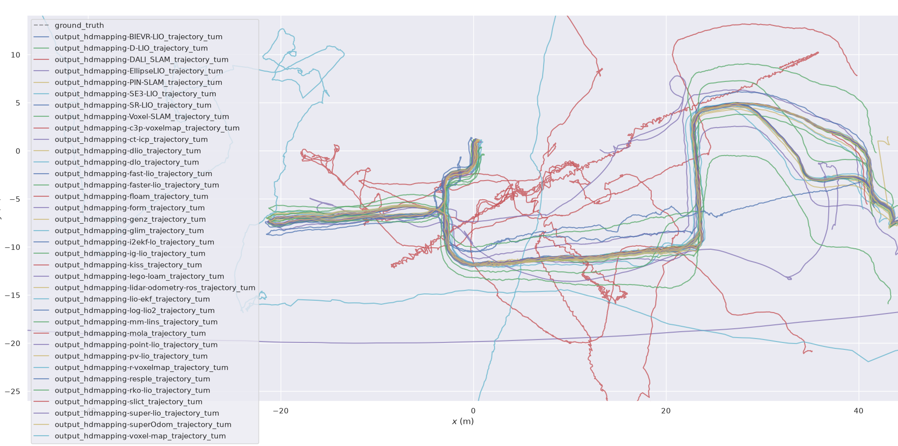

# benchmark-HDMapping-Orchestration

# Option 1 (Full automation)

### Available dataset:

Download the dataset `reg-1.bag` by clicking [link](https://cloud.cylab.be/public.php/dav/files/7PgyjbM2CBcakN5/reg-1.bag) (it is part of [Bunker DVI Dataset](https://charleshamesse.github.io/bunker-dvi-dataset)).
Alternative link to data on Zenodo [link](https://zenodo.org/records/23069933).
If You have problem with downloading data contact me januszbedkowski@gmail.com.

If you download data from Zenodo **reg-1.zip** is split into multiple parts:

```bash
michal@michal-pc:~/Downloads$ ls -lah | grep part
-rw-rw-r--  1 michal michal 500M Oct  7 16:36 reg-1.zip.part-000
-rw-rw-r--  1 michal michal 500M Oct  7 16:36 reg-1.zip.part-001
-rw-rw-r--  1 michal michal 500M Oct  7 16:36 reg-1.zip.part-002
# And so on ...
# And so on ...
# And so on ...
-rw-rw-r--  1 michal michal 500M Oct  7 17:04 reg-1.zip.part-034
-rw-rw-r--  1 michal michal 500M Oct  7 17:06 reg-1.zip.part-035
-rw-rw-r--  1 michal michal 384M Oct  7 17:06 reg-1.zip.part-036
```

In order to merge them use:

```bash
# Move to downloads:
cd ~/Downloads

# Merge zip-parts
cat reg-1.zip.part-0* > full.zip

# Fix merged zip
zip -F full.zip --out full-fixed.zip

# Unzip final archive - this command will produce reg-1.bag in your ~/Downloads
unzip full-fixed.zip
```

File 'reg-1.bag' is an input for further calculations.
It should be located in '~/hdmapping-benchmark/data'.

The same [Zenodo dataset](https://zenodo.org/records/23069933) also provides the
`HDMappingGroundTruth` and `TLS-FARO-Focus` directories. Place both extracted
directories beside `reg-1.bag`, preserving their contents:

```text
~/hdmapping-benchmark/data/
├── reg-1.bag
├── HDMappingGroundTruth/
│   └── lio_result_0/
│       ├── session.mjs
│       ├── session_ini_poses.mri
│       ├── session_poses.mrp
│       ├── scan_lio_*.laz
│       └── trajectory_lio_*.csv
└── TLS-FARO-Focus/
    ├── map_gt_0.01.laz
    └── map_gt_0.01.pcd
```

`HDMappingGroundTruth/lio_result_0/session.mjs` is the reference session for
Steps 4 and 7. The `TLS-FARO-Focus` point cloud is reserved for subsequent
point-cloud benchmark calculations; the Step 7 registration stage does not read it.
Downloading only the bag does not provide the reference session required by
these stages. Do not place the reference directories under an extra `ground_truth`
directory.

## Create worskpace folder
```shell
mkdir -p ~/hdmapping-benchmark/data
```

### Prerequisites for Running the Scripts:
Before running the scripts below, build the required Docker images according to the instructions provided in:

GitHub repository [mandeye_to_bag](https://github.com/MapsHD/mandeye_to_bag)

GitHub repository [livox_bag_aggregate](https://github.com/MapsHD/livox_bag_aggregate)

The following scripts assume that these Docker images have already been built.

A GPU is recommended but not required. PIN-SLAM uses an NVIDIA GPU through the [NVIDIA Container Toolkit](https://docs.nvidia.com/datacenter/cloud-native/container-toolkit/latest/install-guide.html) when one is available and otherwise falls back to CPU, which is slower but still completes. All other algorithms run on CPU.

## Create worskpace folder
```shell
mkdir -p ~/hdmapping-benchmark
```
## Go to your workspace folder:

```shell
cd ~/hdmapping-benchmark
```

## Clone the orchestration repository:
```shell
git clone https://github.com/MapsHD/benchmark-HDMapping-Orchestration.git
```

### Change branch
```shell
cd benchmark-HDMapping-Orchestration
git checkout Bunker-DVI-Dataset-reg-1
```
```shell
chmod +x ~/hdmapping-benchmark/benchmark-HDMapping-Orchestration/prepare_data_step1/prepare_data_step1.sh 
chmod +x ~/hdmapping-benchmark/benchmark-HDMapping-Orchestration/prepare_data_step1/mandeye-convert.sh 
chmod +x ~/hdmapping-benchmark/benchmark-HDMapping-Orchestration/prepare_data_step1/livox_bag.sh 
chmod +x ~/hdmapping-benchmark/benchmark-HDMapping-Orchestration/clone_github_repositories_step2/clone_github_repositories_step2.sh
chmod +x ~/hdmapping-benchmark/benchmark-HDMapping-Orchestration/run_benchmark_step3/run_benchmark_step3.sh
chmod +x ~/hdmapping-benchmark/benchmark-HDMapping-Orchestration/conversion_tum_step4/run_tum_step4.sh
chmod +x ~/hdmapping-benchmark/benchmark-HDMapping-Orchestration/evo_step5/tum-to-latex_step5.sh
chmod +x ~/hdmapping-benchmark/benchmark-HDMapping-Orchestration/registration_step7/run_registration_step7.sh
```

```shell
chmod +x ~/hdmapping-benchmark/benchmark-HDMapping-Orchestration/start_benchmark.sh
```

```shell
~/hdmapping-benchmark/benchmark-HDMapping-Orchestration/start_benchmark.sh
```

Optionally pass a list of algorithm ids to clone, build, run and evaluate only those, for example:
```shell
~/hdmapping-benchmark/benchmark-HDMapping-Orchestration/start_benchmark.sh sr-lio r-voxelmap pv-lio rko-lio pin-slam
```
Without arguments all algorithms are run. An unknown id aborts the run and prints the known ids. The step-by-step scripts of steps 2, 3, 4 and 7 honour the same list through the `ONLY_ALGOS` environment variable, e.g. `ONLY_ALGOS="sr-lio pv-lio" ./run_benchmark_step3.sh ...`.

The full pipeline now runs Steps 1-7, including rigid registration of the algorithm
point clouds to the ground-truth session. It does not run the optional HDMapping
session export utility.

## Adding or changing an algorithm

Every algorithm is described on one line of [algorithms.conf](algorithms.conf), which steps 2, 3, 4 and 7 all read. A name is therefore written exactly once and cannot differ by a letter between steps.

| column | meaning |
| ------------- | ------------- |
| `category` | `ROS1`, `ROS2` or `NON_ROS` (standalone, reads the bag directly) |
| `repo` | repository under https://github.com/MapsHD |
| `id` | short name: the `data/<id>` folder, the `docker_session_run-<ros1\|ros2\|->-<id>.sh` script and, lowercased, the Docker image tag |
| `output` | folder the algorithm's own converter writes, without the `output_hdmapping-` prefix; empty means there is no automated output |
| `input` | `raw` (the ROS1 bag), `pc` (the aggregated `-pc.bag`), `ros2` (the ROS2 bag directory) or `ros2-lidar` |

The `id` is lowercased for the Docker image tag because Docker rejects uppercase image names. The `output` column exists because each algorithm repository hardcodes its own output folder name, which often differs from both the repository name and the id.

# Option 2 (Step by step)
# Step 1 Prepare data

## Create worskpace folder
```shell
mkdir -p ~/hdmapping-benchmark
```

## Go to your workspace folder:

```shell
cd ~/hdmapping-benchmark
```

## Clone the orchestration repository:
```shell
git clone https://github.com/MapsHD/benchmark-HDMapping-Orchestration.git
```

### Change branch
```shell
cd benchmark-HDMapping-Orchestration
git checkout Bunker-DVI-Dataset-reg-1
```
### Available dataset:

Download the dataset `reg-1.bag` by clicking [link](https://cloud.cylab.be/public.php/dav/files/7PgyjbM2CBcakN5/reg-1.bag) (it is part of [Bunker DVI Dataset](https://charleshamesse.github.io/bunker-dvi-dataset)).

File 'reg-1.bag' is an input for further calculations.
It should be located in '~/hdmapping-benchmark/data'.

Also obtain `HDMappingGroundTruth` and `TLS-FARO-Focus` from the
[Zenodo dataset](https://zenodo.org/records/23069933) and place them beside the bag,
following the [dataset layout above](#available-dataset).

### Prerequisites for Running the Scripts:
Before running the scripts below, build the required Docker images according to the instructions provided in:

GitHub repository [mandeye_to_bag](https://github.com/MapsHD/mandeye_to_bag)

GitHub repository [livox_bag_aggregate](https://github.com/MapsHD/livox_bag_aggregate)

The following scripts assume that these Docker images have already been built.

A GPU is recommended but not required. PIN-SLAM uses an NVIDIA GPU through the [NVIDIA Container Toolkit](https://docs.nvidia.com/datacenter/cloud-native/container-toolkit/latest/install-guide.html) when one is available and otherwise falls back to CPU, which is slower but still completes. All other algorithms run on CPU.

## Make the script executable (if not done yet):

```shell
chmod +x ~/hdmapping-benchmark/benchmark-HDMapping-Orchestration/prepare_data_step1/prepare_data_step1.sh 
chmod +x ~/hdmapping-benchmark/benchmark-HDMapping-Orchestration/prepare_data_step1/mandeye-convert.sh 
chmod +x ~/hdmapping-benchmark/benchmark-HDMapping-Orchestration/prepare_data_step1/livox_bag.sh 
chmod +x ~/hdmapping-benchmark/benchmark-HDMapping-Orchestration/clone_github_repositories_step2/clone_github_repositories_step2.sh
chmod +x ~/hdmapping-benchmark/benchmark-HDMapping-Orchestration/run_benchmark_step3/run_benchmark_step3.sh
chmod +x ~/hdmapping-benchmark/benchmark-HDMapping-Orchestration/conversion_tum_step4/run_tum_step4.sh
chmod +x ~/hdmapping-benchmark/benchmark-HDMapping-Orchestration/evo_step5/tum-to-latex_step5.sh
chmod +x ~/hdmapping-benchmark/benchmark-HDMapping-Orchestration/registration_step7/run_registration_step7.sh
```
### Run the script:

```shell
cd ~/hdmapping-benchmark/data
```

```shell
~/hdmapping-benchmark/benchmark-HDMapping-Orchestration/prepare_data_step1/prepare_data_step1.sh reg-1.bag .
```

# Step 2 Clone repositores

## Make the script executable (if not done yet):

```shell
cd ~/hdmapping-benchmark/data
```

```shell
chmod +x ~/hdmapping-benchmark/benchmark-HDMapping-Orchestration/clone_github_repositories_step2/clone_github_repositories_step2.sh
```

## Run the script:
```shell
~/hdmapping-benchmark/benchmark-HDMapping-Orchestration/clone_github_repositories_step2/clone_github_repositories_step2.sh
```
After running the script, you will be prompted to enter the branch name to be cloned for the repositories. For the Bunker DVI dataset, enter:
```shell
Bunker-DVI-Dataset-reg-1
```
The script will then clone the repositories using the specified branch.

## Result:

The repositories will be cloned into:

~/hdmapping-benchmark

The Docker images required for the benchmark will be built.

# Step 3 run benchmark

## Make the script executable (if not done yet):
```shell
chmod +x ~/hdmapping-benchmark/benchmark-HDMapping-Orchestration/run_benchmark_step3/run_benchmark_step3.sh
```

## Change directory to the data folder:

```shell
cd ~/hdmapping-benchmark/data
```

## Run the benchmark script with your ROS1 bag and ROS2 folder:
 
 ```shell
~/hdmapping-benchmark/benchmark-HDMapping-Orchestration/run_benchmark_step3/run_benchmark_step3.sh reg-1.bag reg-1-ros2 .
```

# Step 4 conversion tum

## Make the script executable (if not done yet):
```shell
chmod +x ~/hdmapping-benchmark/benchmark-HDMapping-Orchestration/conversion_tum_step4/run_tum_step4.sh
```

## Change directory to the data folder:

```shell
cd ~/hdmapping-benchmark/data
```

## Run the benchmark script with your ROS1 bag and ROS2 folder:
 
 ```shell
~/hdmapping-benchmark/benchmark-HDMapping-Orchestration/conversion_tum_step4/run_tum_step4.sh
```
# Step 5 evo 

## Make the script executable (if not done yet):
```shell
chmod +x ~/hdmapping-benchmark/benchmark-HDMapping-Orchestration/evo_step5/tum-to-latex_step5.sh
```

## Change directory to the data folder:

```shell
cd ~/hdmapping-benchmark/data
```

## Run the benchmark script with your ROS1 bag and ROS2 folder:
 
 ```shell
~/hdmapping-benchmark/benchmark-HDMapping-Orchestration/evo_step5/tum-to-latex_step5.sh
```

# Step 6 overlap

## Make the script executable (if not done yet):

## Change directory to the data folder:

```shell
cd ~/hdmapping-benchmark/data
```

## Run the benchmark script with your ROS1 bag and ROS2 folder:
 
 ```shell
python3 ~/hdmapping-benchmark/benchmark-HDMapping-Orchestration/overlap_step6/overlap.py
```


## Result:
 
### After running the script, you will get the following folder:

~/hdmapping-benchmark/data/output_hdmapping-ALGONAME/

You should see following data

lio_initial_poses.reg

poses.reg

scan_lio_*.laz

session.json

trajectory_lio_*.csv

~/hdmapping-benchmark/data/tum

# Step 7 Register algorithm point clouds to ground truth

This benchmark stage builds and runs HDMapping's
`session_to_session_rigid_registration` application. Each algorithm is registered
independently to `HDMappingGroundTruth/lio_result_0/session.mjs`, using one rigid
transform estimated from timestamp-matched trajectory positions. The transform is
applied to the source session's scans, preserving its internal map geometry.
The output is a merged, registered point cloud for the next part of Step 7.
Point-cloud metric computation is not implemented in this stage.

## Prerequisites:

- Docker must be installed, running and accessible to your user.
- Place the complete `HDMappingGroundTruth` directory from the Zenodo dataset
  beside `reg-1.bag`, as described in the [dataset section](#available-dataset).
- Algorithm outputs must contain a `session.json` or `session.mjs`, scans, pose
  files and per-scan trajectory CSVs. The current sessions are used, including
  their current poses after Step 4, not the backup copies.
- Internet access is needed for the first image build. The Ubuntu 24.04 image
  recursively clones HDMapping's default branch (main), without pinning a
  revision, and installs CMake 4.0.0 for Linux x86_64. Git uses HTTP/1.1 to avoid
  public-submodule download errors. No local HDMapping checkout, GPU or display
  server is required.
- Allow sufficient RAM to load both the ground-truth session and one algorithm
  session, and disk space for registered clouds. Algorithms run sequentially;
  compilation defaults to two parallel jobs.

Both sessions are downsampled using a fixed **0.01 m bucket size**, matching the
ground-truth session's recorded decimation. This affects the points retained in
`registered.laz`. `TLS-FARO-Focus` is not used during registration and is reserved
for the later point-cloud comparison task.

## Make the script executable (if not done yet):

```shell
chmod +x ~/hdmapping-benchmark/benchmark-HDMapping-Orchestration/registration_step7/run_registration_step7.sh
```

## Change directory to the data folder:

```shell
cd ~/hdmapping-benchmark/data
```

## Run the registration stage:

```shell
~/hdmapping-benchmark/benchmark-HDMapping-Orchestration/registration_step7/run_registration_step7.sh
```

This builds the `hdmapping_rigid_registration` image, reusing Docker's build cache,
and registers all configured algorithms. `start_benchmark.sh` also runs this stage
after Step 6. Inputs are mounted read-only and output files are owned by the invoking
user.

For an initial manual run with one algorithm:

```shell
ONLY_ALGOS="fast-lio" ~/hdmapping-benchmark/benchmark-HDMapping-Orchestration/registration_step7/run_registration_step7.sh
```

Use exact, case-sensitive IDs from [algorithms.conf](algorithms.conf). Unknown IDs
abort before building the image. A list such as `ONLY_ALGOS="fast-lio sr-lio"` is
also supported.

To change directories and reduce compilation parallelism:

```shell
HDMAPPING_BUILD_JOBS=1 ~/hdmapping-benchmark/benchmark-HDMapping-Orchestration/registration_step7/run_registration_step7.sh \
    --data-dir "$HOME/hdmapping-benchmark/data" \
    --output-dir "$HOME/hdmapping-benchmark/step7_registration_run2"
```

Input defaults to `~/hdmapping-benchmark/data`; output defaults to
`<data-dir>/step7_registration`. Relative paths are resolved from the calling
directory. Run with `--help` to display usage.

## Result and input for the next task:

For each selected algorithm, the source is exactly one of:

```text
<data-dir>/<algorithm-id>/output_hdmapping-<output>/session.json
<data-dir>/<algorithm-id>/output_hdmapping-<output>/session.mjs
```

`<output>` is the output column of [algorithms.conf](algorithms.conf). If both
session files exist, the algorithm is reported as ambiguous; retain only the
intended session before running.

Successful registration produces:

```text
<output-dir>/
├── fast-lio/
│   ├── registered.laz
│   ├── registration.log
│   ├── sanity_check_trg.txt
│   └── sanity_check_src.txt
└── registration_summary.csv
```

- **`<algorithm-id>/registered.laz`** is the merged source cloud transformed into
  the ground-truth frame, ready for the next part of Step 7.
- `registration.log` contains application output, including the transform and
  iteration diagnostics, plus the output-header validation result.
- `sanity_check_trg.txt` and `sanity_check_src.txt` contain ground-truth and
  transformed-source trajectory positions for inspection. They are not TUM files.
- `registration_summary.csv` records `algorithm_id`, `source_session`,
  `target_session`, `bucket_size_m`, `registered_laz` and `status`. Status is
  `registered`, `missing`, `ambiguous`, `existing` or `failed`. Missing or ambiguous
  sources have an empty source-session field.

Paths in the CSV use container prefixes `/data` and `/results`, corresponding to
the selected host input/output directories. A `registered` status means the
application completed without known failure diagnostics, both sanity-check files
are nonempty, and the LAZ header has a positive point count and finite coordinate
metadata. Header validation does not fully decode compressed points or prove
registration accuracy. Application iteration diagnostics are not the later
point-cloud benchmark metrics.

## Timestamp-matching limitation:

The application is used unchanged. It matches each source trajectory node to the
first ground-truth node at or after the source timestamp; it does not interpolate
or restrict fitting to the shared time interval. Source timestamps before ground
truth begins therefore match the first ground-truth pose, and timestamps after
ground truth ends are omitted from the fit.

For this dataset, FAST-LIO begins approximately 20 seconds before the ground-truth
trajectory. This behavior can influence the fitted transform and should be
considered when interpreting later benchmark results.

## Missing inputs, failures and reruns:

Missing ground truth aborts before the image build. Missing algorithm sessions,
ambiguous sessions and failed registrations are reported individually while the
remaining algorithms are processed. The final summary lists selected, registered,
missing and failed counts. The command returns nonzero if any selected algorithm
is missing or fails, or if none is registered.

Existing per-algorithm result directories are never overwritten or silently
skipped, including partial results from failed runs. Their status is `existing`,
which counts as a failure in the current run. Use a new `--output-dir` for another
full run. To retry a subset, set `ONLY_ALGOS` and first move any existing result
folders for those algorithms aside. Existing logs and clouds are preserved;
`registration_summary.csv` is replaced with the report for the most recent run.

# Optional utilities

## HDMapping session export (optional)

The benchmark pipeline includes rigid registration in Step 7. The separate
HDMapping Step 2 exports below are **not required for benchmarking** and are not
inputs to the Step 7 registration stage. The
[HDMapping export utility](utilities/hdmapping_export/) is separate from the
numbered steps and is never invoked by `start_benchmark.sh`.

This utility image uses HDMapping's `multi_view_tls_registration_step_2` application
to export each algorithm's existing session as a merged global point cloud and
trajectory, useful for inspection or use in other applications. It does not optimize
registration or calculate point-cloud metrics. Use the current algorithm outputs
after Step 4 if you want exports of the registered poses; the utility does not read
the backup copies.

### Prerequisites:

- Docker must be installed, running and accessible to your user.
- Step 3 must have produced HDMapping sessions and their referenced scans, poses
  and trajectory files.
- Internet access is needed for the first image build. Like Step 4, the Ubuntu
  24.04 image recursively clones HDMapping's default branch (main), without
  pinning a revision, and installs CMake 4.0.0 for Linux x86_64. No local HDMapping
  checkout, GPU or display server is required. Git uses HTTP/1.1 to avoid the
  HTTP/2 authentication errors observed when fetching public submodules in Docker;
  no GitHub credentials are needed.
- Allow sufficient RAM for loading one complete algorithm session and sufficient
  disk space for the image and merged point clouds. Algorithms are exported
  sequentially. Compilation defaults to two parallel jobs to limit memory usage.

### Make the script executable (if not done yet):

```shell
chmod +x ~/hdmapping-benchmark/benchmark-HDMapping-Orchestration/utilities/hdmapping_export/run_hdmapping_export.sh
```

### Change directory to the data folder:

```shell
cd ~/hdmapping-benchmark/data
```

### Run the utility (only if you need these exports):

```shell
~/hdmapping-benchmark/benchmark-HDMapping-Orchestration/utilities/hdmapping_export/run_hdmapping_export.sh
```

The script builds the `hdmapping_export` Docker image (reusing Docker's build cache
on subsequent runs) and exports every algorithm listed in
[algorithms.conf](algorithms.conf). Inputs are mounted read-only, and exports are
owned by the invoking user. Skipping this utility has no effect on the benchmark.

To export only selected algorithms:

```shell
ONLY_ALGOS="fast-lio sr-lio" ~/hdmapping-benchmark/benchmark-HDMapping-Orchestration/utilities/hdmapping_export/run_hdmapping_export.sh
```

Use the exact, case-sensitive algorithm IDs from [algorithms.conf](algorithms.conf).
Unknown IDs abort before building the image.

To change input/output directories and reduce compilation to one parallel job:

```shell
HDMAPPING_BUILD_JOBS=1 ~/hdmapping-benchmark/benchmark-HDMapping-Orchestration/utilities/hdmapping_export/run_hdmapping_export.sh \
    --data-dir "$HOME/hdmapping-benchmark/data" \
    --output-dir "$HOME/hdmapping-benchmark/hdmapping_exports"
```

The default input is `~/hdmapping-benchmark/data`; the default output is
`<data-dir>/hdmapping_exports`. Relative paths are resolved from the calling directory.
Run with `--help` to display usage.

The former Step 7 directory, runner and image have been renamed to this utility.
Existing `step7_exports` folders are not moved or deleted; their files remain usable.
Pass a new `--output-dir` when exporting again to avoid overwriting existing files.

### Result:

For each selected algorithm, the utility reads exactly one of:

```text
<data-dir>/<algorithm-id>/output_hdmapping-<output>/session.json
<data-dir>/<algorithm-id>/output_hdmapping-<output>/session.mjs
```

`<output>` is the output column of [algorithms.conf](algorithms.conf), which may
differ from the algorithm ID. If both session files exist, the algorithm is
reported as ambiguous; retain only the intended session file before running.
Backups, ground truth and previous exports are not discovered recursively.

Successful exports produce:

```text
<output-dir>/
├── fast-lio/
│   ├── all_step_2.laz
│   └── trajectories.csv
└── logs/
    └── fast-lio.log
```

- `all_step_2.laz`: merged point cloud transformed using the session's poses.
- `trajectories.csv`: quaternion trajectory with LiDAR and Unix timestamps.
  Missing Unix timestamps are reported by HDMapping and remain zero.
- `logs/<algorithm-id>.log`: application output for each attempted export.

The command uses full-resolution headless defaults, without `--same-as-gui`
decimation or trajectory downsampling. Original benchmark files are not modified.

### Missing inputs, failures and reruns:

Missing sessions and failed exports are reported individually; remaining algorithms
are still processed. The final summary lists selected, exported, missing and failed
counts. The command returns nonzero if any selected algorithm is missing or fails,
or if nothing is exported. A zero exit status requires both nonempty export files
for every selected algorithm.

Existing export files are never overwritten or silently skipped. For another full
run, use a new `--output-dir`. To retry missing/failed algorithms after correcting
their inputs, restrict `ONLY_ALGOS` to those IDs. Failed exports may leave partial
files; move those algorithm export folders aside or choose a new output directory
before retrying. Logs for attempted exports are replaced on a retry; logs belonging
to algorithms refused because of existing exports are retained.

## Benchmark Result (04.07.2026)

# APE (Absolute Pose Error)

| method | max | mean | median | min | rmse | sse | std |
| ------------- | ------------- | ------------- | ------------- | ------------- | ------------- | ------------- | ------------- |
| BIEVR-LIO | 0.283657 | 0.084747 | 0.066077 | 0.011555 | 0.100429 | 33.041891 | 0.053889 |
| D-LIO | 13969.954552 | 2327.440222 | 1490.924642 | 1231.046810 | 3383.889143 | 23599904512.456551 | 2456.364741 |
| DALI_SLAM | 0.279920 | 0.059078 | 0.054942 | 0.001700 | 0.066879 | 14.648375 | 0.031347 |
| EllipseLIO | 664.534893 | 135.035763 | 77.077348 | 9.217571 | 196.779641 | 506602896.742465 | 143.134796 |
| NV-LIOM | - | - | - | - | - | - | - |
| PIN-SLAM | 1.492346 | 0.465805 | 0.330852 | 0.006168 | 0.606530 | 1204.803137 | 0.388465 |
| SE3-LIO | 1.620294 | 0.370770 | 0.292033 | 0.043150 | 0.435212 | 620.127814 | 0.227903 |
| SR-LIO | 0.294156 | 0.046001 | 0.044586 | 0.001868 | 0.051373 | 25.925028 | 0.022873 |
| Voxel-SLAM | 0.267477 | 0.060386 | 0.054822 | 0.009426 | 0.067019 | 14.709803 | 0.029070 |
| c3p-voxelmap | 49.538771 | 24.694448 | 22.697917 | 5.577547 | 27.092698 | 2403896.731177 | 11.144438 |
| ct-icp | 0.666498 | 0.211220 | 0.175000 | 0.041057 | 0.242839 | 193.012033 | 0.119821 |
| dlio | 0.727268 | 0.236086 | 0.196072 | 0.008480 | 0.273407 | 2447.742594 | 0.137894 |
| dlo | 1.007037 | 0.395008 | 0.358424 | 0.013105 | 0.444477 | 642.465482 | 0.203786 |
| fast-lio | 0.357417 | 0.131993 | 0.124538 | 0.000713 | 0.145818 | 69.614518 | 0.061974 |
| faster-lio | 0.322132 | 0.095715 | 0.081589 | 0.007113 | 0.110314 | 39.841927 | 0.054844 |
| floam | 21.535233 | 11.123223 | 10.204508 | 1.935919 | 12.135829 | 482189.299843 | 4.853066 |
| form | 5.424295 | 2.299797 | 1.854106 | 0.336454 | 2.756216 | 24871.689367 | 1.519099 |
| genz | 0.488599 | 0.169901 | 0.119660 | 0.004509 | 0.209733 | 123.078049 | 0.122969 |
| glim | 3.749541 | 1.043137 | 0.566832 | 0.169781 | 1.365509 | 6104.745989 | 0.881180 |
| i2ekf-lo | 0.296202 | 0.089640 | 0.092098 | 0.006714 | 0.098859 | 24.041734 | 0.041686 |
| ig-lio | 0.291680 | 0.108937 | 0.099985 | 0.006311 | 0.121269 | 48.133593 | 0.053283 |
| kiss | 56.937448 | 21.286976 | 17.855994 | 6.442888 | 25.064012 | 2046062.753883 | 13.231379 |
| lego-loam | 33.777943 | 10.388128 | 10.404738 | 2.245275 | 11.873763 | 113070.971855 | 5.750917 |
| lidar-odometry-ros | 9.047466 | 0.887040 | 0.530759 | 0.120527 | 1.580968 | 8183.236604 | 1.308672 |
| lio-ekf | 361.054300 | 174.156617 | 179.723217 | 15.120959 | 194.972230 | 124268323.322022 | 87.656393 |
| loam-livox * | 62.877317 | 30.125352 | 29.077845 | 0.000000 | 34.346719 | 11410030.451065 | 16.497282 |
| log-lio2 | 0.518082 | 0.317627 | 0.305625 | 0.073371 | 0.326389 | 348.671612 | 0.075118 |
| mm-lins | 3.001517 | 1.152233 | 0.952584 | 0.040657 | 1.346537 | 5936.295164 | 0.696794 |
| mola | 0.779122 | 0.267540 | 0.172156 | 0.028973 | 0.335430 | 178.220563 | 0.202325 |
| point-lio | 0.389445 | 0.151188 | 0.128217 | 0.006291 | 0.170729 | 95.431953 | 0.079313 |
| pv-lio | 0.980966 | 0.299065 | 0.240665 | 0.024844 | 0.343366 | 380.700014 | 0.168702 |
| r-voxelmap | 5918.972857 | 532.182939 | 295.530880 | 260.983185 | 998.783464 | 3249080302.218204 | 845.192124 |
| resple | 16.377754 | 3.721145 | 2.861844 | 0.376377 | 4.864721 | 76321.284102 | 3.133464 |
| rko-lio | 8.193630 | 3.182000 | 3.050238 | 0.368586 | 3.710588 | 44389.514313 | 1.908752 |
| slict | 1299.915471 | 577.934950 | 494.188651 | 69.905953 | 678.110744 | 486964397.153726 | 354.718726 |
| super-lio | 0.363315 | 0.130605 | 0.105079 | 0.015049 | 0.148729 | 72.421892 | 0.071152 |
| superOdom | 0.416708 | 0.166730 | 0.155193 | 0.016545 | 0.181710 | 539.420872 | 0.072247 |
| voxel-map | 87.416552 | 37.332890 | 38.199023 | 9.204363 | 41.090865 | 5151489.066689 | 17.167252 |

# RPE (Relative Pose Error)


| method | max | mean | median | min | rmse | sse | std |
| ------------- | ------------- | ------------- | ------------- | ------------- | ------------- | ------------- | ------------- |
| BIEVR-LIO | 0.159946 | 0.003351 | 0.002783 | 0.000202 | 0.005954 | 0.116085 | 0.004921 |
| D-LIO | 52.896993 | 8.132618 | 0.029205 | 0.001357 | 16.787110 | 580522.529851 | 14.685625 |
| DALI_SLAM | 0.149366 | 0.003698 | 0.003185 | 0.000176 | 0.006023 | 0.118760 | 0.004754 |
| EllipseLIO | 0.641481 | 0.067086 | 0.006541 | 0.000219 | 0.133092 | 231.728905 | 0.114948 |
| NV-LIOM | - | - | - | - | - | - | - |
| PIN-SLAM | 0.246905 | 0.030628 | 0.023415 | 0.001170 | 0.039802 | 5.186758 | 0.025420 |
| SE3-LIO | 0.157137 | 0.009274 | 0.007586 | 0.000406 | 0.012515 | 0.512630 | 0.008403 |
| SR-LIO | 0.128339 | 0.005227 | 0.004801 | 0.000155 | 0.006089 | 0.364201 | 0.003123 |
| Voxel-SLAM | 0.155729 | 0.004012 | 0.003247 | 0.000190 | 0.006360 | 0.132428 | 0.004935 |
| c3p-voxelmap | 3.985485 | 0.166830 | 0.123573 | 0.004721 | 0.235063 | 180.903041 | 0.165596 |
| ct-icp | 0.170148 | 0.023061 | 0.020382 | 0.001367 | 0.026755 | 2.342111 | 0.013565 |
| dlio | 0.164160 | 0.022167 | 0.012761 | 0.000000 | 0.037053 | 44.955878 | 0.029692 |
| dlo | 0.232189 | 0.015820 | 0.011664 | 0.000895 | 0.022423 | 1.634540 | 0.015891 |
| fast-lio | 0.154157 | 0.006580 | 0.005684 | 0.000405 | 0.008558 | 0.239701 | 0.005471 |
| faster-lio | 0.166459 | 0.005467 | 0.004883 | 0.000267 | 0.007450 | 0.181661 | 0.005062 |
| floam | 0.170223 | 0.028184 | 0.023908 | 0.000779 | 0.033625 | 3.700546 | 0.018338 |
| form | 0.207295 | 0.014179 | 0.012077 | 0.000929 | 0.017388 | 0.989588 | 0.010065 |
| genz | 0.162090 | 0.009767 | 0.008766 | 0.000160 | 0.011779 | 0.388086 | 0.006584 |
| glim | 0.463942 | 0.007420 | 0.004319 | 0.000170 | 0.016696 | 0.912334 | 0.014956 |
| i2ekf-lo | 0.153804 | 0.010036 | 0.009036 | 0.000481 | 0.012256 | 0.369339 | 0.007033 |
| ig-lio | 0.158068 | 0.012860 | 0.010756 | 0.000676 | 0.015768 | 0.813488 | 0.009123 |
| kiss | 0.760740 | 0.102654 | 0.086851 | 0.005766 | 0.124227 | 50.247768 | 0.069961 |
| lego-loam | 0.716083 | 0.311434 | 0.310104 | 0.010291 | 0.342172 | 93.782649 | 0.141742 |
| lidar-odometry-ros | 9.028032 | 0.011852 | 0.007464 | 0.000648 | 0.158487 | 82.211675 | 0.158043 |
| lio-ekf | 1.125873 | 0.233184 | 0.188362 | 0.004624 | 0.278770 | 253.965742 | 0.152768 |
| loam-livox | 0.291996 | 0.020930 | 0.000000 | 0.000000 | 0.037909 | 13.897820 | 0.031607 |
| log-lio2 | 0.147678 | 0.008844 | 0.007654 | 0.000307 | 0.010948 | 0.392161 | 0.006452 |
| mm-lins | 0.157535 | 0.008771 | 0.006465 | 0.000338 | 0.013886 | 0.631062 | 0.010765 |
| mola | 0.712069 | 0.007474 | 0.005195 | 0.000367 | 0.021361 | 0.722308 | 0.020011 |
| point-lio | 0.158866 | 0.010723 | 0.009878 | 0.000534 | 0.012579 | 0.517904 | 0.006576 |
| pv-lio | 0.153554 | 0.014033 | 0.011062 | 0.000560 | 0.018476 | 1.101891 | 0.012018 |
| r-voxelmap | 29.323797 | 2.117258 | 0.023510 | 0.000409 | 6.184777 | 124546.771828 | 5.811083 |
| resple | 0.193239 | 0.061777 | 0.061994 | 0.000000 | 0.068196 | 14.993673 | 0.028883 |
| rko-lio | 0.126372 | 0.016388 | 0.014711 | 0.000932 | 0.018755 | 1.133719 | 0.009120 |
| slict | 4.792563 | 2.911732 | 3.052185 | 0.057760 | 3.014421 | 9613.762509 | 0.780094 |
| super-lio | 0.157089 | 0.009095 | 0.007817 | 0.000290 | 0.011271 | 0.415787 | 0.006658 |
| superOdom | 0.115123 | 0.020822 | 0.014430 | 0.000299 | 0.027798 | 12.623528 | 0.018417 |
| voxel-map | 2.390599 | 0.177134 | 0.124051 | 0.002231 | 0.252363 | 194.245413 | 0.179752 |

# Trajectories



# More info
Our paper about benchmark
- https://www.sciencedirect.com/science/article/pii/S2352711026003146

To cite benchmark suite please use as follows:
```
@article{BEDKOWSKI2026102822,
title = {MapsHD: A benchmark suite for LiDAR odometry frameworks},
journal = {SoftwareX},
volume = {35},
pages = {102822},
year = {2026},
issn = {2352-7110},
doi = {https://doi.org/10.1016/j.softx.2026.102822},
url = {https://www.sciencedirect.com/science/article/pii/S2352711026003146},
author = {Janusz Bȩdkowski and Michał Pełka and Karol Majek and Marcin Matecki and Adrian Radulescu and Charles Hamesse and Ethan Decleyn and Przemysław Lekston and Tomasz Owerko and Przemysław Kuras and Michał Ciszewski and Jakub Kolecki and Karolina Tomaszkiewicz and Łukasz Ambroziński and Joanna Koszyk and Bartosz Hyla and Karolina Pargieła and Anna Malczewska and Tomasz Lipecki and Artur Adamek and Bartosz Mitka and Klapa Przemysław and Pelagia Gawronek and Martin Mokros and Jozef Výboštok and Juliána Chudá and Michal Skladan and Carlos Cabo and Kim André Anstensen and Craciun Daniel-Marian and Antun Jakopec and Michal Wlasiuk and Kornel Mrozowski and Maksymilian Kulicki and Krzysztof Stereńczak and Oskar Bartosz and Jakub Markiewicz and Sławomir Łapiński and Adam Kostrzewa and Mariana Campos and Machi Zawidzki and Jacek Szklarski and Rami Faraj and Loris Redovniković and Jurica Jagetić and Samer Karam and Răzvan Dumbravă and Milosz Mielcarek and Grzegorz Krok and Michal Laszkowski and Jaroslaw Wajs and Jakub Chudziński},
keywords = {LiDAR odometry, LiDAR-inertial odometry, Benchmarking},
abstract = {This paper describes a software toolbox for LiDAR (Light Detection and Ranging) and LiDAR-Inertial Odometry qualitative and quantitative evaluation. We provide software as https://github.com/MapsHD organization with all necessary information at https://github.com/MapsHD/HDMapping. Our software contributions are a) ground truth data processing tool, b) dockerized state-of-the-art LO and LIO algorithms, c) multi-session data registration to common coordinate system, d) Absolute Pose Error (APE) and Relative Pose Error (RPE) metrics, e) import/export tools for easier 3D data handling and visualizing, e.g., in Cloud Compare software. This software is compatible with ROS1 (Robot Operating System) and ROS2 data formats. We show an example benchmark of LeGO-LOAM, LIO-SAM, FAST-LIO, DLO, VoxelMap, Faster-LIO, KISS-ICP, CT-ICP, SLICT, DLIO, GLIM, iG-LIO, LIO-EKF, I2EKF-LO, GenZ-ICP, RESPLE, odometry_ros_wrapper, Point-LIO, and LOAM-Livox algorithms. For all experiments we provide movies. The contribution of the paper is software-oriented LO/LIO algorithm benchmark suite. The novelty lies in the integration of multiple benchmarking steps into a unified framework, thus overall effort needed for qualitative and quantitative evaluation is reduced.}
}
```
