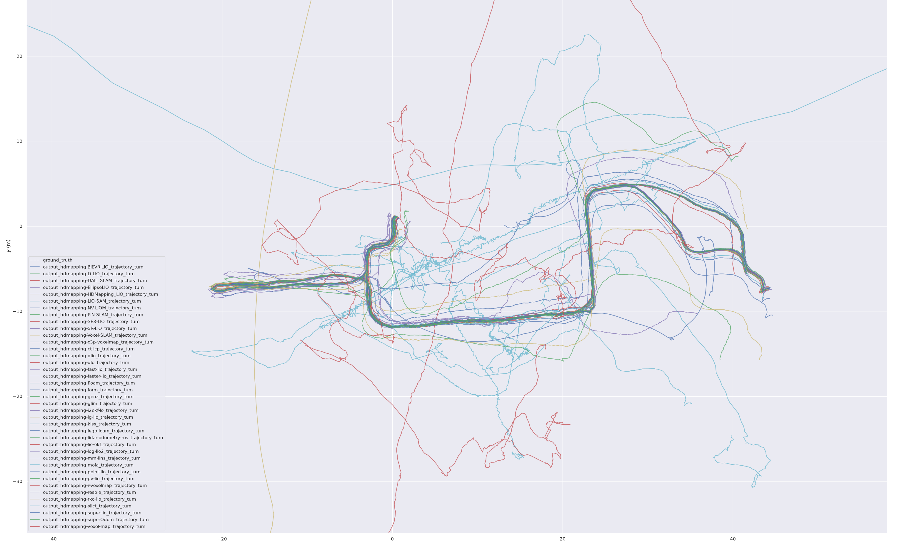

# benchmark-HDMapping-Orchestration

# Oxford Spires (this branch)

This branch benchmarks the [Oxford Spires dataset](https://huggingface.co/datasets/ori-drs/oxford_spires_dataset)
(Hesai QT64 lidar, Alphasense IMU, handheld). The algorithms read a **canonical bag** instead of the Livox
bags of the other branches. Each algorithm gets a `hdmapping-benchmark-canonical` branch in its own repo with a
config for that bag; until it has one, the benchmark skips it. The rest of this README describes the pipeline in
general, and this section only covers what is different here.

## Run

```bash
./start_benchmark.sh                                   # 2024-03-12-keble-college-02
OXFORD_SPIRES_SEQUENCE=<core sequence> ./start_benchmark.sh fast-lio   # one sequence, one algorithm
```

| Variable | Default |
|---|---|
| `OXFORD_SPIRES_SEQUENCE` | `2024-03-12-keble-college-02` (a core sequence: only those have `gt-tum.txt`) |
| `BENCHMARK_DATA_DIR` | `~/hdmapping-benchmark/data-oxford-spires` |
| `OXFORD_SPIRES_DOWNLOAD_DIR` | `<data dir>/download` (about 25 GB per sequence with its TLS map) |
| `STEP8_TIMEOUT` | `900` s per map; a diverged map's evaluation can take hours |

Step 1 does everything below on its own; each part can also run by hand.

## Step 1: dataset → canonical bag

The scripts are in `prepare_data_step1/oxford_spires/`, and `prepare.sh` is the only one to run. It builds the
two Docker images if they are missing (`build_images.sh`), downloads what is not there yet (`download.sh`), then
converts:

```bash
prepare_data_step1/oxford_spires/prepare.sh                                  # all defaults, as start_benchmark.sh
prepare_data_step1/oxford_spires/prepare.sh 2024-03-12-keble-college-02 ~/oxford-download ~/data-oxford-spires
```

Every argument is optional: `[sequence] [download_dir] [data_dir] [name]`. The defaults are those of
`start_benchmark.sh`, and its environment variables override them.

- `hdmapping-tools`: HDMapping's ROS-free converters `bag_to_laz`, `laz_to_bag`, `laz_to_mcap` and
  `mcap_to_laz`, from HDMapping branch `canonical-bag`. Set `HDMAPPING_SRC=<checkout>` when building to use a
  local checkout instead.
- `oxford-spires-tools`: `oxford_spires.py` and `rosbags-convert`.

`prepare.sh` writes, for `<name>` = the sequence without its date:

| Output                               | How                                                                                                                                                                                                                   |
|--------------------------------------|-----------------------------------------------------------------------------------------------------------------------------------------------------------------------------------------------------------------------|
| `<name>-hdmapping/`                  | `bag_to_laz` of the raw bag(s). The IMU is rotated into the lidar frame (from `cam-lidar-imu.yaml`) and converted to g. The ring is kept as the LAS extra-bytes attribute `ring`. This is the input of HDMapping-LIO. |
| `<name>.bag`                         | `laz_to_bag --lidar-type canonical --msg_hz 10`: the canonical ROS1 bag                                                                                                                                               |
| `<name>-ros2/`                       | the same, as a ROS2 sqlite3 bag (`rosbags-convert`; the Humble images have no MCAP plugin)                                                                                                                            |
| `<name>.mcap`                        | the same as MCAP, only with `WRITE_MCAP=1`                                                                                                                                                                            |
| `ground_truth.tum`                   | `gt-tum.txt` (base frame, ICP to TLS) moved to the lidar frame; step 4 uses it                                                                                                                                        |
| `HDMappingGroundTruth/lio_result_0/` | ground-truth session for steps 4, 7 and 8: raw scans deskewed with the ground truth, in 5 s chunks                                                                                                                    |
| `TLS-FARO-Focus/map_gt_0.01.laz`     | step 8 reference: the site's TLS map cropped to the walk plus 20 m                                                                                                                                                    |

## Canonical bag

| Topic | Type | Content |
|---|---|---|
| `/lidar/pointcloud` | `sensor_msgs/PointCloud2` | One message per 100 ms, `frame_id: lidar`. Fields: `x y z intensity` (float32), `ring` (uint16, the laser 0–63), `time` (float32 s), `t` (uint32 ns). |
| `/lidar/imu` | `sensor_msgs/Imu` | `frame_id: lidar`. Rotated into the lidar frame, rad/s and m/s². |

- `time` and `t` are relative to `header.stamp`, which is the first point.
- Points are sorted by time, ties by ring.
- The layout matches the Velodyne point type of FAST-LIO (`lidar_type: 2`, `timestamp_unit: 0`), LIO-SAM
  (`sensor: velodyne`) and their derivatives. PCL matches fields by name *and* type, so use the Velodyne
  mode, not an Ouster one (`ring` as uint8).
- **Known issue, IMU lever arm:** the IMU is rotated into the lidar frame, but its accelerations are not
  transferred to the lidar origin. The missing term is `α × r + ω × (ω × r)` for the 8.6 cm lever arm: about
  0.09 m/s² at 1 rad/s, and about 0.4 m/s² in a 5 rad/s² turn. In the bag, the lidar–IMU extrinsic is identity
  (rotation and translation), so configs must say identity too.
- Hesai QT64 values for configs:
  - 64 rings, vertical field of view −52.5° to +52.1°, unevenly spaced;
  - up to about 1200 points per ring per sweep;
  - range 0.13–60 m;
  - IMU noise in `calibration/imu.yaml`.

## Adding an algorithm

Do it one algorithm at a time:

1. In `benchmark-<algo>-to-HDMapping`, create a branch `hdmapping-benchmark-canonical`. It is the same for every
   dataset converted to the canonical bag; step 2 checks it out (`ALGO_BRANCH` overrides the name).
2. Point the run script at `/lidar/pointcloud` and `/lidar/imu`.
3. Start from the algorithm's own spinning-lidar (Velodyne) config, and change only the sensor description:
   rings, time unit, ranges, field of view and IMU noise.
4. In `algorithms.conf` on this branch, set the algorithm's input to `canonical` (ROS1 bag) or
   `canonical-ros2` (ROS2 bag). HDMapping-LIO's input, `hdmapping` (the session), is already produced
   here, so it runs from its repo's current checkout until that repo has a `hdmapping-benchmark-canonical` branch.
5. Run `./start_benchmark.sh <algo>`.

Step 2 skips repos without that branch on GitHub, and step 3 skips algorithms whose input is still a
Livox one (`raw`, `pc`, `ros2`, `ros2-lidar`). Converted so far: fast-lio, lio-sam, kiss-icp, faster-lio, point-lio, ig-lio, pv-lio, r-voxelmap, dlio, dlo, ct-icp, lio-ekf, lego-loam, form, nv-liom, se3-lio, dalislam, voxelslam, log-lio2, sr-lio, floam, map-lio, super-lio, i2ekf-lo, voxel-map, slict, c3p-voxelmap.

**Exception, code patches:** where a config cannot describe the sensor, the branch patches the algorithm's code
in its Dockerfile, with a guard that fails the build if the patched line changes upstream. So far:
- **R-VoxelMap:** its Velodyne-with-time mode (`lidar_type: 5`) converts `time` to ms with a hard-coded `1e-3`, i.e. it assumes
  µs. Patched to `1e3` for the canonical seconds; without it deskew is off.
- **R-VoxelMap:** it stamps odometry and clouds with `ros::Time::now()`, the replay clock at publish time, 10–20 ms behind the
  scan. Patched to `lidar_end_time`, which its own TUM output uses. Without it evo pairs only 913 of 2996 poses
  with the ground truth. The Livox route has the same problem.
- **DLIO** keeps `t`, `time` and `timestamp` in one union, and PCL copies fields in offset order, so with the
  canonical `time` + `t` the union holds `t`; but its sensor detection stops at `time` (VELODYNE) and reads the
  ns bits as float seconds (~1e-37): deskew silently off. Patched to pick OUSTER (`t`) whenever `t` is present.
- **CT-ICP** publishes the pose at the end of the scan with the cloud's header stamp, the first point's time, so
  every pose is one sweep (0.1 s) early. Patched to stamp the odometry at the scan end (header stamp + the scan's
  point-time span). On keble-college-02 the unpatched run scored APE 0.131 m; shifting that trajectory by +0.1 s
  gives 0.091 m.
- **Voxel-SLAM** stamps its pose (TF `camera_init` -> `aft_mapped`) and `/map_scan` with `ros::Time::now()`,
  so consecutive stamps were 90-111 ms apart and evo paired only 2544 of 2995 poses. Patched to the state's time
  `x_curr.t` (scan end): 2980 poses, APE 0.035 m (unchanged), RPE 0.0063 -> 0.0034 m.
- **F-LOAM** ignores the `ring` field and derives the scan ID from the elevation angle with fixed Velodyne tables;
  the HDL-64 one (−24.3 to +2°) keeps only ~20 of the QT64's rings. Patched to take the scan ID from `ring` when the
  cloud has one.
- **MAP-LIO** never initialises `bool lidar_pushed`. With a garbage value its sync never loads the first scan, so
  it skips every scan and publishes nothing; whether it happens depends on memory contents. Patched to `false`, as
  in FAST-LIO. A bug fix, not a sensor description. The Livox route's empty MAP-LIO result is probably the same bug
  (not checked).
- **C3P-VoxelMap:** same `time * 1e-3` (µs) assumption as R-VoxelMap in its VELO32 handler (`lidar_type: 5`).
  Patched to `1e3`.

## Known issues

- **IMU lever arm:** see "Canonical bag". The accelerations are not transferred to the lidar origin.
- **Faster-LIO is worse on the canonical bag than on the Livox route** (keble-college-02: APE 0.103 m and map
  F-score 0.367, against 0.064 m and 0.552). Its canonical config is its upstream `velodyne.yaml` with only the
  sensor description changed, and everything else in that file was tuned for NCLT. A suspect was
  `extrinsic_est_en: true` (online IMU–lidar estimation), which is off in its `avia.yaml` and in FAST-LIO's
  `velodyne.yaml`. But PV-LIO's upstream `velodyne.yaml` has it on too and scores APE 0.043 m on the canonical
  bag, so that setting alone does not explain it; the cause is open. It is left as is by the
  sensor-description-only rule. The alternative, a written rule to turn off online extrinsic estimation for every
  algorithm when the bag's extrinsic is exact (as it is here), was considered and not taken.
- **Point-LIO is worse on the canonical bag than on the Livox route** (keble-college-02: APE 0.189 m and map
  F-score 0.359, against 0.099 m and 0.407), while its RPE is better (0.0086 m against 0.0166 m). Its config is
  upstream `velody16.yaml` with only the sensor description changed. Cause not identified; candidates are the
  uncorrected IMU lever arm (its IMU-as-output model leans on raw accelerations) and `point_filter_num 4` on 64
  rings.
- **DLO's map is keyframes only** (keble-college-02: map F-score 0.053, recall 0.03, the same as on the Livox
  route). Its run script records the keyframe clouds, which upstream spaces 5 m apart (`threshD`), not every
  scan. This predates the canonical bag. Its trajectory also covers only 278 s of the sequence: it starts 5 s
  late (IMU calibration) and ends 17 s early (not investigated; probably processing lag). DLO does not deskew.
- **LIO-EKF drifts horizontally** (keble-college-02: APE 1.539 m, of which 1.53 m in xy and 0.16 m in z,
  growing to 3.8 m at the end), while its RPE is 0.050 m. Its config is upstream `m2dgr.yaml` (a ground robot:
  1 m voxels, one ICP iteration, IMU noise of M2DGR's handsfree IMU) with only the sensor description changed.
  Its upstream `newerCollege.yaml` (handheld Ouster) was not tried: choosing a config by its score is tuning.
  The Livox route gave no LIO-EKF result.
- **LIO-EKF's map is its local map** (map F-score 0.019, recall 0.012): the run script records `/local_map`, the
  downsampled voxel map, not every scan. This predates the canonical bag.
- **LeGO-LOAM's RPE is not comparable** with the other methods': its mapping (and so its odometry output) runs
  every 0.3 s (upstream `mappingProcessInterval`), so its poses come at ~2.5 Hz and RPE is taken over ~0.4 s
  steps instead of 0.1 s (keble-college-02: RPE 0.586 m, 744 matched poses). APE (0.179 m) and the map
  (F-score 0.285) are comparable.
- **NV-LIOM's RPE is not comparable** either, the other way round: its odometry is the 400 Hz IMU odometry,
  so evo pairs consecutive poses ~40 ms apart (keble-college-02: RPE 0.0062 m, 7607 matched poses). APE (0.147 m)
  and the map (F-score 0.377) are comparable. Its range image has evenly spaced rows (64 over 106.5 deg), so a few
  of the QT64's denser rings near the horizon (1.46 deg apart) share a row; NV-LIOM keeps the nearest point.
- **SE3-LIO's map scores low** (keble-college-02: map F-score 0.226, against APE 0.049 m; Livox route 0.261): the
  run script records `/local/cloud_registered_body`, probably the scan after SE3-LIO's 1 m downsampling (not
  checked). This predates the canonical bag.
- **LOG-LIO2 runs without its normal model** (keble-college-02: APE 0.033 m, RPE 0.0022 m, map F-score 0.573;
  Livox route 0.224 / 0.108 / 0.151): `compute_normal` is off, because the ring-based normals need a ring angle
  table LOG-LIO2 has only for its own lidars. The score is plain point-to-plane LIO, not the full method.
- **SR-LIO** (keble-college-02: APE 0.046 m, RPE 0.0031 m, map F-score 0.076; Livox route 0.040 / 0.012 / 0.138):
  it publishes a pose per half-sweep (20 Hz), so its RPE is over 50 ms steps. The map scores low (recall 0.042)
  probably because the run script records `/cloud_global_map`, only the points each sweep adds to the voxel map (not
  checked). This predates the canonical bag.
- **F-LOAM diverges** (keble-college-02: APE 5.75 m, RPE 0.085 m; Livox route 15.6 / 1.78): about 2-3 m for the
  first ~250 s, then 22 m at the end; the map evaluation hits step 8's 900 s limit. F-LOAM is lidar-only with no
  deskew. Its ring patch takes the scan ID from the cloud's `ring` field instead of the HDL-64 elevation table.
- **I2EKF-LO diverges** (keble-college-02: APE 20.97 m, RPE 0.133 m; Livox route 15.67 / 0.099 / F 0.029):
  within ~0.25 m for the first ~45 s, then it drifts (~13 m at 150 s, ~75 m at the end); the map evaluation hits
  step 8's 900 s limit. I2EKF-LO is lidar-only; config-only conversion, no code patch.
- **VoxelMap diverges** (keble-college-02: APE 22.17 m, RPE 0.339 m; Livox route 17.9 / 0.750, map failed):
  ~1 m at 45-60 s, 13 m at 200 s, >60 m near the end; the map evaluation hits step 8's 900 s limit. Its upstream
  spinning-lidar config (KITTI) is lidar-only and reads no per-point time, so scans are not deskewed. Config-only:
  lidar_type 3 (the velodyne handler without its HDL-64 elevation window), calib_laser false.
- **C3P-VoxelMap runs with its IMU on**, beyond the sensor description (keble-college-02: APE 0.059 m, RPE
  0.037 m, map F-score 0.388; Livox route 24.7 / 1.26 / 0.005): its upstream spinning-lidar config (KITTI) is
  lidar-only, and like that it diverged (APE 22.3 m, F 0.009). With `imu_en: true` (identity extrinsic, default
  noise scales) it propagates and deskews with the IMU. The high RPE is probably its pose stamps,
  `ros::Time::now()` at publish time (not checked).

## Other differences from the Bunker branch

- **Data dir:** steps 4–6 and `validate.sh` read it from `BENCHMARK_DATA_DIR`.
- **Ground truth:** step 4 takes `ground_truth.tum` from the data dir when it is there.
- **Step 5:** saves the trajectory plot to `tum/trajectories_xy.png` instead of opening a window.
- **Step 8:** `--timeout SECONDS` stops a map's evaluation and records it as failed.
- **Step 4 memory:** it loads every selected session at once. With all 41 algorithms on Oxford that needed
  more than 60 GB of RAM. Run it in batches with `ONLY_ALGOS`, and include in every batch the session that
  starts latest, so all batches align at the same instant.

# 0. Dataset and workspace setup

## Download the dataset

Download `reg-1.bag` from the [direct download](https://cloud.cylab.be/public.php/dav/files/7PgyjbM2CBcakN5/reg-1.bag)
or [Zenodo](https://zenodo.org/records/23069933). It is part of the
[Bunker DVI Dataset](https://charleshamesse.github.io/bunker-dvi-dataset).
For download problems, contact januszbedkowski@gmail.com.

Also download the complete `HDMappingGroundTruth` and `TLS-FARO-Focus` directories
from the same Zenodo record.

If the bag archive is split into `reg-1.zip.part-000`, `reg-1.zip.part-001`, etc.,
download all parts, then merge and extract them:

```bash
cd ~/Downloads
cat reg-1.zip.part-0* > full.zip
zip -F full.zip --out full-fixed.zip
unzip full-fixed.zip
```

## Prepare the workspace

```shell
mkdir -p ~/hdmapping-benchmark/data
cd ~/hdmapping-benchmark
git clone https://github.com/MapsHD/benchmark-HDMapping-Orchestration.git
cd benchmark-HDMapping-Orchestration
git checkout Bunker-DVI-Dataset-reg-1
```

Place `reg-1.bag` and both extracted ground-truth directories in `data/`.
Preserve all files referenced by the ground-truth session:

```text
~/hdmapping-benchmark/
├── benchmark-HDMapping-Orchestration/
├── mandeye_to_bag/                  # helper source, if cloned here
├── livox_bag_aggregate/             # helper source, if cloned here
└── data/
    ├── reg-1.bag
    ├── HDMappingGroundTruth/
    │   └── lio_result_0/
    │       ├── session.mjs
    │       ├── session_ini_poses.mri
    │       ├── session_poses.mrp
    │       ├── scan_lio_*.laz
    │       └── trajectory_lio_*.csv
    └── TLS-FARO-Focus/
        ├── map_gt_0.01.laz
        └── map_gt_0.01.pcd
```

Steps 4 and 7 require `HDMappingGroundTruth/lio_result_0/session.mjs`.
Step 8 requires `TLS-FARO-Focus/map_gt_0.01.laz`; the PCD is not used by Step 8.
Prepared bags, algorithm repositories and benchmark results are generated by the
pipeline and are not required in this initial layout.

## Prerequisites

Use Linux with Bash, Git, Python 3, Docker access and internet access for builds.
Archive extraction uses `zip` and `unzip`. Steps displaying trajectory plots or
algorithm visualizations also need a graphical session with X access.

Build the helper Docker images using the instructions in
[mandeye_to_bag](https://github.com/MapsHD/mandeye_to_bag) and
[livox_bag_aggregate](https://github.com/MapsHD/livox_bag_aggregate):

- `livox_bag_aggregate_noetic:latest`
- `mandeye-ws_noetic:latest`
- `mandeye-ws_humble:latest`

Helper source directories are not required if these images exist. Algorithm and
evaluation images are built by the pipeline.

A GPU is recommended but not required. PIN-SLAM uses an NVIDIA GPU through the
[NVIDIA Container Toolkit](https://docs.nvidia.com/datacenter/cloud-native/container-toolkit/latest/install-guide.html)
when available and otherwise falls back to CPU. All other algorithms run on CPU.

## Validate setup

[validate.sh](validate.sh) checks the workspace, input bag, FARO LAZ, ground-truth
session and its referenced pose files, scans and trajectory CSVs. It also checks
Docker access and the three helper images above. No Python packages are needed.

```shell
cd ~/hdmapping-benchmark/benchmark-HDMapping-Orchestration
bash ./validate.sh
```

Validation does not modify data, build images or run containers. The automatic
runner invokes it before any stage; run it explicitly for step-by-step execution.

# 1. Make all scripts executable

```shell
chmod +x ~/hdmapping-benchmark/benchmark-HDMapping-Orchestration/start_benchmark.sh
chmod +x ~/hdmapping-benchmark/benchmark-HDMapping-Orchestration/validate.sh
chmod +x ~/hdmapping-benchmark/benchmark-HDMapping-Orchestration/clean.sh
chmod +x ~/hdmapping-benchmark/benchmark-HDMapping-Orchestration/algos_lib.sh
chmod +x ~/hdmapping-benchmark/benchmark-HDMapping-Orchestration/prepare_data_step1/prepare_data_step1.sh
chmod +x ~/hdmapping-benchmark/benchmark-HDMapping-Orchestration/prepare_data_step1/mandeye-convert.sh
chmod +x ~/hdmapping-benchmark/benchmark-HDMapping-Orchestration/prepare_data_step1/livox_bag.sh
chmod +x ~/hdmapping-benchmark/benchmark-HDMapping-Orchestration/clone_github_repositories_step2/clone_github_repositories_step2.sh
chmod +x ~/hdmapping-benchmark/benchmark-HDMapping-Orchestration/run_benchmark_step3/run_benchmark_step3.sh
chmod +x ~/hdmapping-benchmark/benchmark-HDMapping-Orchestration/conversion_tum_step4/run_tum_step4.sh
chmod +x ~/hdmapping-benchmark/benchmark-HDMapping-Orchestration/evo_step5/tum-to-latex_step5.sh
chmod +x ~/hdmapping-benchmark/benchmark-HDMapping-Orchestration/registration_step7/run_registration_step7.sh
chmod +x ~/hdmapping-benchmark/benchmark-HDMapping-Orchestration/registration_step7/register_sessions.sh
chmod +x ~/hdmapping-benchmark/benchmark-HDMapping-Orchestration/point_cloud_evaluation_step8/run_evaluation_step8.sh
chmod +x ~/hdmapping-benchmark/benchmark-HDMapping-Orchestration/utilities/hdmapping_export/run_hdmapping_export.sh
chmod +x ~/hdmapping-benchmark/benchmark-HDMapping-Orchestration/utilities/hdmapping_export/export_sessions.sh
```

This covers the automatic runner, all stage scripts, validation, cleanup and the
optional export utility.

# 2. Run modes

- [2.1 Full automation](#21-full-automation): run Steps 1-8 with one command.
- [2.2 Step by step](#22-step-by-step): run individual stages in order.

Both modes use the workspace prepared in Section 0. Algorithm selection uses the
case-sensitive `id` column in [algorithms.conf](algorithms.conf). Unknown IDs abort
the selection and print the known IDs.

## 2.1 Full automation

[start_benchmark.sh](start_benchmark.sh) validates setup and runs Steps 1-8.
The [optional utilities](#3-optional-utilities) are not part of this pipeline.

### Run with defaults

```shell
cd ~/hdmapping-benchmark/benchmark-HDMapping-Orchestration
./start_benchmark.sh
```

### Run with options

Use **0.025 m** for the Step 7 bucket, Step 8 voxel filter and precision/recall
threshold, with two simultaneous evaluations:

```shell
cd ~/hdmapping-benchmark/benchmark-HDMapping-Orchestration
./start_benchmark.sh \
    --bucket-size 0.025 \
    --voxel-size 0.025 \
    --threshold 0.025 \
    --jobs 2
```

### Run selected algorithms with defaults

```shell
cd ~/hdmapping-benchmark/benchmark-HDMapping-Orchestration
./start_benchmark.sh sr-lio pv-lio
```

Positional IDs restrict Steps 2, 3, 4, 7 and 8. Without positional IDs, all
algorithms are selected unless `ONLY_ALGOS` is already set.

### Arguments and defaults

| Argument or setting | Purpose | Default |
| --- | --- | --- |
| `--bucket-size METERS` | Step 7 per-scan registration bucket | `0.05 m` |
| `--voxel-size METERS` | Step 8 voxel filtering of both clouds; `0` disables it | `0.05 m` |
| `--threshold METERS` | Step 8 precision/recall agreement threshold | `0.05 m` |
| `--jobs N` | Simultaneous Step 8 algorithm evaluations | `1` |
| `--no-force` | Preserve existing Step 7/8 result folders instead of replacing them | Off |
| `algo ...` | Selected algorithm IDs | All, or `ONLY_ALGOS` if set |
| `ONLY_ALGOS` | Environment-based algorithm selection when no IDs are passed | Unset |
| `HDMAPPING_BUILD_JOBS` | Step 7/8 image compilation parallelism | `2` |
| `--help` | Show usage without running stages | Not set |

The distance settings are independent. Bucket size and threshold must be finite
and positive; voxel size must be finite and nonnegative. Jobs must be a positive
integer and affect Step 8 only. CLI settings are validated before any stage runs.

The runner uses `~/hdmapping-benchmark/data` and the standard output directories;
it does not expose path options. **Steps 7 and 8 permanently replace selected
results by default.** Use `--no-force` to preserve their existing result folders,
or separate output directories with the individual runners to keep multiple runs.
See [Step 7](#step-7-register-algorithm-point-clouds-to-ground-truth)
and [Step 8](#step-8-evaluate-registered-point-clouds-against-faro).

## 2.2 Step by step

Run the following stages in order. Each command block includes its working
directory and can be copied independently after completing Sections 0 and 1.
Steps 2, 3, 4, 7 and 8 accept `ONLY_ALGOS`; Steps 5 and 6 process all matching
trajectories already present in `data/tum`.

### Step 1 Prepare data

Convert the original bag to aggregated point clouds, ROS2 bags and HDMapping
(Mandeye) data using the prerequisite helper images.

#### Run with standard inputs

```shell
cd ~/hdmapping-benchmark/data
~/hdmapping-benchmark/benchmark-HDMapping-Orchestration/prepare_data_step1/prepare_data_step1.sh reg-1.bag .
```

#### Result

The outputs beside `reg-1.bag` are `reg-1.bag-pc.bag`, `reg-1-ros2/`,
`reg-1-ros2-lidar/` and `reg-1-hdmapping/`.
Preparation is shared by all algorithms; it has no algorithm selection.

#### Arguments and defaults

| Argument | Purpose | Default |
| --- | --- | --- |
| `<ros1_bag>` | Original ROS1 bag path | Required; example uses `reg-1.bag` |
| `<output_dir>` | Existing destination directory | Required; example uses `.` |

There are no additional runner options.

### Step 2 Clone repositories and build images

Clone the algorithm repositories into `~/hdmapping-benchmark`, check out the
requested branch and build each available Dockerfile.

#### Run with interactive branch selection

```shell
cd ~/hdmapping-benchmark/benchmark-HDMapping-Orchestration
./clone_github_repositories_step2/clone_github_repositories_step2.sh
```

At the prompt, enter `Bunker-DVI-Dataset-reg-1` for this dataset.

#### Run with options

Pass the branch explicitly to avoid the prompt:

```shell
cd ~/hdmapping-benchmark/benchmark-HDMapping-Orchestration
./clone_github_repositories_step2/clone_github_repositories_step2.sh Bunker-DVI-Dataset-reg-1
```

#### Run selected algorithms with defaults

```shell
cd ~/hdmapping-benchmark/benchmark-HDMapping-Orchestration
ONLY_ALGOS="sr-lio pv-lio" ./clone_github_repositories_step2/clone_github_repositories_step2.sh
```

This still prompts for the branch. Repositories without a Dockerfile are reported
as manual procedures; consult their READMEs. Build failures are listed at the end.

#### Arguments and defaults

| Argument or setting | Purpose | Default |
| --- | --- | --- |
| `[branch_name]` | Branch for all selected repositories | Interactive prompt |
| `ONLY_ALGOS` | Selected algorithm IDs | All |
| `--help` | Show usage | Not set |

### Step 3 Run algorithms

Run the selected algorithms using the prepared inputs from Step 1 and images
from Step 2. Each algorithm writes into `data/<algorithm-id>/`.

#### Run with standard inputs

```shell
cd ~/hdmapping-benchmark/data
~/hdmapping-benchmark/benchmark-HDMapping-Orchestration/run_benchmark_step3/run_benchmark_step3.sh reg-1.bag reg-1-ros2 .
```

#### Run selected algorithms with standard inputs

```shell
cd ~/hdmapping-benchmark/data
ONLY_ALGOS="sr-lio pv-lio" ~/hdmapping-benchmark/benchmark-HDMapping-Orchestration/run_benchmark_step3/run_benchmark_step3.sh reg-1.bag reg-1-ros2 .
```

#### Arguments and defaults

| Argument or setting | Purpose | Default |
| --- | --- | --- |
| `<ros1_bag>` | Original ROS1 bag; other input paths are derived from its name | Required; example uses `reg-1.bag` |
| `<ros2_bag_dir>` | ROS2 bag directory | Required; example uses `reg-1-ros2` |
| `<output_dir>` | Parent directory for per-algorithm outputs | Required; example uses `.` |
| `ONLY_ALGOS` | Selected algorithm IDs | All |
| `--help` | Show usage | Not set |

Input kinds come from [algorithms.conf](algorithms.conf); no extra tuning flags
are exposed by this runner. Algorithms without an executable run script are
reported as manual procedures and skipped.

### Step 4 Register sessions and export TUM trajectories

Build `hdmapping_tum`, back up algorithm outputs to `data/backup/`, register
sessions against ground truth and export their TUM trajectories into `data/tum/`.
The runner also copies `ground_truth.tum` there.

#### Run with defaults

```shell
cd ~/hdmapping-benchmark/data
~/hdmapping-benchmark/benchmark-HDMapping-Orchestration/conversion_tum_step4/run_tum_step4.sh
```

#### Run selected algorithms with defaults

```shell
cd ~/hdmapping-benchmark/data
ONLY_ALGOS="sr-lio pv-lio" ~/hdmapping-benchmark/benchmark-HDMapping-Orchestration/conversion_tum_step4/run_tum_step4.sh
```

#### Arguments and defaults

| Argument or setting | Purpose | Default |
| --- | --- | --- |
| `ONLY_ALGOS` | Sessions to register and export | All |
| `--help` | Show usage | Not set |

There are no path or tuning arguments. Inputs are under
`~/hdmapping-benchmark/data`; backups include all available algorithm folders,
even when trajectory processing is restricted to a subset.

### Step 5 Evaluate trajectories with evo

Build `evo` and compute absolute and relative pose errors from `data/tum/`.
A trajectory plot opens in the graphical session.

#### Run with defaults

```shell
cd ~/hdmapping-benchmark/data
~/hdmapping-benchmark/benchmark-HDMapping-Orchestration/evo_step5/tum-to-latex_step5.sh
```

#### Result

Results in `data/tum/` include `table_ape.csv`, `table_rpe.csv`,
`table_ape.tex`, `table_rpe.tex`, `ape_table_github.md` and `rpe_table_github.md`.

#### Arguments and defaults

The runner has no CLI options or algorithm selector. It processes all matching
trajectory files in `~/hdmapping-benchmark/data/tum` against `ground_truth.tum`.

### Step 6 Evaluate trajectory overlap

Compute time coverage, trajectory node ratios and frequencies relative to the
ground-truth trajectory.

#### Run with defaults

```shell
cd ~/hdmapping-benchmark/data
python3 ~/hdmapping-benchmark/benchmark-HDMapping-Orchestration/overlap_step6/overlap.py
```

#### Result

Per-algorithm coverage is printed to the terminal. Markdown and LaTeX reports
are written into `data/tum/`.

#### Arguments and defaults

The script has no CLI options or algorithm selector. It reads all matching TUM
trajectories and `ground_truth.tum` from `~/hdmapping-benchmark/data/tum`.

### Step 7 Register algorithm point clouds to ground truth

HDMapping's `session_to_session_rigid_registration` registers each algorithm
session to `HDMappingGroundTruth/lio_result_0/session.mjs`. It estimates one rigid
transform from timestamp-matched trajectory positions and exports a merged
`registered.laz` for Step 8. `--bucket-size METERS` controls per-scan downsampling
of both sessions and defaults to **0.05 m**. Larger buckets retain fewer points;
the trajectory-based fitting uses the same trajectory nodes.

#### Prerequisites

- Docker and internet access for the image build.
- The complete ground-truth directory from the [dataset setup](#0-dataset-and-workspace-setup).
- Algorithm sessions from Steps 3-4, with scans, pose files and trajectory CSVs.
- RAM for the ground-truth session and one algorithm session, plus disk space
  for registered clouds. Registration runs sequentially.

#### Run with defaults

```shell
cd ~/hdmapping-benchmark/data
~/hdmapping-benchmark/benchmark-HDMapping-Orchestration/registration_step7/run_registration_step7.sh
```

The script builds `hdmapping_rigid_registration` and processes the configured
algorithms sequentially.

#### Run with options

Use **0.025 m** buckets:

```shell
cd ~/hdmapping-benchmark/data
~/hdmapping-benchmark/benchmark-HDMapping-Orchestration/registration_step7/run_registration_step7.sh \
    --bucket-size 0.025
```

Selected result folders are replaced by default, including when changing bucket
size. Use a separate `--output-dir` to keep multiple runs.

#### Run selected algorithms with defaults

```shell
cd ~/hdmapping-benchmark/data
ONLY_ALGOS="sr-lio pv-lio" ~/hdmapping-benchmark/benchmark-HDMapping-Orchestration/registration_step7/run_registration_step7.sh
```

#### Result and input for Step 8

For each selected algorithm, the source is exactly one of:

```text
<data-dir>/<algorithm-id>/output_hdmapping-<output>/session.json
<data-dir>/<algorithm-id>/output_hdmapping-<output>/session.mjs
```

`<output>` is the output column of [algorithms.conf](algorithms.conf).
Exactly one session file must be present.

Successful registration produces:

```text
<output-dir>/
├── fast-lio/
│   ├── registered.laz
│   ├── registration.log
│   ├── sanity_check_trg.txt
│   └── sanity_check_src.txt
└── registration_summary.csv
```

- `registered.laz`: merged algorithm cloud in the ground-truth frame.
- `registration.log`: application diagnostics and output validation.
- `sanity_check_trg.txt` / `sanity_check_src.txt`: ground-truth and transformed
  algorithm trajectory positions, not TUM files.
- `registration_summary.csv`: input/output paths, bucket size and status:
  `registered`, `missing`, `ambiguous`, `existing` or `failed`.

CSV paths use `/data` for inputs and `/results` for outputs. Successful status
requires no known failure diagnostics, nonempty sanity-check files and a valid LAZ
header. These checks do not prove registration accuracy.

#### Timestamp-matching limitation

Each source node matches the first ground-truth node at or after its timestamp,
without interpolation. Nodes earlier than ground truth match its first pose;
nodes later than ground truth are excluded. FAST-LIO starts approximately 20
seconds earlier than ground truth in this dataset, which can affect the transform.

#### Missing inputs, failures and reruns

Missing ground truth aborts the stage. Algorithm failures are reported while
remaining algorithms continue. If at least one algorithm registers successfully,
the master pipeline continues to Step 8 using those successful registrations.
The command returns nonzero if none register or a stage-level error occurs.

**Selected registration folders are permanently replaced by default**, including
logs and partial outputs, once a valid, unambiguous source session is available.
Other algorithms and source data are untouched. Stop other runs writing to these
folders first.

With `--no-force`, completed registrations are validated and reused without overwriting files;
their report status is `registered`. Reuse requires successful completion and
output-validation records in the log, no failure diagnostics, nonempty sanity-check
trajectories, a valid LAZ header and a recorded bucket size matching the requested
value. An unrecorded or different bucket size cannot be reused.
These checks verify completion, not whether source sessions or ground truth have
changed. To register changed inputs or settings, run without `--no-force` or use
a separate `--output-dir`.

With `--no-force`, incomplete or invalid folders are preserved and reported as `existing`.
To retry, select a subset with `ONLY_ALGOS` and move its folders aside, or use a
separate output directory. Each run replaces `registration_summary.csv`.

To preserve selected registration folders and reuse completed results:

```shell
cd ~/hdmapping-benchmark/data
ONLY_ALGOS="fast-lio sr-lio" ~/hdmapping-benchmark/benchmark-HDMapping-Orchestration/registration_step7/run_registration_step7.sh --no-force
```

#### Arguments and defaults

| Argument or setting | Purpose | Default |
| --- | --- | --- |
| `--bucket-size METERS` | Per-scan downsampling of both sessions | `0.05 m` |
| `--no-force` | Reuse validated completed registrations; preserve other existing folders | Off |
| `--data-dir DIRECTORY` | Dataset and algorithm session directory | `~/hdmapping-benchmark/data` |
| `--output-dir DIRECTORY` | Registration results | `<data-dir>/step7_registration` |
| `ONLY_ALGOS` | Selected algorithm IDs | All |
| `HDMAPPING_BUILD_JOBS` | Image compilation parallelism | `2` |
| `--help` | Show usage | Not set |

Bucket size must be finite and positive. Inputs are read-only; outputs belong to
the invoking user. Relative paths are resolved from the calling directory.

For example, keep a separate **0.025 m** registration run:

```shell
cd ~/hdmapping-benchmark/data
~/hdmapping-benchmark/benchmark-HDMapping-Orchestration/registration_step7/run_registration_step7.sh \
    --bucket-size 0.025 \
    --output-dir "$HOME/hdmapping-benchmark/data/step7_registration_0025"
```

### Step 8 Evaluate registered point clouds against FARO

This stage compares each successful Step 7 cloud with
`TLS-FARO-Focus/map_gt_0.01.laz`, using
[MapsHD/point_clouds_evaluation](https://github.com/MapsHD/point_clouds_evaluation).
HDMapping's `laz_to_ply` converts the inputs to binary PLY. Evaluation uses
**0.05 m voxel downsampling of both algorithm and FARO clouds by default**,
controlled by `--voxel-size METERS`. Open3D replaces each occupied voxel's points
with their centroid. Use `--voxel-size 0` to evaluate full clouds.
There is no cropping or additional alignment.
Step 7 and FARO must use the same coordinate frame.

#### Prerequisites

- Docker and internet access for the image build; no GPU is required.
- `TLS-FARO-Focus/map_gt_0.01.laz` from the [dataset setup](#0-dataset-and-workspace-setup).
- Step 7's `registration_summary.csv` and algorithm `registered.laz` files.
  Rows marked `registered` are eligible. Rows marked `existing` are also eligible
  if their saved artifacts pass the completed-registration checks above.
- Substantial RAM for full-cloud nearest-neighbor searches and approximately
  **16 GiB of additional disk space** for converted clouds, excluding Docker
  storage. FARO has approximately 29 million points; algorithm clouds can exceed
  55 million points. Voxel filtering happens after full conversion and loading,
  so it does not reduce PLY disk usage or eliminate full-cloud loading peaks.
  Downsampling itself also needs temporary memory.

#### Run with defaults

```shell
cd ~/hdmapping-benchmark/data
~/hdmapping-benchmark/benchmark-HDMapping-Orchestration/point_cloud_evaluation_step8/run_evaluation_step8.sh
```

The script builds `hdmapping_point_cloud_evaluation`. `--jobs N` controls the
maximum number of simultaneous algorithm evaluations; the default is **1**.

#### Run with options

Use **0.025 m** voxels and precision/recall threshold with two simultaneous
evaluations:

```shell
cd ~/hdmapping-benchmark/data
~/hdmapping-benchmark/benchmark-HDMapping-Orchestration/point_cloud_evaluation_step8/run_evaluation_step8.sh \
    --voxel-size 0.025 \
    --threshold 0.025 \
    --jobs 2
```

Voxel size must be finite and nonnegative; threshold must be finite and positive.
The settings are independent: Step 7's bucket removes points within individual
scans, Step 8's voxel filter downsamples each merged cloud, and the threshold
defines agreement. They do not automatically change one another.
Evaluation replaces selected eligible result folders by default. Use `--no-force`
to preserve existing folders instead.
Use the same bucket, voxel and threshold settings for comparisons across algorithms;
different settings produce different metrics.

#### Run selected algorithms with defaults

```shell
cd ~/hdmapping-benchmark/data
ONLY_ALGOS="sr-lio pv-lio" ~/hdmapping-benchmark/benchmark-HDMapping-Orchestration/point_cloud_evaluation_step8/run_evaluation_step8.sh
```

#### Execution and progress

FARO is converted to full-resolution PLY once. Each map is evaluated by a separate
invocation of the upstream `pointcloud_metrics.py` CLI, which loads
and voxel-filters both clouds. Its default cache shares KD-trees and nearest-neighbor
queries across metrics within that invocation.
Worker threads manage the external converter and evaluator processes; numerical
evaluation does not share the coordinator's Python GIL. Each simultaneous
evaluation needs its own clouds, trees and query caches, including temporary
loading and voxel-filtering memory. Start with two workers and increase only if
RAM and disk throughput permit.
The image limits OpenMP and BLAS thread counts to 1. `HDMAPPING_BUILD_JOBS`
controls compilation only (default: 2).

An interactive terminal shows an overall completed-map bar and one stage bar per
worker. Each worker row names its algorithm and current phase, with algorithm
and phase elapsed times. Worker slots pick up another algorithm when they finish.
For example:

```text
Overall          |########------------| 15/37 [OK=14, failed=1]
W1 fast-lio      |########------------| 4/9 stages [Chamfer, elapsed=252s, phase=180s]
W2 sr-lio        |####----------------| 2/9 stages [Loading FARO, elapsed=38s, phase=25s]
```

The nine stages are hashing, conversion, FARO loading/filtering, algorithm
loading/filtering, Chamfer, Hausdorff, precision/recall, RMSE and saving.
Stage bars count completed checkpoints, not estimated runtime or point-query
percentage. Long native operations expose no internal progress; elapsed timers
continue updating while the stage stays unchanged.

The Docker runner enables a TTY only when output is a terminal. Redirected output
uses timestamped `W1 <algorithm>` messages instead of bars. A single coordinator
renders progress to avoid mixed worker output. Full upstream output, including
its timing table, is saved in each map's `evaluation.log`; FARO conversion uses
`reference/conversion.log`. Interactive bars use `tqdm` from the image's evaluator
dependencies, without changes to the upstream repository.

#### Metrics

All distances are in meters. Precision, recall and F-score are fractions in
`[0, 1]`. `--threshold METERS` defaults to **0.05 m**, with a strict less-than
comparison. All metrics use the clouds after the selected voxel filtering.

| Output field | Definition |
| --- | --- |
| `chamfer_algorithm_to_faro_m` | Mean algorithm-to-FARO nearest-neighbor distance |
| `chamfer_faro_to_algorithm_m` | Mean FARO-to-algorithm nearest-neighbor distance |
| `chamfer_distance_m` | Average of the two directional means; not a squared distance |
| `hausdorff_distance_m` | Maximum nearest-neighbor distance across both directions |
| `precision` | Fraction of evaluated algorithm points closer than the threshold to evaluated FARO |
| `recall` | Fraction of evaluated FARO points closer than the threshold to the evaluated algorithm |
| `fscore` | Harmonic mean of precision and recall |
| `rmse_m` | Upstream RMSE: FARO-to-algorithm nearest-neighbor RMS for unequal point counts; row-correspondence RMS for equal counts |

The upstream CLI receives FARO first and the algorithm second. Directional Chamfer
fields are mapped accordingly; upstream precision and recall are swapped in the
summary to retain the algorithm-as-prediction definitions above. RMSE is taken
directly from upstream and does not consistently represent algorithm-to-FARO
nearest-neighbor error. Equal point counts do not establish actual correspondence.

Only XYZ geometry is evaluated; colors, normals, intensity and timestamps are
not used.

#### Result

```text
<output-dir>/
├── reference/
│   ├── faro.ply
│   ├── conversion.log
│   └── source.json
├── fast-lio/
│   ├── registered.ply
│   ├── upstream_metrics.json
│   ├── metrics.json
│   └── evaluation.log
├── evaluation_summary.csv
├── evaluation_summary.md
└── evaluation_summary.tex
```

- `reference/source.json`: FARO path, SHA-256 and point count for cached conversion.
- `<algorithm-id>/upstream_metrics.json`: unmodified upstream CLI metric output.
- `<algorithm-id>/metrics.json`: input paths and fingerprints, point counts,
  `voxel_size_m`, `threshold_m`, `additional_downsampling`, `evaluation_backend`,
  and the eight metrics.
  `algorithm_input_points` / `reference_input_points` count full input points;
  `algorithm_points` / `reference_points` count points actually evaluated.
  Written atomically on success.
- `<algorithm-id>/evaluation.log`: conversion and evaluation progress.
- `<algorithm-id>/failure.json`: error details when failure recording is possible.
- `evaluation_summary.csv` / `.md`: statuses, counts, metrics and errors, updated
  atomically by the coordinator after all workers finish, using their saved
  reports in [algorithms.conf](algorithms.conf) order, not completion order.
  Both reports include voxel size and threshold. Unavailable metrics are blank
  in CSV and `-` in Markdown.
- `evaluation_summary.tex`: self-contained LaTeX document with an A4 landscape page
  and 15 mm margins. The standalone wrapper centers the complete table and caption
  horizontally and vertically, shrinking them together only if needed to fit one
  page. It uses the standard `geometry`, `adjustbox`, `caption` and `environ`
  packages. The copy-pasteable table itself is unchanged and needs no extra
  packages. Compile the document directly, or copy only the section
  between `% BEGIN COPY-PASTE TABLE` and `% END COPY-PASTE TABLE` into another
  document. Separate comment guards identify the standalone preamble and footer.
  The table includes a caption and label, plus every selected algorithm's
  status and all eight metrics in the same order as CSV/Markdown, with six decimal
  places and `-` for unavailable values. The caption documents units, voxel size,
  threshold and metric definitions. Paths, point counts and error messages remain
  in CSV/Markdown and are not referenced in the LaTeX document. The table is wide;
  adjust the font size or page orientation when copying it into your document.
  Change the label when including multiple evaluation tables.

All three summaries are written atomically per file by the same report-generation
paths, including failure/interruption reporting. Use `--merge-only` to generate
them from saved results without rerunning cloud evaluation.

Workers write only their own per-algorithm reports. Existing combined reports
remain from the previous run until the final merge replaces them.
`.evaluation.lock` prevents simultaneous evaluation or merge runs using the same
output directory. The lock file remains on disk; the lock is released when the
process exits.

Conversion validates full-resolution point counts. Evaluated counts are read from
the upstream CLI's two `Points:` log lines because its JSON contains metrics only;
missing or invalid counts fail the map. Saved metrics must be finite, nonnegative
numbers, with precision, recall and F-score in `[0, 1]`.

CSV/JSON paths use container prefixes: `/data` is the dataset directory,
`/registration` is the selected Step 7 directory, and `/evaluation` is the output
directory.

#### Missing inputs, failures and reruns

Missing FARO or a missing/invalid Step 7 report aborts the stage.

| Status | Meaning |
| --- | --- |
| `evaluated` | Conversion and evaluation succeeded |
| `not_registered` | Skipped: Step 7 status is missing, failed, ambiguous, unreported, or existing but not validated |
| `missing_input` | Step 7 claims success, but its LAZ is missing or empty |
| `existing` | With `--no-force`, an evaluation folder already exists and is not overwritten |
| `failed` | FARO preparation, conversion, loading, or metric computation failed |

Individual failures do not prevent remaining maps from being evaluated. The
command succeeds when at least one map is evaluated and every eligible registered
map succeeds. Unregistered algorithms remain in the report as `not_registered`
but do not count as evaluation failures. Missing inputs for a registered map,
existing evaluation folders and evaluation errors still produce a nonzero exit
status. Ctrl+C or SIGTERM stops scheduling, terminates active converters and
evaluators, and force-kills them after a five-second grace period if necessary.
Completed reports are preserved; interrupted work can leave partial files.
Orderly interruption attempts a partial final summary with failed rows for
unfinished algorithms. Abrupt termination can leave the previous combined reports
in place; use `--merge-only` to rebuild them from saved per-algorithm reports.

**Selected eligible algorithms' evaluation folders are permanently replaced by
default**, including metrics, logs and converted PLYs. Unregistered algorithms
and Step 7 inputs are untouched. Stop other runs writing to these folders first.
Use a separate `--output-dir` to keep multiple runs.

To preserve existing per-algorithm folders instead (reported as `existing`,
without reevaluating or reusing their saved metrics):

```shell
cd ~/hdmapping-benchmark/data
ONLY_ALGOS="fast-lio sr-lio" ~/hdmapping-benchmark/benchmark-HDMapping-Orchestration/point_cloud_evaluation_step8/run_evaluation_step8.sh \
    --no-force
```

Cached FARO conversion is reused only when its path, SHA-256 and point count
match. Cached PLYs are full-resolution; changing voxel size does not require
reconversion. An incomplete or incompatible FARO cache is rebuilt by default;
with `--no-force`, it causes an error instead. Do not merge results evaluated
against different references. `--merge-only` disables replacement automatically.

#### Merge saved results without reevaluating

To rebuild summaries from completed per-map files:

```shell
cd ~/hdmapping-benchmark/data
ONLY_ALGOS="fast-lio sr-lio" ~/hdmapping-benchmark/benchmark-HDMapping-Orchestration/point_cloud_evaluation_step8/run_evaluation_step8.sh \
    --merge-only
```

To merge the 0.025 m evaluation from the example above:

```shell
cd ~/hdmapping-benchmark/data
~/hdmapping-benchmark/benchmark-HDMapping-Orchestration/point_cloud_evaluation_step8/run_evaluation_step8.sh \
    --registration-dir "$HOME/hdmapping-benchmark/data/step7_registration_0025" \
    --output-dir "$HOME/hdmapping-benchmark/data/step8_evaluation_0025" \
    --voxel-size 0.025 --threshold 0.025 --merge-only
```

Use the evaluation's input/output paths. `ONLY_ALGOS` selects report rows;
summaries are replaced, not appended. Inputs must be marked `registered` or be
validated completed registrations marked `existing`.
This mode reads `metrics.json` / `failure.json` without conversion, cloud loading
or metric computation. It validates settings, counts, metrics and available input
fingerprints; hashing reads the LAZ files from disk. Supply the evaluation's exact
voxel size and threshold; mismatched results are rejected. Successful results must
record `evaluation_backend: "pointcloud_metrics_cli"` and the `rmse_m` field.
Results with a different backend or RMSE definition require reevaluation with
default replacement or a separate output directory.

Results without fingerprints trigger a warning and are checked by paths, counts
and FARO provenance only; same-count algorithm input changes cannot be detected.
Missing, incomplete, inconsistent or failed results for eligible registered maps
produce a nonzero exit status; unregistered algorithms are skipped.
Merge-only neither resumes evaluation nor changes per-map files.

#### Arguments and defaults

| Argument or setting | Purpose | Default |
| --- | --- | --- |
| `--voxel-size METERS` | Voxel filtering of both clouds; `0` disables it | `0.05 m` |
| `--threshold METERS` | Strict precision/recall agreement threshold | `0.05 m` |
| `--jobs N` | Simultaneous algorithm evaluations | `1` |
| `--no-force` | Preserve existing evaluation folders rather than replace them | Off |
| `--merge-only` | Rebuild summaries from saved reports without evaluating | Off |
| `--data-dir DIRECTORY` | Dataset directory containing FARO | `~/hdmapping-benchmark/data` |
| `--registration-dir DIRECTORY` | Step 7 results | `<data-dir>/step7_registration` |
| `--output-dir DIRECTORY` | Evaluation results | `<data-dir>/step8_evaluation` |
| `ONLY_ALGOS` | Selected algorithm IDs | All |
| `HDMAPPING_BUILD_JOBS` | Image compilation parallelism, independent of `--jobs` | `2` |
| `--help` | Show usage | Not set |

Voxel size must be finite and nonnegative, threshold finite and positive, and jobs
a positive integer. Merge-only disables replacement even without `--no-force`.
The FARO input is `<data-dir>/TLS-FARO-Focus/map_gt_0.01.laz`.
Relative paths are resolved from the calling directory. Inputs are read-only;
outputs are owned by the invoking user.

For the separate **0.025 m** Step 7 run, keep evaluation results separately too:

```shell
cd ~/hdmapping-benchmark/data
~/hdmapping-benchmark/benchmark-HDMapping-Orchestration/point_cloud_evaluation_step8/run_evaluation_step8.sh \
    --registration-dir "$HOME/hdmapping-benchmark/data/step7_registration_0025" \
    --output-dir "$HOME/hdmapping-benchmark/data/step8_evaluation_0025" \
    --voxel-size 0.025 \
    --threshold 0.025 \
    --jobs 2
```

# 3. Optional utilities

## Workspace cleanup

[clean.sh](clean.sh) removes everything from `~/hdmapping-benchmark` except:

- `benchmark-HDMapping-Orchestration/` (the entire repository)
- `mandeye_to_bag/` and `livox_bag_aggregate/` (prerequisite helper repositories)
- `data/reg-1.bag`
- `data/HDMappingGroundTruth/` and `data/TLS-FARO-Focus/` (entire directories)

**Stop all benchmark jobs first. Deletion is permanent**, including algorithm
repositories, converted datasets, outputs, backups and hidden files.
Docker images, containers, volumes and build cache are not removed.

Preview the exact deletion list:

```shell
bash ~/hdmapping-benchmark/benchmark-HDMapping-Orchestration/clean.sh --dry-run
```

Run cleanup and type `CLEAN` at the confirmation prompt:

```shell
bash ~/hdmapping-benchmark/benchmark-HDMapping-Orchestration/clean.sh
```

The script validates the standard workspace layout and required dataset inputs,
preserves the workspace and `data/` directories, and does not follow symlinks when
deleting entries. The `data/` and ground-truth directories must not be symlinks.
It works independently of the calling directory and is not run by the pipeline.

## HDMapping session export (optional)

The [HDMapping export utility](utilities/hdmapping_export/) exports session poses
as a merged point cloud and trajectory using `multi_view_tls_registration_step_2`.
It does not optimize registration or compute metrics. It is **not required for
benchmarking**, provides no input to Steps 7-8, and is not invoked by
`start_benchmark.sh`.

### Prerequisites:

- Docker and internet access for the image build.
- Algorithm sessions from Step 3 with scans, poses and trajectory files.
  Use sessions after Step 4 to export registered poses.
- RAM for one complete session and disk space for merged clouds.

### Run:

```shell
cd ~/hdmapping-benchmark/data
~/hdmapping-benchmark/benchmark-HDMapping-Orchestration/utilities/hdmapping_export/run_hdmapping_export.sh
```

The script builds `hdmapping_export` and exports algorithms sequentially at full
resolution. Inputs are read-only; outputs belong to the invoking user.
To select algorithms:

```shell
ONLY_ALGOS="fast-lio sr-lio" ~/hdmapping-benchmark/benchmark-HDMapping-Orchestration/utilities/hdmapping_export/run_hdmapping_export.sh
```

To set paths and compilation parallelism:

```shell
HDMAPPING_BUILD_JOBS=1 ~/hdmapping-benchmark/benchmark-HDMapping-Orchestration/utilities/hdmapping_export/run_hdmapping_export.sh \
    --data-dir "$HOME/hdmapping-benchmark/data" \
    --output-dir "$HOME/hdmapping-benchmark/hdmapping_exports"
```

The default input is `~/hdmapping-benchmark/data`; the default output is
`<data-dir>/hdmapping_exports`. `HDMAPPING_BUILD_JOBS` defaults to 2.
Use `--help` for options.

### Result:

Input session paths follow the [Step 7 layout](#result-and-input-for-step-8).
Exactly one `session.json` or `session.mjs` must be present.

Successful exports produce:

```text
<output-dir>/
├── fast-lio/
│   ├── all_step_2.laz
│   └── trajectories.csv
└── logs/
    └── fast-lio.log
```

- `all_step_2.laz`: merged cloud using the session's poses.
- `trajectories.csv`: quaternion trajectory with LiDAR and Unix timestamps.
  Missing Unix timestamps are reported by HDMapping and remain zero.
- `logs/<algorithm-id>.log`: application output.

### Missing inputs, failures and reruns:

Failures are reported while remaining algorithms continue. Success requires both
nonempty export files for every selected algorithm.
Export files are not overwritten. Use a separate `--output-dir`, or select a retry
subset with `ONLY_ALGOS` and move its export folders aside, including partial files.

# 4. Adding or changing an algorithm

Every algorithm is described on one line of [algorithms.conf](algorithms.conf),
which Steps 2, 3, 4, 7 and 8 all read. A name is therefore written exactly once
and cannot differ between steps.

| Column | Meaning |
| --- | --- |
| `category` | `ROS1`, `ROS2` or `NON_ROS` (standalone, reads the bag directly) |
| `repo` | Repository under https://github.com/MapsHD |
| `id` | Short name: the `data/<id>` folder, run script and, lowercased, Docker image tag |
| `output` | Session output folder without the `output_hdmapping-` prefix; empty means no automated output |
| `input` | `raw` (ROS1 bag), `pc` (aggregated bag), `ros2`, `ros2-lidar` or `hdmapping` (Mandeye data) |

The ID is case-sensitive; Docker image tags use lowercase. The algorithm's output
name may differ from its ID. Run-script names are
`docker_session_run-ros1-<id>.sh`, `docker_session_run-ros2-<id>.sh` or
`docker_session_run-<id>.sh` for standalone algorithms.

# 5. Benchmark Result (19.10.2026)

## APE (Absolute Pose Error)

| method | max | mean | median | min | rmse | sse | std |
| ------------- | ------------- | ------------- | ------------- | ------------- | ------------- | ------------- | ------------- |
| BIEVR-LIO | 0.389940 | 0.097949 | 0.079906 | 0.015774 | 0.115130 | 43.422860 | 0.060504 |
| D-LIO | 82864.855314 | 22055.827263 | 17343.124049 | 2211.324014 | 27512.502005 | 2304118561473.609375 | 16446.222981 |
| DALI_SLAM | 0.276146 | 0.049547 | 0.047257 | 0.012313 | 0.054767 | 9.823253 | 0.023337 |
| EllipseLIO | 0.301519 | 0.065520 | 0.057725 | 0.008592 | 0.076158 | 75.963249 | 0.038823 |
| HDMapping_LIO | 0.311207 | 0.062268 | 0.049976 | 0.007774 | 0.077882 | 397.295799 | 0.046779 |
| LIO-SAM | 3205.220924 | 1190.984018 | 858.760997 | 141.335028 | 1349.881340 | 2982908055.793208 | 635.402786 |
| NV-LIOM | 1.185201 | 0.557897 | 0.471234 | 0.106943 | 0.632641 | 26194.582334 | 0.298305 |
| PIN-SLAM | 1.336763 | 0.386585 | 0.339108 | 0.044066 | 0.478275 | 749.147760 | 0.281601 |
| SE3-LIO | 0.553905 | 0.190751 | 0.151246 | 0.026665 | 0.222416 | 161.961772 | 0.114382 |
| SR-LIO | 0.294155 | 0.045998 | 0.044583 | 0.001867 | 0.051371 | 25.922552 | 0.022872 |
| Voxel-SLAM | 0.264938 | 0.060468 | 0.054893 | 0.008672 | 0.067082 | 14.737493 | 0.029045 |
| c3p-voxelmap | 41.840220 | 17.362255 | 13.565709 | 0.963716 | 20.160488 | 1331108.272200 | 10.246823 |
| ct-icp | 0.666500 | 0.211222 | 0.175001 | 0.041061 | 0.242841 | 193.014353 | 0.119821 |
| dlio | 0.566011 | 0.198903 | 0.197390 | 0.002250 | 0.216107 | 1529.216446 | 0.084498 |
| dlo | 1.004006 | 0.283654 | 0.217084 | 0.025928 | 0.346832 | 393.837477 | 0.199582 |
| fast-lio | 0.845356 | 0.313695 | 0.247795 | 0.031072 | 0.367556 | 442.307786 | 0.191553 |
| faster-lio | 0.318845 | 0.124401 | 0.107892 | 0.004880 | 0.139907 | 64.084771 | 0.064017 |
| floam | 21.535224 | 11.123221 | 10.204505 | 1.935921 | 12.135826 | 482189.033910 | 4.853064 |
| form | 5.424297 | 2.299799 | 1.854110 | 0.336459 | 2.756218 | 24871.719140 | 1.519099 |
| genz | 0.338922 | 0.093615 | 0.079646 | 0.009071 | 0.105508 | 31.169565 | 0.048664 |
| glim | 3.196194 | 0.806277 | 0.484741 | 0.078712 | 1.088357 | 3878.120405 | 0.731053 |
| i2ekf-lo | 0.352607 | 0.133722 | 0.126965 | 0.014843 | 0.147166 | 53.278057 | 0.061450 |
| ig-lio | 0.381790 | 0.130542 | 0.110333 | 0.006626 | 0.153611 | 77.254116 | 0.080963 |
| kiss | 56.778806 | 21.304972 | 17.923441 | 6.450089 | 25.066743 | 2042110.149804 | 13.207565 |
| lego-loam | 33.777942 | 10.388127 | 10.404736 | 2.245273 | 11.873762 | 113070.955165 | 5.750916 |
| lidar-odometry-ros | 27.415331 | 10.797102 | 11.768368 | 1.038789 | 12.877819 | 542290.968255 | 7.018604 |
| lio-ekf | 361.054279 | 174.156605 | 179.723205 | 15.120954 | 194.972217 | 124268306.462024 | 87.656388 |
| loam-livox * | 62.877317 | 30.125931 | 29.081076 | 0.000000 | 34.347635 | 11410639.191497 | 16.498130 |
| log-lio2 | 0.518086 | 0.317627 | 0.305624 | 0.073371 | 0.326389 | 348.672518 | 0.075118 |
| mm-lins | 1591.100805 | 120.532636 | 64.764303 | 38.991812 | 250.249811 | 204658394.996968 | 219.309944 |
| mola | 0.820353 | 0.404961 | 0.400609 | 0.037543 | 0.453458 | 590.964112 | 0.204037 |
| point-lio | 0.389444 | 0.151187 | 0.128216 | 0.006289 | 0.170728 | 95.430217 | 0.079313 |
| pv-lio | 1.037882 | 0.257168 | 0.227502 | 0.019970 | 0.294061 | 279.218608 | 0.142608 |
| r-voxelmap | 15437.866858 | 2131.101070 | 1293.479420 | 1000.391301 | 3276.930684 | 34974560725.740570 | 2489.313748 |
| resple | 19.706158 | 4.009954 | 2.432192 | 0.768134 | 5.563761 | 100543.263433 | 3.856904 |
| rko-lio | 8.003797 | 3.088915 | 3.031738 | 0.369496 | 3.603111 | 41920.191483 | 1.854997 |
| slict | 1329.175340 | 602.118074 | 513.564518 | 44.768696 | 703.537263 | 519712914.972584 | 363.893536 |
| super-lio | 0.363501 | 0.130542 | 0.105029 | 0.014603 | 0.148683 | 72.376920 | 0.071172 |
| superOdom | 0.450667 | 0.189822 | 0.169797 | 0.034408 | 0.207077 | 700.543383 | 0.082755 |
| voxel-map | 57.781153 | 15.379296 | 12.760350 | 1.095758 | 19.122095 | 1115611.934438 | 11.363616 |

\* never moved, so Umeyama (SE(3)) alignment is impossible; aligned at the first pose instead (`evo_ape --align_origin`).

## RPE (Relative Pose Error)

| method | max | mean | median | min | rmse | sse | std |
| ------------- | ------------- | ------------- | ------------- | ------------- | ------------- | ------------- | ------------- |
| BIEVR-LIO | 0.191349 | 0.003384 | 0.002767 | 0.000145 | 0.006727 | 0.148216 | 0.005814 |
| D-LIO | 121.465521 | 33.831897 | 7.622497 | 0.001164 | 53.269423 | 8634912.471638 | 41.146497 |
| DALI_SLAM | 0.148405 | 0.003667 | 0.003133 | 0.000140 | 0.005981 | 0.117100 | 0.004725 |
| EllipseLIO | 0.121836 | 0.005365 | 0.004856 | 0.000133 | 0.006252 | 0.511851 | 0.003210 |
| HDMapping_LIO | 0.024083 | 0.001248 | 0.001103 | 0.000000 | 0.001567 | 0.160861 | 0.000948 |
| LIO-SAM | 216.091307 | 13.029910 | 0.149468 | 0.001581 | 42.264657 | 2922388.821449 | 40.206003 |
| NV-LIOM | 0.165465 | 0.002560 | 0.001567 | 0.000001 | 0.006200 | 2.515905 | 0.005647 |
| PIN-SLAM | 0.314937 | 0.031088 | 0.023160 | 0.001772 | 0.041730 | 5.701418 | 0.027838 |
| SE3-LIO | 0.152976 | 0.008333 | 0.007429 | 0.000393 | 0.010315 | 0.348229 | 0.006079 |
| SR-LIO | 0.128339 | 0.005227 | 0.004801 | 0.000155 | 0.006089 | 0.364201 | 0.003123 |
| Voxel-SLAM | 0.149378 | 0.004003 | 0.003171 | 0.000165 | 0.006358 | 0.132329 | 0.004939 |
| c3p-voxelmap | 2.068054 | 0.164762 | 0.122920 | 0.002832 | 0.223148 | 163.029072 | 0.150495 |
| ct-icp | 0.170148 | 0.023061 | 0.020382 | 0.001367 | 0.026755 | 2.342111 | 0.013565 |
| dlio | 0.226127 | 0.022109 | 0.012843 | 0.000000 | 0.037080 | 45.019482 | 0.029768 |
| dlo | 0.251199 | 0.015055 | 0.011680 | 0.000778 | 0.020267 | 1.344431 | 0.013569 |
| fast-lio | 0.155569 | 0.006874 | 0.005703 | 0.000483 | 0.009224 | 0.278459 | 0.006150 |
| faster-lio | 0.163749 | 0.005440 | 0.004867 | 0.000080 | 0.007438 | 0.181053 | 0.005072 |
| floam | 0.170223 | 0.028184 | 0.023908 | 0.000779 | 0.033625 | 3.700545 | 0.018338 |
| form | 0.207295 | 0.014179 | 0.012077 | 0.000929 | 0.017388 | 0.989588 | 0.010065 |
| genz | 0.159613 | 0.009569 | 0.008619 | 0.000099 | 0.011597 | 0.376432 | 0.006552 |
| glim | 0.153281 | 0.007286 | 0.005013 | 0.000231 | 0.012170 | 0.484789 | 0.009748 |
| i2ekf-lo | 0.152149 | 0.010203 | 0.009147 | 0.000153 | 0.012370 | 0.376269 | 0.006994 |
| ig-lio | 0.146708 | 0.012583 | 0.010688 | 0.000494 | 0.015355 | 0.771674 | 0.008799 |
| kiss | 0.760739 | 0.102866 | 0.087096 | 0.005766 | 0.124493 | 50.354746 | 0.070122 |
| lego-loam | 0.716083 | 0.311434 | 0.310104 | 0.010291 | 0.342172 | 93.782625 | 0.141742 |
| lidar-odometry-ros | 3.845588 | 0.009974 | 0.007539 | 0.000424 | 0.068195 | 15.202681 | 0.067462 |
| lio-ekf | 1.125873 | 0.233184 | 0.188362 | 0.004624 | 0.278770 | 253.965713 | 0.152768 |
| loam-livox | 0.224551 | 0.020874 | 0.000000 | 0.000000 | 0.037872 | 13.870651 | 0.031599 |
| log-lio2 | 0.147678 | 0.008844 | 0.007654 | 0.000307 | 0.010948 | 0.392161 | 0.006452 |
| mm-lins | 1666.110284 | 1.115274 | 0.007088 | 0.000380 | 29.213938 | 2788234.757694 | 29.192642 |
| mola | 0.213592 | 0.006938 | 0.005228 | 0.000314 | 0.010274 | 0.303288 | 0.007578 |
| point-lio | 0.158866 | 0.010723 | 0.009878 | 0.000534 | 0.012579 | 0.517904 | 0.006576 |
| pv-lio | 0.141419 | 0.014242 | 0.011064 | 0.000953 | 0.019077 | 1.174789 | 0.012692 |
| r-voxelmap | 51.157998 | 5.855142 | 0.034022 | 0.001062 | 13.334898 | 578980.296739 | 11.980685 |
| resple | 0.211779 | 0.061054 | 0.061117 | 0.000000 | 0.067207 | 14.666033 | 0.028093 |
| rko-lio | 0.152547 | 0.016886 | 0.015362 | 0.001296 | 0.019361 | 1.210006 | 0.009471 |
| slict | 5.368520 | 2.967078 | 3.085464 | 0.142529 | 3.072286 | 9901.452297 | 0.797116 |
| super-lio | 0.157088 | 0.009095 | 0.007817 | 0.000290 | 0.011271 | 0.415797 | 0.006658 |
| superOdom | 0.114471 | 0.020817 | 0.014495 | 0.000369 | 0.027728 | 12.560023 | 0.018317 |
| voxel-map | 2.659145 | 0.170934 | 0.140744 | 0.002900 | 0.228607 | 159.396116 | 0.151798 |

## Trajectories



## Step 8 point-cloud evaluation

Distances in meters; precision/recall uses a strict less-than threshold.
rmse_m uses upstream reference-to-algorithm NN RMSE for unequal counts, or row-correspondence RMSE for equal counts.
Input point counts are before voxel filtering; algorithm/reference points are evaluated counts.

| algorithm_id | status | algorithm_input_points | reference_input_points | algorithm_points | reference_points | voxel_size_m | threshold_m | chamfer_distance_m | chamfer_algorithm_to_faro_m | chamfer_faro_to_algorithm_m | hausdorff_distance_m | precision | recall | fscore | rmse_m | message |
| --- | --- | --- | --- | --- | --- | --- | --- | --- | --- | --- | --- | --- | --- | --- | --- | --- |
| fast-lio | evaluated | 2414950 | 29113641 | 1248632 | 1313324 | 0.050000 | 0.050000 | 0.264892 | 0.193162 | 0.336622 | 59.807222 | 0.179129 | 0.190367 | 0.184577 | 0.634816 |  |
| dlo | evaluated | 98252 | 29113641 | 89126 | 1313324 | 0.050000 | 0.050000 | 0.319223 | 0.191655 | 0.446791 | 59.671357 | 0.168301 | 0.025419 | 0.044168 | 0.746891 |  |
| super-lio | evaluated | 1753692 | 29113641 | 946455 | 1313324 | 0.050000 | 0.050000 | 0.222843 | 0.152339 | 0.293346 | 59.880181 | 0.265149 | 0.222410 | 0.241907 | 0.601465 |  |
| dlio | evaluated | 4586794 | 29113641 | 2013385 | 1313324 | 0.050000 | 0.050000 | 0.241769 | 0.200928 | 0.282611 | 60.103638 | 0.188342 | 0.286928 | 0.227410 | 0.589016 |  |
| faster-lio | evaluated | 785435 | 29113641 | 631900 | 1313324 | 0.050000 | 0.050000 | 0.208539 | 0.129736 | 0.287342 | 60.468787 | 0.303051 | 0.231996 | 0.262805 | 0.598382 |  |
| ig-lio | evaluated | 2586198 | 29113641 | 1307905 | 1313324 | 0.050000 | 0.050000 | 0.215415 | 0.150906 | 0.279925 | 61.399537 | 0.211164 | 0.227943 | 0.219233 | 0.585958 |  |
| i2ekf-lo | evaluated | 906869 | 29113641 | 704449 | 1313324 | 0.050000 | 0.050000 | 0.253952 | 0.153296 | 0.354609 | 60.157130 | 0.247532 | 0.191410 | 0.215883 | 0.666229 |  |
| ct-icp | evaluated | 872766 | 29113641 | 722747 | 1313324 | 0.050000 | 0.050000 | 0.238937 | 0.170717 | 0.307156 | 59.668467 | 0.249217 | 0.216097 | 0.231478 | 0.595368 |  |
| loam-livox | evaluated | 10857548 | 29113641 | 2535660 | 1313324 | 0.050000 | 0.050000 | 2.702932 | 1.907697 | 3.498167 | 65.679798 | 0.017933 | 0.042823 | 0.025279 | 4.960064 |  |
| lio-ekf | evaluated | 3300366 | 29113641 | 272377 | 1313324 | 0.050000 | 0.050000 | 88.485729 | 166.054615 | 10.916843 | 343.937102 | 0.000018 | 0.000008 | 0.000011 | 12.210155 |  |
| lego-loam | evaluated | 190975 | 29113641 | 185330 | 1313324 | 0.050000 | 0.050000 | 4.718973 | 5.638849 | 3.799096 | 52.726354 | 0.004554 | 0.001740 | 0.002518 | 4.691660 |  |
| point-lio | evaluated | 895963 | 29113641 | 716076 | 1313324 | 0.050000 | 0.050000 | 0.228566 | 0.151546 | 0.305587 | 58.414927 | 0.233195 | 0.196293 | 0.213158 | 0.609478 |  |
| voxel-map | evaluated | 7192711 | 29113641 | 6207158 | 1313324 | 0.050000 | 0.050000 | 4.936926 | 7.840430 | 2.033421 | 50.340539 | 0.009743 | 0.078546 | 0.017336 | 3.814050 |  |
| slict | evaluated | 21034444 | 29113641 | 19739823 | 1313324 | 0.050000 | 0.050000 | 331.129357 | 644.435951 | 17.822764 | 1289.398716 | 0.000000 | 0.000000 | 0.000000 | 20.033151 |  |
| form | evaluated | 4705697 | 29113641 | 2770167 | 1313324 | 0.050000 | 0.050000 | 1.281793 | 1.553502 | 1.010085 | 55.035353 | 0.035561 | 0.086624 | 0.050422 | 1.441273 |  |
| c3p-voxelmap | evaluated | 108422 | 29113641 | 108044 | 1313324 | 0.050000 | 0.050000 | 6.099563 | 9.825506 | 2.373620 | 39.478947 | 0.005563 | 0.001275 | 0.002075 | 3.591242 |  |
| nv-liom | evaluated | 14101850 | 29113641 | 3380342 | 1313324 | 0.050000 | 0.050000 | 0.298662 | 0.289828 | 0.307495 | 58.714975 | 0.101711 | 0.230488 | 0.141139 | 0.585171 |  |
| se3-lio | evaluated | 1365643 | 29113641 | 1122274 | 1313324 | 0.050000 | 0.050000 | 0.210211 | 0.171384 | 0.249039 | 57.707699 | 0.187449 | 0.261237 | 0.218276 | 0.540903 |  |
| dalislam | evaluated | 2418423 | 29113641 | 1073672 | 1313324 | 0.050000 | 0.050000 | 0.197088 | 0.129652 | 0.264524 | 59.419581 | 0.338460 | 0.299702 | 0.317904 | 0.585818 |  |
| voxelslam | evaluated | 1760496 | 29113641 | 919538 | 1313324 | 0.050000 | 0.050000 | 0.197911 | 0.125714 | 0.270107 | 60.553826 | 0.350318 | 0.295093 | 0.320343 | 0.593701 |  |
| mm-lins | evaluated | 11642971 | 29113641 | 3750311 | 1313324 | 0.050000 | 0.050000 | 151.540015 | 277.747838 | 25.332192 | 1587.071221 | 0.000000 | 0.000000 | 0.000000 | 30.240467 |  |
| log-lio2 | evaluated | 1122320 | 29113641 | 788868 | 1313324 | 0.050000 | 0.050000 | 0.202693 | 0.132088 | 0.273298 | 59.842257 | 0.205502 | 0.199881 | 0.202653 | 0.582689 |  |
| sr-lio | evaluated | 77492 | 29113641 | 76945 | 1313324 | 0.050000 | 0.050000 | 0.236737 | 0.150445 | 0.323028 | 62.820085 | 0.242186 | 0.037397 | 0.064790 | 0.640414 |  |
| r-voxelmap | evaluated | 7852794 | 29113641 | 6730408 | 1313324 | 0.050000 | 0.050000 | 2176.742578 | 3407.086634 | 946.398521 | 15507.465604 | 0.000000 | 0.000000 | 0.000000 | 946.419533 |  |
| pv-lio | evaluated | 3836513 | 29113641 | 1557170 | 1313324 | 0.050000 | 0.050000 | 0.269267 | 0.207006 | 0.331529 | 58.609185 | 0.160939 | 0.191851 | 0.175040 | 0.623566 |  |
| floam | evaluated | 3047276 | 29113641 | 2262788 | 1313324 | 0.050000 | 0.050000 | 5.707200 | 6.462707 | 4.951693 | 50.086869 | 0.005106 | 0.010962 | 0.006967 | 6.230435 |  |
| lio-sam | evaluated | 9827289 | 29113641 | 7609666 | 1313324 | 0.050000 | 0.050000 | 696.838770 | 1243.002373 | 150.675167 | 3245.079987 | 0.000000 | 0.000000 | 0.000000 | 150.800512 |  |
| superOdom | evaluated | 3794993 | 29113641 | 1544821 | 1313324 | 0.050000 | 0.050000 | 0.230880 | 0.175265 | 0.286495 | 59.155860 | 0.197969 | 0.238913 | 0.216522 | 0.582675 |  |
| kiss-icp | evaluated | 10756907 | 29113641 | 6459177 | 1313324 | 0.050000 | 0.050000 | 10.209955 | 15.100342 | 5.319568 | 48.626224 | 0.005264 | 0.027010 | 0.008811 | 6.248239 |  |
| genz-icp | evaluated | 1688954 | 29113641 | 1089740 | 1313324 | 0.050000 | 0.050000 | 0.239383 | 0.150598 | 0.328168 | 62.816626 | 0.272031 | 0.260492 | 0.266137 | 0.656469 |  |
| lidar_odometry_ros_wrapper | evaluated | 2544882 | 29113641 | 1343241 | 1313324 | 0.050000 | 0.050000 | 5.334759 | 7.640360 | 3.029158 | 61.100226 | 0.010201 | 0.012672 | 0.011303 | 3.683351 |  |
| ellipselio | evaluated | 2048227 | 29113641 | 1012516 | 1313324 | 0.050000 | 0.050000 | 0.206807 | 0.141890 | 0.271723 | 58.953330 | 0.234471 | 0.214546 | 0.224067 | 0.584368 |  |
| d-lio | evaluated | 19264738 | 29113641 | 15846883 | 1313324 | 0.050000 | 0.050000 | 13738.721041 | 25251.248503 | 2226.193579 | 86999.371949 | 0.000000 | 0.000000 | 0.000000 | 2226.211995 |  |
| glim | evaluated | 4138190 | 29113641 | 2738567 | 1313324 | 0.050000 | 0.050000 | 0.460464 | 0.522319 | 0.398608 | 59.545576 | 0.094208 | 0.222769 | 0.132417 | 0.678709 |  |
| bievr-lio | evaluated | 3319448 | 29113641 | 1222622 | 1313324 | 0.050000 | 0.050000 | 0.218302 | 0.157642 | 0.278961 | 58.817021 | 0.222019 | 0.218360 | 0.220174 | 0.585183 |  |
| rko-lio | evaluated | 6385034 | 29113641 | 3946699 | 1313324 | 0.050000 | 0.050000 | 0.810808 | 1.124079 | 0.497537 | 57.358716 | 0.040420 | 0.139129 | 0.062642 | 0.742060 |  |
| mola | evaluated | 3570656 | 29113641 | 2002738 | 1313324 | 0.050000 | 0.050000 | 0.283978 | 0.253477 | 0.314478 | 61.528744 | 0.149953 | 0.250244 | 0.187532 | 0.606526 |  |
| resple | evaluated | 1048647 | 29113641 | 877287 | 1313324 | 0.050000 | 0.050000 | 1.678677 | 1.977605 | 1.379749 | 61.079411 | 0.027994 | 0.031521 | 0.029653 | 1.912516 |  |
| pin-slam | evaluated | 5275460 | 29113641 | 2455196 | 1313324 | 0.050000 | 0.050000 | 0.311818 | 0.279893 | 0.343744 | 56.930653 | 0.115368 | 0.215404 | 0.150259 | 0.631120 |  |
| hdmapping-lio | evaluated | 4168122 | 29113641 | 1215680 | 1313324 | 0.050000 | 0.050000 | 0.172294 | 0.107592 | 0.236997 | 59.073557 | 0.588288 | 0.555039 | 0.571180 | 0.588140 |  |

## More info
Our paper about benchmark
- https://www.sciencedirect.com/science/article/pii/S2352711026003146

To cite benchmark suite please use as follows:
```
@article{BEDKOWSKI2026102822,
title = {MapsHD: A benchmark suite for LiDAR odometry frameworks},
journal = {SoftwareX},
volume = {35},
pages = {102822},
year = {2026},
issn = {2352-7110},
doi = {https://doi.org/10.1016/j.softx.2026.102822},
url = {https://www.sciencedirect.com/science/article/pii/S2352711026003146},
author = {Janusz Bȩdkowski and Michał Pełka and Karol Majek and Marcin Matecki and Adrian Radulescu and Charles Hamesse and Ethan Decleyn and Przemysław Lekston and Tomasz Owerko and Przemysław Kuras and Michał Ciszewski and Jakub Kolecki and Karolina Tomaszkiewicz and Łukasz Ambroziński and Joanna Koszyk and Bartosz Hyla and Karolina Pargieła and Anna Malczewska and Tomasz Lipecki and Artur Adamek and Bartosz Mitka and Klapa Przemysław and Pelagia Gawronek and Martin Mokros and Jozef Výboštok and Juliána Chudá and Michal Skladan and Carlos Cabo and Kim André Anstensen and Craciun Daniel-Marian and Antun Jakopec and Michal Wlasiuk and Kornel Mrozowski and Maksymilian Kulicki and Krzysztof Stereńczak and Oskar Bartosz and Jakub Markiewicz and Sławomir Łapiński and Adam Kostrzewa and Mariana Campos and Machi Zawidzki and Jacek Szklarski and Rami Faraj and Loris Redovniković and Jurica Jagetić and Samer Karam and Răzvan Dumbravă and Milosz Mielcarek and Grzegorz Krok and Michal Laszkowski and Jaroslaw Wajs and Jakub Chudziński},
keywords = {LiDAR odometry, LiDAR-inertial odometry, Benchmarking},
abstract = {This paper describes a software toolbox for LiDAR (Light Detection and Ranging) and LiDAR-Inertial Odometry qualitative and quantitative evaluation. We provide software as https://github.com/MapsHD organization with all necessary information at https://github.com/MapsHD/HDMapping. Our software contributions are a) ground truth data processing tool, b) dockerized state-of-the-art LO and LIO algorithms, c) multi-session data registration to common coordinate system, d) Absolute Pose Error (APE) and Relative Pose Error (RPE) metrics, e) import/export tools for easier 3D data handling and visualizing, e.g., in Cloud Compare software. This software is compatible with ROS1 (Robot Operating System) and ROS2 data formats. We show an example benchmark of LeGO-LOAM, LIO-SAM, FAST-LIO, DLO, VoxelMap, Faster-LIO, KISS-ICP, CT-ICP, SLICT, DLIO, GLIM, iG-LIO, LIO-EKF, I2EKF-LO, GenZ-ICP, RESPLE, odometry_ros_wrapper, Point-LIO, and LOAM-Livox algorithms. For all experiments we provide movies. The contribution of the paper is software-oriented LO/LIO algorithm benchmark suite. The novelty lies in the integration of multiple benchmarking steps into a unified framework, thus overall effort needed for qualitative and quantitative evaluation is reduced.}
}
```
