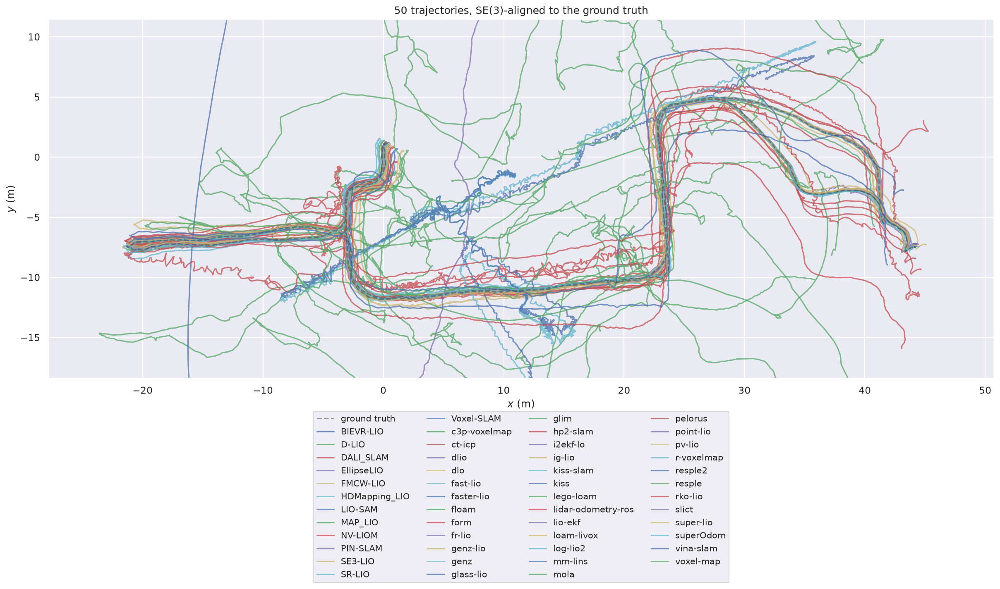

# benchmark-HDMapping-Orchestration

# 0. Dataset and workspace setup

## Download the dataset

Download `reg-1.bag` from the [direct download](https://cloud.cylab.be/public.php/dav/files/7PgyjbM2CBcakN5/reg-1.bag)
or [Zenodo](https://zenodo.org/records/23069933). It is part of the
[Bunker DVI Dataset](https://charleshamesse.github.io/bunker-dvi-dataset).
For download problems, contact januszbedkowski@gmail.com.

Also download the complete `HDMappingGroundTruth` and `TLS-FARO-Focus` directories
from the same Zenodo record.

If the bag archive is split into `reg-1.zip.part-000`, `reg-1.zip.part-001`, etc.,
download all parts, then merge and extract them:

```bash
cd ~/Downloads
cat reg-1.zip.part-0* > full.zip
zip -F full.zip --out full-fixed.zip
unzip full-fixed.zip
```

## Prepare the workspace

```shell
mkdir -p ~/hdmapping-benchmark/data
cd ~/hdmapping-benchmark
git clone https://github.com/MapsHD/benchmark-HDMapping-Orchestration.git
cd benchmark-HDMapping-Orchestration
git checkout Bunker-DVI-Dataset-reg-1
```

Place `reg-1.bag` and both extracted ground-truth directories in `data/`.
Preserve all files referenced by the ground-truth session:

```text
~/hdmapping-benchmark/
├── benchmark-HDMapping-Orchestration/
├── mandeye_to_bag/                  # helper source, if cloned here
├── livox_bag_aggregate/             # helper source, if cloned here
└── data/
    ├── reg-1.bag
    ├── HDMappingGroundTruth/
    │   └── lio_result_0/
    │       ├── session.mjs
    │       ├── session_ini_poses.mri
    │       ├── session_poses.mrp
    │       ├── scan_lio_*.laz
    │       └── trajectory_lio_*.csv
    └── TLS-FARO-Focus/
        ├── map_gt_0.01.laz
        └── map_gt_0.01.pcd
```

Steps 4 and 7 require `HDMappingGroundTruth/lio_result_0/session.mjs`.
Step 8 requires `TLS-FARO-Focus/map_gt_0.01.laz`; the PCD is not used by Step 8.
Step 9 uses the FARO PLY that Step 8 converts from this LAZ.
Prepared bags, algorithm repositories and benchmark results are generated by the
pipeline and are not required in this initial layout.

## Prerequisites

Use Linux with Bash, Git, Python 3, Docker access and internet access for builds.
Archive extraction uses `zip` and `unzip`. Steps displaying trajectory plots or
algorithm visualizations also need a graphical session with X access.

Build the helper Docker images using the instructions in
[mandeye_to_bag](https://github.com/MapsHD/mandeye_to_bag) and
[livox_bag_aggregate](https://github.com/MapsHD/livox_bag_aggregate):

- `livox_bag_aggregate_noetic:latest`
- `mandeye-ws_noetic:latest`
- `mandeye-ws_humble:latest`

Helper source directories are not required if these images exist. Algorithm and
evaluation images are built by the pipeline.

A GPU is recommended but not required. PIN-SLAM uses an NVIDIA GPU through the
[NVIDIA Container Toolkit](https://docs.nvidia.com/datacenter/cloud-native/container-toolkit/latest/install-guide.html)
when available and otherwise falls back to CPU. Step 9 renders with OpenCL on an
NVIDIA, Intel or AMD GPU, or on the CPU when no GPU is available. All other
algorithms and steps run on CPU.

## Validate setup

[validate.sh](validate.sh) checks the workspace, input bag, FARO LAZ, ground-truth
session and its referenced pose files, scans and trajectory CSVs. It also checks
Docker access and the three helper images above. No Python packages are needed.

```shell
cd ~/hdmapping-benchmark/benchmark-HDMapping-Orchestration
bash ./validate.sh
```

Validation does not modify data, build images or run containers. The automatic
runner invokes it before any stage; run it explicitly for step-by-step execution.

# 1. Make all scripts executable

```shell
chmod +x ~/hdmapping-benchmark/benchmark-HDMapping-Orchestration/start_benchmark.sh
chmod +x ~/hdmapping-benchmark/benchmark-HDMapping-Orchestration/validate.sh
chmod +x ~/hdmapping-benchmark/benchmark-HDMapping-Orchestration/clean.sh
chmod +x ~/hdmapping-benchmark/benchmark-HDMapping-Orchestration/algos_lib.sh
chmod +x ~/hdmapping-benchmark/benchmark-HDMapping-Orchestration/prepare_data_step1/prepare_data_step1.sh
chmod +x ~/hdmapping-benchmark/benchmark-HDMapping-Orchestration/prepare_data_step1/mandeye-convert.sh
chmod +x ~/hdmapping-benchmark/benchmark-HDMapping-Orchestration/prepare_data_step1/livox_bag.sh
chmod +x ~/hdmapping-benchmark/benchmark-HDMapping-Orchestration/clone_github_repositories_step2/clone_github_repositories_step2.sh
chmod +x ~/hdmapping-benchmark/benchmark-HDMapping-Orchestration/run_benchmark_step3/run_benchmark_step3.sh
chmod +x ~/hdmapping-benchmark/benchmark-HDMapping-Orchestration/conversion_tum_step4/run_tum_step4.sh
chmod +x ~/hdmapping-benchmark/benchmark-HDMapping-Orchestration/evo_step5/tum-to-latex_step5.sh
chmod +x ~/hdmapping-benchmark/benchmark-HDMapping-Orchestration/registration_step7/run_registration_step7.sh
chmod +x ~/hdmapping-benchmark/benchmark-HDMapping-Orchestration/registration_step7/register_sessions.sh
chmod +x ~/hdmapping-benchmark/benchmark-HDMapping-Orchestration/point_cloud_evaluation_step8/run_evaluation_step8.sh
chmod +x ~/hdmapping-benchmark/benchmark-HDMapping-Orchestration/point_cloud_compare_step9/run_compare_step9.sh
chmod +x ~/hdmapping-benchmark/benchmark-HDMapping-Orchestration/point_cloud_compare_step9/compare_clouds.sh
chmod +x ~/hdmapping-benchmark/benchmark-HDMapping-Orchestration/utilities/hdmapping_export/run_hdmapping_export.sh
chmod +x ~/hdmapping-benchmark/benchmark-HDMapping-Orchestration/utilities/hdmapping_export/export_sessions.sh
```

This covers the automatic runner, all stage scripts, validation, cleanup and the
optional export utility.

# 2. Run modes

- [2.1 Full automation](#21-full-automation): run Steps 1-9 with one command.
- [2.2 Step by step](#22-step-by-step): run individual stages in order.

Both modes use the workspace prepared in Section 0. Algorithm selection uses the
case-sensitive `id` column in [algorithms.conf](algorithms.conf). Unknown IDs abort
the selection and print the known IDs.

## 2.1 Full automation

[start_benchmark.sh](start_benchmark.sh) validates setup and runs Steps 1-9.
Step 9 runs last and renders FARO and every cloud Step 8 evaluated into
comparison images; it has no settings of its own in the runner and uses
`--opencl auto` (NVIDIA GPU, then Intel or AMD GPU, then CPU).
The [optional utilities](#3-optional-utilities) are not part of this pipeline.

### Run with defaults

```shell
cd ~/hdmapping-benchmark/benchmark-HDMapping-Orchestration
./start_benchmark.sh
```

### Run with options

Use **0.025 m** for the Step 7 bucket, Step 8 voxel filter and precision/recall
threshold, with two simultaneous evaluations:

```shell
cd ~/hdmapping-benchmark/benchmark-HDMapping-Orchestration
./start_benchmark.sh \
    --bucket-size 0.025 \
    --voxel-size 0.025 \
    --threshold 0.025 \
    --jobs 2
```

### Run selected algorithms with defaults

```shell
cd ~/hdmapping-benchmark/benchmark-HDMapping-Orchestration
./start_benchmark.sh sr-lio pv-lio
```

Positional IDs restrict Steps 2, 3, 4, 7, 8 and 9. Without positional IDs, all
algorithms are selected unless `ONLY_ALGOS` is already set. Step 9 then compares
only the selected algorithms with FARO.

### Arguments and defaults

| Argument or setting | Purpose | Default |
| --- | --- | --- |
| `--bucket-size METERS` | Step 7 per-scan registration bucket | `0.05 m` |
| `--voxel-size METERS` | Step 8 voxel filtering of both clouds; `0` disables it | `0.05 m` |
| `--threshold METERS` | Step 8 precision/recall agreement threshold | `0.05 m` |
| `--jobs N` | Simultaneous Step 8 algorithm evaluations | `1` |
| `--no-force` | Preserve existing Step 7/8/9 results instead of replacing them | Off |
| `algo ...` | Selected algorithm IDs | All, or `ONLY_ALGOS` if set |
| `ONLY_ALGOS` | Environment-based algorithm selection when no IDs are passed | Unset |
| `HDMAPPING_BUILD_JOBS` | Step 7/8/9 image compilation parallelism | `2` |
| `--help` | Show usage without running stages | Not set |

The distance settings are independent. Bucket size and threshold must be finite
and positive; voxel size must be finite and nonnegative. Jobs must be a positive
integer and affect Step 8 only. CLI settings are validated before any stage runs.

The runner uses `~/hdmapping-benchmark/data` and the standard output directories;
it does not expose path options. **Steps 7, 8 and 9 permanently replace selected
results by default.** Use `--no-force` to preserve their existing results,
or separate output directories with the individual runners to keep multiple runs.
With `--no-force`, an existing Step 9 comparison makes Step 9 stop with an error.
See [Step 7](#step-7-register-algorithm-point-clouds-to-ground-truth),
[Step 8](#step-8-evaluate-registered-point-clouds-against-faro)
and [Step 9](#step-9-render-visual-comparison-against-faro).

Step 9 runs only if Step 8 succeeds, because the runner stops at the first failing
stage. To produce the comparison images after a full run without repeating
earlier stages, run the [Step 9 runner](#step-9-render-visual-comparison-against-faro)
on its own.

## 2.2 Step by step

Run the following stages in order. Each command block includes its working
directory and can be copied independently after completing Sections 0 and 1.
Steps 2, 3, 4, 7, 8 and 9 accept `ONLY_ALGOS`; Steps 5 and 6 process all matching
trajectories already present in `data/tum`.

### Step 1 Prepare data

Convert the original bag to aggregated point clouds, ROS2 bags and HDMapping
(Mandeye) data using the prerequisite helper images.

#### Run with standard inputs

```shell
cd ~/hdmapping-benchmark/data
~/hdmapping-benchmark/benchmark-HDMapping-Orchestration/prepare_data_step1/prepare_data_step1.sh reg-1.bag .
```

#### Result

The outputs beside `reg-1.bag` are `reg-1.bag-pc.bag`, `reg-1-ros2/`,
`reg-1-ros2-lidar/` and `reg-1-hdmapping/`.
Preparation is shared by all algorithms; it has no algorithm selection.

#### Arguments and defaults

| Argument | Purpose | Default |
| --- | --- | --- |
| `<ros1_bag>` | Original ROS1 bag path | Required; example uses `reg-1.bag` |
| `<output_dir>` | Existing destination directory | Required; example uses `.` |

There are no additional runner options.

### Step 2 Clone repositories and build images

Clone the algorithm repositories into `~/hdmapping-benchmark`, check out the
requested branch and build each available Dockerfile.

#### Run with interactive branch selection

```shell
cd ~/hdmapping-benchmark/benchmark-HDMapping-Orchestration
./clone_github_repositories_step2/clone_github_repositories_step2.sh
```

At the prompt, enter `Bunker-DVI-Dataset-reg-1` for this dataset.

#### Run with options

Pass the branch explicitly to avoid the prompt:

```shell
cd ~/hdmapping-benchmark/benchmark-HDMapping-Orchestration
./clone_github_repositories_step2/clone_github_repositories_step2.sh Bunker-DVI-Dataset-reg-1
```

#### Run selected algorithms with defaults

```shell
cd ~/hdmapping-benchmark/benchmark-HDMapping-Orchestration
ONLY_ALGOS="sr-lio pv-lio" ./clone_github_repositories_step2/clone_github_repositories_step2.sh
```

This still prompts for the branch. Repositories without a Dockerfile are reported
as manual procedures; consult their READMEs. Build failures are listed at the end.

#### Arguments and defaults

| Argument or setting | Purpose | Default |
| --- | --- | --- |
| `[branch_name]` | Branch for all selected repositories | Interactive prompt |
| `ONLY_ALGOS` | Selected algorithm IDs | All |
| `--help` | Show usage | Not set |

### Step 3 Run algorithms

Run the selected algorithms using the prepared inputs from Step 1 and images
from Step 2. Each algorithm writes into `data/<algorithm-id>/`.

#### Run with standard inputs

```shell
cd ~/hdmapping-benchmark/data
~/hdmapping-benchmark/benchmark-HDMapping-Orchestration/run_benchmark_step3/run_benchmark_step3.sh reg-1.bag reg-1-ros2 .
```

#### Run selected algorithms with standard inputs

```shell
cd ~/hdmapping-benchmark/data
ONLY_ALGOS="sr-lio pv-lio" ~/hdmapping-benchmark/benchmark-HDMapping-Orchestration/run_benchmark_step3/run_benchmark_step3.sh reg-1.bag reg-1-ros2 .
```

#### Arguments and defaults

| Argument or setting | Purpose | Default |
| --- | --- | --- |
| `<ros1_bag>` | Original ROS1 bag; other input paths are derived from its name | Required; example uses `reg-1.bag` |
| `<ros2_bag_dir>` | ROS2 bag directory | Required; example uses `reg-1-ros2` |
| `<output_dir>` | Parent directory for per-algorithm outputs | Required; example uses `.` |
| `ONLY_ALGOS` | Selected algorithm IDs | All |
| `--help` | Show usage | Not set |

Input kinds come from [algorithms.conf](algorithms.conf); no extra tuning flags
are exposed by this runner. Algorithms without an executable run script are
reported as manual procedures and skipped.

### Step 4 Register sessions and export TUM trajectories

Build `hdmapping_tum`, back up algorithm outputs to `data/backup/`, register
sessions against ground truth and export their TUM trajectories into `data/tum/`.
The runner also copies `ground_truth.tum` there.

#### Run with defaults

```shell
cd ~/hdmapping-benchmark/data
~/hdmapping-benchmark/benchmark-HDMapping-Orchestration/conversion_tum_step4/run_tum_step4.sh
```

#### Run selected algorithms with defaults

```shell
cd ~/hdmapping-benchmark/data
ONLY_ALGOS="sr-lio pv-lio" ~/hdmapping-benchmark/benchmark-HDMapping-Orchestration/conversion_tum_step4/run_tum_step4.sh
```

#### Arguments and defaults

| Argument or setting | Purpose | Default |
| --- | --- | --- |
| `ONLY_ALGOS` | Sessions to register and export | All |
| `--help` | Show usage | Not set |

There are no path or tuning arguments. Inputs are under
`~/hdmapping-benchmark/data`; backups include all available algorithm folders,
even when trajectory processing is restricted to a subset.

### Step 5 Evaluate trajectories with evo

Build `evo` and compute absolute and relative pose errors from `data/tum/`.
The trajectory plot (tabs trajectories, xyz, rpy and speeds) opens in the
graphical session. The trajectories tab shows every trajectory aligned to the
ground truth, zoomed to the ground truth with a margin (zoom out to see
diverged trajectories), and is also saved as `data/tum/trajectories.png`. A
trajectory that never moves (e.g. LOAM-Livox) is aligned at its first pose,
as in the APE table.

#### Run with defaults

```shell
cd ~/hdmapping-benchmark/data
~/hdmapping-benchmark/benchmark-HDMapping-Orchestration/evo_step5/tum-to-latex_step5.sh
```

#### Result

Results in `data/tum/` include `table_ape.csv`, `table_rpe.csv`,
`table_ape.tex`, `table_rpe.tex`, `ape_table_github.md`, `rpe_table_github.md`
and `trajectories.png`.

#### Arguments and defaults

The runner has no CLI options or algorithm selector. It processes all matching
trajectory files in `~/hdmapping-benchmark/data/tum` against `ground_truth.tum`.

### Step 6 Evaluate trajectory overlap

Compute time coverage, trajectory node ratios and frequencies relative to the
ground-truth trajectory.

#### Run with defaults

```shell
cd ~/hdmapping-benchmark/data
python3 ~/hdmapping-benchmark/benchmark-HDMapping-Orchestration/overlap_step6/overlap.py
```

#### Result

Per-algorithm coverage is printed to the terminal. Markdown and LaTeX reports
are written into `data/tum/`.

#### Arguments and defaults

The script has no CLI options or algorithm selector. It reads all matching TUM
trajectories and `ground_truth.tum` from `~/hdmapping-benchmark/data/tum`.

### Step 7 Register algorithm point clouds to ground truth

HDMapping's `session_to_session_rigid_registration` registers each algorithm
session to `HDMappingGroundTruth/lio_result_0/session.mjs`. It estimates one rigid
transform from timestamp-matched trajectory positions and exports a merged
`registered.laz` for Step 8. `--bucket-size METERS` controls per-scan downsampling
of both sessions and defaults to **0.05 m**. Larger buckets retain fewer points;
the trajectory-based fitting uses the same trajectory nodes.

#### Prerequisites

- Docker and internet access for the image build.
- The complete ground-truth directory from the [dataset setup](#0-dataset-and-workspace-setup).
- Algorithm sessions from Steps 3-4, with scans, pose files and trajectory CSVs.
- RAM for the ground-truth session and one algorithm session, plus disk space
  for registered clouds. Registration runs sequentially.

#### Run with defaults

```shell
cd ~/hdmapping-benchmark/data
~/hdmapping-benchmark/benchmark-HDMapping-Orchestration/registration_step7/run_registration_step7.sh
```

The script builds `hdmapping_rigid_registration` and processes the configured
algorithms sequentially.

#### Run with options

Use **0.025 m** buckets:

```shell
cd ~/hdmapping-benchmark/data
~/hdmapping-benchmark/benchmark-HDMapping-Orchestration/registration_step7/run_registration_step7.sh \
    --bucket-size 0.025
```

Selected result folders are replaced by default, including when changing bucket
size. Use a separate `--output-dir` to keep multiple runs.

#### Run selected algorithms with defaults

```shell
cd ~/hdmapping-benchmark/data
ONLY_ALGOS="sr-lio pv-lio" ~/hdmapping-benchmark/benchmark-HDMapping-Orchestration/registration_step7/run_registration_step7.sh
```

#### Result and input for Step 8

For each selected algorithm, the source is exactly one of:

```text
<data-dir>/<algorithm-id>/output_hdmapping-<output>/session.json
<data-dir>/<algorithm-id>/output_hdmapping-<output>/session.mjs
```

`<output>` is the output column of [algorithms.conf](algorithms.conf).
Exactly one session file must be present.

Successful registration produces:

```text
<output-dir>/
├── fast-lio/
│   ├── registered.laz
│   ├── registration.log
│   ├── sanity_check_trg.txt
│   └── sanity_check_src.txt
└── registration_summary.csv
```

- `registered.laz`: merged algorithm cloud in the ground-truth frame.
- `registration.log`: application diagnostics and output validation.
- `sanity_check_trg.txt` / `sanity_check_src.txt`: ground-truth and transformed
  algorithm trajectory positions, not TUM files.
- `registration_summary.csv`: input/output paths, bucket size and status:
  `registered`, `missing`, `ambiguous`, `existing` or `failed`.

CSV paths use `/data` for inputs and `/results` for outputs. Successful status
requires no known failure diagnostics, nonempty sanity-check files and a valid LAZ
header. These checks do not prove registration accuracy.

#### Timestamp-matching limitation

Each source node matches the first ground-truth node at or after its timestamp,
without interpolation. Nodes earlier than ground truth match its first pose;
nodes later than ground truth are excluded. FAST-LIO starts approximately 20
seconds earlier than ground truth in this dataset, which can affect the transform.

#### Missing inputs, failures and reruns

Missing ground truth aborts the stage. Algorithm failures are reported while
remaining algorithms continue. If at least one algorithm registers successfully,
the master pipeline continues to Step 8 using those successful registrations.
The command returns nonzero if none register or a stage-level error occurs.

**Selected registration folders are permanently replaced by default**, including
logs and partial outputs, once a valid, unambiguous source session is available.
Other algorithms and source data are untouched. Stop other runs writing to these
folders first.

With `--no-force`, completed registrations are validated and reused without overwriting files;
their report status is `registered`. Reuse requires successful completion and
output-validation records in the log, no failure diagnostics, nonempty sanity-check
trajectories, a valid LAZ header and a recorded bucket size matching the requested
value. An unrecorded or different bucket size cannot be reused.
These checks verify completion, not whether source sessions or ground truth have
changed. To register changed inputs or settings, run without `--no-force` or use
a separate `--output-dir`.

With `--no-force`, incomplete or invalid folders are preserved and reported as `existing`.
To retry, select a subset with `ONLY_ALGOS` and move its folders aside, or use a
separate output directory. Each run replaces `registration_summary.csv`.

To preserve selected registration folders and reuse completed results:

```shell
cd ~/hdmapping-benchmark/data
ONLY_ALGOS="fast-lio sr-lio" ~/hdmapping-benchmark/benchmark-HDMapping-Orchestration/registration_step7/run_registration_step7.sh --no-force
```

#### Arguments and defaults

| Argument or setting | Purpose | Default |
| --- | --- | --- |
| `--bucket-size METERS` | Per-scan downsampling of both sessions | `0.05 m` |
| `--no-force` | Reuse validated completed registrations; preserve other existing folders | Off |
| `--data-dir DIRECTORY` | Dataset and algorithm session directory | `~/hdmapping-benchmark/data` |
| `--output-dir DIRECTORY` | Registration results | `<data-dir>/step7_registration` |
| `ONLY_ALGOS` | Selected algorithm IDs | All |
| `HDMAPPING_BUILD_JOBS` | Image compilation parallelism | `2` |
| `--help` | Show usage | Not set |

Bucket size must be finite and positive. Inputs are read-only; outputs belong to
the invoking user. Relative paths are resolved from the calling directory.

For example, keep a separate **0.025 m** registration run:

```shell
cd ~/hdmapping-benchmark/data
~/hdmapping-benchmark/benchmark-HDMapping-Orchestration/registration_step7/run_registration_step7.sh \
    --bucket-size 0.025 \
    --output-dir "$HOME/hdmapping-benchmark/data/step7_registration_0025"
```

### Step 8 Evaluate registered point clouds against FARO

This stage compares each successful Step 7 cloud with
`TLS-FARO-Focus/map_gt_0.01.laz`, using
[MapsHD/point_clouds_evaluation](https://github.com/MapsHD/point_clouds_evaluation).
HDMapping's `laz_to_ply` converts the inputs to binary PLY. Evaluation uses
**0.05 m voxel downsampling of both algorithm and FARO clouds by default**,
controlled by `--voxel-size METERS`. Open3D replaces each occupied voxel's points
with their centroid. Use `--voxel-size 0` to evaluate full clouds.
There is no cropping or additional alignment.
Step 7 and FARO must use the same coordinate frame.

#### Prerequisites

- Docker and internet access for the image build; no GPU is required.
- `TLS-FARO-Focus/map_gt_0.01.laz` from the [dataset setup](#0-dataset-and-workspace-setup).
- Step 7's `registration_summary.csv` and algorithm `registered.laz` files.
  Rows marked `registered` are eligible. Rows marked `existing` are also eligible
  if their saved artifacts pass the completed-registration checks above.
- Substantial RAM for full-cloud nearest-neighbor searches and approximately
  **16 GiB of additional disk space** for converted clouds, excluding Docker
  storage. FARO has approximately 29 million points; algorithm clouds can exceed
  55 million points. Voxel filtering happens after full conversion and loading,
  so it does not reduce PLY disk usage or eliminate full-cloud loading peaks.
  Downsampling itself also needs temporary memory.

#### Run with defaults

```shell
cd ~/hdmapping-benchmark/data
~/hdmapping-benchmark/benchmark-HDMapping-Orchestration/point_cloud_evaluation_step8/run_evaluation_step8.sh
```

The script builds `hdmapping_point_cloud_evaluation`. `--jobs N` controls the
maximum number of simultaneous algorithm evaluations; the default is **1**.

#### Run with options

Use **0.025 m** voxels and precision/recall threshold with two simultaneous
evaluations:

```shell
cd ~/hdmapping-benchmark/data
~/hdmapping-benchmark/benchmark-HDMapping-Orchestration/point_cloud_evaluation_step8/run_evaluation_step8.sh \
    --voxel-size 0.025 \
    --threshold 0.025 \
    --jobs 2
```

Voxel size must be finite and nonnegative; threshold must be finite and positive.
The settings are independent: Step 7's bucket removes points within individual
scans, Step 8's voxel filter downsamples each merged cloud, and the threshold
defines agreement. They do not automatically change one another.
Evaluation replaces selected eligible result folders by default. Use `--no-force`
to preserve existing folders instead.
Use the same bucket, voxel and threshold settings for comparisons across algorithms;
different settings produce different metrics.

#### Run selected algorithms with defaults

```shell
cd ~/hdmapping-benchmark/data
ONLY_ALGOS="sr-lio pv-lio" ~/hdmapping-benchmark/benchmark-HDMapping-Orchestration/point_cloud_evaluation_step8/run_evaluation_step8.sh
```

#### Execution and progress

FARO is converted to full-resolution PLY once. Each map is evaluated by a separate
invocation of the upstream `pointcloud_metrics.py` CLI, which loads
and voxel-filters both clouds. Its default cache shares KD-trees and nearest-neighbor
queries across metrics within that invocation.
Worker threads manage the external converter and evaluator processes; numerical
evaluation does not share the coordinator's Python GIL. Each simultaneous
evaluation needs its own clouds, trees and query caches, including temporary
loading and voxel-filtering memory. Start with two workers and increase only if
RAM and disk throughput permit.
The image limits OpenMP and BLAS thread counts to 1. `HDMAPPING_BUILD_JOBS`
controls compilation only (default: 2).

An interactive terminal shows an overall completed-map bar and one stage bar per
worker. Each worker row names its algorithm and current phase, with algorithm
and phase elapsed times. Worker slots pick up another algorithm when they finish.
For example:

```text
Overall          |########------------| 15/37 [OK=14, failed=1]
W1 fast-lio      |########------------| 4/9 stages [Chamfer, elapsed=252s, phase=180s]
W2 sr-lio        |####----------------| 2/9 stages [Loading FARO, elapsed=38s, phase=25s]
```

The nine stages are hashing, conversion, FARO loading/filtering, algorithm
loading/filtering, Chamfer, Hausdorff, precision/recall, RMSE and saving.
Stage bars count completed checkpoints, not estimated runtime or point-query
percentage. Long native operations expose no internal progress; elapsed timers
continue updating while the stage stays unchanged.

The Docker runner enables a TTY only when output is a terminal. Redirected output
uses timestamped `W1 <algorithm>` messages instead of bars. A single coordinator
renders progress to avoid mixed worker output. Full upstream output, including
its timing table, is saved in each map's `evaluation.log`; FARO conversion uses
`reference/conversion.log`. Interactive bars use `tqdm` from the image's evaluator
dependencies, without changes to the upstream repository.

#### Metrics

All distances are in meters. Precision, recall and F-score are fractions in
`[0, 1]`. `--threshold METERS` defaults to **0.05 m**, with a strict less-than
comparison. All metrics use the clouds after the selected voxel filtering.

| Output field | Definition |
| --- | --- |
| `chamfer_algorithm_to_faro_m` | Mean algorithm-to-FARO nearest-neighbor distance |
| `chamfer_faro_to_algorithm_m` | Mean FARO-to-algorithm nearest-neighbor distance |
| `chamfer_distance_m` | Average of the two directional means; not a squared distance |
| `hausdorff_distance_m` | Maximum nearest-neighbor distance across both directions |
| `precision` | Fraction of evaluated algorithm points closer than the threshold to evaluated FARO |
| `recall` | Fraction of evaluated FARO points closer than the threshold to the evaluated algorithm |
| `fscore` | Harmonic mean of precision and recall |
| `rmse_m` | Upstream RMSE: FARO-to-algorithm nearest-neighbor RMS for unequal point counts; row-correspondence RMS for equal counts |

The upstream CLI receives FARO first and the algorithm second. Directional Chamfer
fields are mapped accordingly; upstream precision and recall are swapped in the
summary to retain the algorithm-as-prediction definitions above. RMSE is taken
directly from upstream and does not consistently represent algorithm-to-FARO
nearest-neighbor error. Equal point counts do not establish actual correspondence.

Only XYZ geometry is evaluated; colors, normals, intensity and timestamps are
not used.

#### Result

```text
<output-dir>/
├── reference/
│   ├── faro.ply
│   ├── conversion.log
│   └── source.json
├── fast-lio/
│   ├── registered.ply
│   ├── upstream_metrics.json
│   ├── metrics.json
│   └── evaluation.log
├── evaluation_summary.csv
├── evaluation_summary.md
└── evaluation_summary.tex
```

- `reference/source.json`: FARO path, SHA-256 and point count for cached conversion.
- `<algorithm-id>/upstream_metrics.json`: unmodified upstream CLI metric output.
- `<algorithm-id>/metrics.json`: input paths and fingerprints, point counts,
  `voxel_size_m`, `threshold_m`, `additional_downsampling`, `evaluation_backend`,
  and the eight metrics.
  `algorithm_input_points` / `reference_input_points` count full input points;
  `algorithm_points` / `reference_points` count points actually evaluated.
  Written atomically on success.
- `<algorithm-id>/evaluation.log`: conversion and evaluation progress.
- `reference/faro.ply` and `<algorithm-id>/registered.ply`: full-resolution
  conversions, kept after evaluation because
  [Step 9](#step-9-render-visual-comparison-against-faro) renders them.
- `<algorithm-id>/failure.json`: error details when failure recording is possible.
- `evaluation_summary.csv` / `.md`: statuses, counts, metrics and errors, updated
  atomically by the coordinator after all workers finish, using their saved
  reports in [algorithms.conf](algorithms.conf) order, not completion order.
  Both reports include voxel size and threshold. Unavailable metrics are blank
  in CSV and `-` in Markdown.
- `evaluation_summary.tex`: self-contained LaTeX document with an A4 landscape page
  and 15 mm margins. The standalone wrapper centers the complete table and caption
  horizontally and vertically, shrinking them together only if needed to fit one
  page. It uses the standard `geometry`, `adjustbox`, `caption` and `environ`
  packages. The copy-pasteable table itself is unchanged and needs no extra
  packages. Compile the document directly, or copy only the section
  between `% BEGIN COPY-PASTE TABLE` and `% END COPY-PASTE TABLE` into another
  document. Separate comment guards identify the standalone preamble and footer.
  The table includes a caption and label, plus every selected algorithm's
  status and all eight metrics in the same order as CSV/Markdown, with six decimal
  places and `-` for unavailable values. The caption documents units, voxel size,
  threshold and metric definitions. Paths, point counts and error messages remain
  in CSV/Markdown and are not referenced in the LaTeX document. The table is wide;
  adjust the font size or page orientation when copying it into your document.
  Change the label when including multiple evaluation tables.

All three summaries are written atomically per file by the same report-generation
paths, including failure/interruption reporting. Use `--merge-only` to generate
them from saved results without rerunning cloud evaluation.

Workers write only their own per-algorithm reports. Existing combined reports
remain from the previous run until the final merge replaces them.
`.evaluation.lock` prevents simultaneous evaluation or merge runs using the same
output directory. The lock file remains on disk; the lock is released when the
process exits.

Conversion validates full-resolution point counts. Evaluated counts are read from
the upstream CLI's two `Points:` log lines because its JSON contains metrics only;
missing or invalid counts fail the map. Saved metrics must be finite, nonnegative
numbers, with precision, recall and F-score in `[0, 1]`.

CSV/JSON paths use container prefixes: `/data` is the dataset directory,
`/registration` is the selected Step 7 directory, and `/evaluation` is the output
directory.

#### Missing inputs, failures and reruns

Missing FARO or a missing/invalid Step 7 report aborts the stage.

| Status | Meaning |
| --- | --- |
| `evaluated` | Conversion and evaluation succeeded |
| `not_registered` | Skipped: Step 7 status is missing, failed, ambiguous, unreported, or existing but not validated |
| `missing_input` | Step 7 claims success, but its LAZ is missing or empty |
| `existing` | With `--no-force`, an evaluation folder already exists and is not overwritten |
| `failed` | FARO preparation, conversion, loading, or metric computation failed |

Individual failures do not prevent remaining maps from being evaluated. The
command succeeds when at least one map is evaluated and every eligible registered
map succeeds. Unregistered algorithms remain in the report as `not_registered`
but do not count as evaluation failures. Missing inputs for a registered map,
existing evaluation folders and evaluation errors still produce a nonzero exit
status. Ctrl+C or SIGTERM stops scheduling, terminates active converters and
evaluators, and force-kills them after a five-second grace period if necessary.
Completed reports are preserved; interrupted work can leave partial files.
Orderly interruption attempts a partial final summary with failed rows for
unfinished algorithms. Abrupt termination can leave the previous combined reports
in place; use `--merge-only` to rebuild them from saved per-algorithm reports.

**Selected eligible algorithms' evaluation folders are permanently replaced by
default**, including metrics, logs and converted PLYs. Unregistered algorithms
and Step 7 inputs are untouched. Stop other runs writing to these folders first.
Use a separate `--output-dir` to keep multiple runs. Rerun
[Step 9](#step-9-render-visual-comparison-against-faro) after reevaluating so
its images match the new PLYs.

To preserve existing per-algorithm folders instead (reported as `existing`,
without reevaluating or reusing their saved metrics):

```shell
cd ~/hdmapping-benchmark/data
ONLY_ALGOS="fast-lio sr-lio" ~/hdmapping-benchmark/benchmark-HDMapping-Orchestration/point_cloud_evaluation_step8/run_evaluation_step8.sh \
    --no-force
```

Cached FARO conversion is reused only when its path, SHA-256 and point count
match. Cached PLYs are full-resolution; changing voxel size does not require
reconversion. An incomplete or incompatible FARO cache is rebuilt by default;
with `--no-force`, it causes an error instead. Do not merge results evaluated
against different references. `--merge-only` disables replacement automatically.

#### Merge saved results without reevaluating

To rebuild summaries from completed per-map files:

```shell
cd ~/hdmapping-benchmark/data
ONLY_ALGOS="fast-lio sr-lio" ~/hdmapping-benchmark/benchmark-HDMapping-Orchestration/point_cloud_evaluation_step8/run_evaluation_step8.sh \
    --merge-only
```

To merge the 0.025 m evaluation from the example above:

```shell
cd ~/hdmapping-benchmark/data
~/hdmapping-benchmark/benchmark-HDMapping-Orchestration/point_cloud_evaluation_step8/run_evaluation_step8.sh \
    --registration-dir "$HOME/hdmapping-benchmark/data/step7_registration_0025" \
    --output-dir "$HOME/hdmapping-benchmark/data/step8_evaluation_0025" \
    --voxel-size 0.025 --threshold 0.025 --merge-only
```

Use the evaluation's input/output paths. `ONLY_ALGOS` selects report rows;
summaries are replaced, not appended. Inputs must be marked `registered` or be
validated completed registrations marked `existing`.
This mode reads `metrics.json` / `failure.json` without conversion, cloud loading
or metric computation. It validates settings, counts, metrics and available input
fingerprints; hashing reads the LAZ files from disk. Supply the evaluation's exact
voxel size and threshold; mismatched results are rejected. Successful results must
record `evaluation_backend: "pointcloud_metrics_cli"` and the `rmse_m` field.
Results with a different backend or RMSE definition require reevaluation with
default replacement or a separate output directory.

Results without fingerprints trigger a warning and are checked by paths, counts
and FARO provenance only; same-count algorithm input changes cannot be detected.
Missing, incomplete, inconsistent or failed results for eligible registered maps
produce a nonzero exit status; unregistered algorithms are skipped.
Merge-only neither resumes evaluation nor changes per-map files.

#### Arguments and defaults

| Argument or setting | Purpose | Default |
| --- | --- | --- |
| `--voxel-size METERS` | Voxel filtering of both clouds; `0` disables it | `0.05 m` |
| `--threshold METERS` | Strict precision/recall agreement threshold | `0.05 m` |
| `--jobs N` | Simultaneous algorithm evaluations | `1` |
| `--no-force` | Preserve existing evaluation folders rather than replace them | Off |
| `--merge-only` | Rebuild summaries from saved reports without evaluating | Off |
| `--data-dir DIRECTORY` | Dataset directory containing FARO | `~/hdmapping-benchmark/data` |
| `--registration-dir DIRECTORY` | Step 7 results | `<data-dir>/step7_registration` |
| `--output-dir DIRECTORY` | Evaluation results | `<data-dir>/step8_evaluation` |
| `ONLY_ALGOS` | Selected algorithm IDs | All |
| `HDMAPPING_BUILD_JOBS` | Image compilation parallelism, independent of `--jobs` | `2` |
| `--help` | Show usage | Not set |

Voxel size must be finite and nonnegative, threshold finite and positive, and jobs
a positive integer. Merge-only disables replacement even without `--no-force`.
The FARO input is `<data-dir>/TLS-FARO-Focus/map_gt_0.01.laz`.
Relative paths are resolved from the calling directory. Inputs are read-only;
outputs are owned by the invoking user.

For the separate **0.025 m** Step 7 run, keep evaluation results separately too:

```shell
cd ~/hdmapping-benchmark/data
~/hdmapping-benchmark/benchmark-HDMapping-Orchestration/point_cloud_evaluation_step8/run_evaluation_step8.sh \
    --registration-dir "$HOME/hdmapping-benchmark/data/step7_registration_0025" \
    --output-dir "$HOME/hdmapping-benchmark/data/step8_evaluation_0025" \
    --voxel-size 0.025 \
    --threshold 0.025 \
    --jobs 2
```

### Step 9 Render visual comparison against FARO

This stage renders the FARO reference and every cloud evaluated in Step 8 from
the same 14 orthographic views. It then builds one mosaic per view with all clouds
side by side, using `cloud_visual_compare` from
[MapsHD/HDMapping-benchmark-pointcloud-visual-inspection](https://github.com/MapsHD/HDMapping-benchmark-pointcloud-visual-inspection)
with its default options, except that each render is **8192 px** along its longer
side (the tool's own default is 16384 px). Rendering is headless OpenCL; no GUI or
X access is needed. The images are for visual inspection only; this stage computes
no metrics.

Views are fitted to FARO only, so every cloud appears with the same framing and
scale. Gaps, doubled walls or drift therefore show up as differences from the
FARO image of the same view. There is no cropping or additional alignment.

#### Prerequisites

- A finished Step 8 run: `<evaluation-dir>/reference/faro.ply`,
  `<evaluation-dir>/evaluation_summary.csv` and the `registered.ply` file of each
  evaluated algorithm. Step 8 writes the summary only after all workers finish,
  so do not start Step 9 while Step 8 is still running.
- Docker and internet access for the image build.
- An OpenCL GPU is recommended but not required; see
  [OpenCL device](#opencl-device). It can be an NVIDIA GPU through the
  [NVIDIA Container Toolkit](https://docs.nvidia.com/datacenter/cloud-native/container-toolkit/latest/install-guide.html),
  or an Intel or AMD GPU with a working host kernel driver (`/dev/dri/renderD*`).
  Without a GPU, rendering uses the PoCL CPU OpenCL device, which is much slower
  but completes. Each render allocates up to three OpenCL buffers of 4 bytes per
  pixel: 256 MiB each at 8192 px, 1 GiB each at 16384 px. A device with a lower
  per-buffer limit stops with an error that names the limit.
- Disk space for 28 PNGs per cloud (14 renders up to `--resolution` px and 14
  mosaic tiles) plus 14 mosaics of up to 2 GiB uncompressed each. Check the size
  with a small `ONLY_ALGOS` run before rendering all algorithms.
- RAM for one cloud at a time, up to 3 GiB of images waiting to be encoded, and one
  mosaic in memory while it is built.

#### Run with defaults

```shell
cd ~/hdmapping-benchmark/data
~/hdmapping-benchmark/benchmark-HDMapping-Orchestration/point_cloud_compare_step9/run_compare_step9.sh
```

The script builds `hdmapping_point_cloud_compare`, picks the OpenCL device
(`--opencl auto`) and renders into `<data-dir>/step9_comparison`.

#### Run with options

Render the separate **0.025 m** Step 8 evaluation into its own directory:

```shell
cd ~/hdmapping-benchmark/data
~/hdmapping-benchmark/benchmark-HDMapping-Orchestration/point_cloud_compare_step9/run_compare_step9.sh \
    --evaluation-dir "$HOME/hdmapping-benchmark/data/step8_evaluation_0025" \
    --output-dir "$HOME/hdmapping-benchmark/data/step9_comparison_0025"
```

Step 8's PLYs are full resolution, so Step 8's `--voxel-size` and `--threshold`
do not change the images. Step 7's `--bucket-size` does, because it changes the
registered clouds themselves.

Render at the tool's full **16384 px** instead of the 8192 px default:

```shell
cd ~/hdmapping-benchmark/data
~/hdmapping-benchmark/benchmark-HDMapping-Orchestration/point_cloud_compare_step9/run_compare_step9.sh \
    --resolution 16384
```

`--resolution` sets the size of the renders in `full/` only; mosaics keep the
largest size the PNG writer allows.

#### Run selected algorithms with defaults

```shell
cd ~/hdmapping-benchmark/data
ONLY_ALGOS="sr-lio pv-lio" ~/hdmapping-benchmark/benchmark-HDMapping-Orchestration/point_cloud_compare_step9/run_compare_step9.sh
```

#### Test without an NVIDIA GPU

On a machine with an NVIDIA GPU, `--opencl` forces the other OpenCL paths, so
they can be tested without a second machine. Use two algorithms and a separate
output directory per device:

```shell
cd ~/hdmapping-benchmark/data
STEP9=~/hdmapping-benchmark/benchmark-HDMapping-Orchestration/point_cloud_compare_step9/run_compare_step9.sh
for device in cpu intel amd nvidia; do
    ONLY_ALGOS="fast-lio dlo" "$STEP9" --opencl "$device" \
        --output-dir "$HOME/hdmapping-benchmark/data/step9_test_$device"
done
grep -H 'OpenCL device' ~/hdmapping-benchmark/data/step9_test_*/compare.log
```

Drop `intel` or `amd` from the list if the machine has no such GPU. `cpu` matches
a machine without any GPU. Each log should name the requested device, for example
a `pthread` or `cpu` PoCL device for `cpu`. A missing driver or device fails that
run instead of falling back to another device.

To check that the other devices render the same images as the NVIDIA run, compare
the outputs with the tool's `compare_outputs.py`, which needs `numpy` and `pillow`.
Mosaics are built from the tiles, so comparing `full/` and `tile/` covers them:

```shell
mkdir -p ~/hdmapping-benchmark/step9_test_tools
cd ~/hdmapping-benchmark/step9_test_tools
python3 -m venv venv
venv/bin/pip install numpy pillow
git clone https://github.com/MapsHD/HDMapping-benchmark-pointcloud-visual-inspection.git tool

cd ~/hdmapping-benchmark/data
for device in cpu intel amd; do
    for folder in full tile; do
        echo "== $device $folder"
        ~/hdmapping-benchmark/step9_test_tools/venv/bin/python \
            ~/hdmapping-benchmark/step9_test_tools/tool/scripts/compare_outputs.py \
            step9_test_nvidia/$folder step9_test_$device/$folder
    done
done
```

For each folder it prints `N identical, M differing or missing`, plus the pixel
count and largest difference of each differing image. A few differing pixels
between devices can come from floating-point rounding at point projection;
missing images or large differences point to a device problem. Remove
`step9_test_*` and `step9_test_tools` afterwards.

#### Inputs and selection

- **Reference:** `<evaluation-dir>/reference/faro.ply`, the full-resolution FARO
  conversion made by Step 8.
- **Compared clouds:** `<evaluation-dir>/<algorithm-id>/registered.ply` of every
  algorithm with status `evaluated` in `evaluation_summary.csv`, in
  [algorithms.conf](algorithms.conf) order and restricted by `ONLY_ALGOS`.
  The other algorithms are listed as `SKIP` and are not errors.

The summary lists only the algorithms selected in the last Step 8 run. After a
Step 8 run with `ONLY_ALGOS`, Step 9 compares only those algorithms. To compare
all algorithms again, rebuild the full summary first with Step 8's
[`--merge-only`](#merge-saved-results-without-reevaluating) without `ONLY_ALGOS`,
using the evaluation's voxel size and threshold.

PLYs must contain `x`, `y`, `z` and `intensity` vertex properties; Step 8's
`laz_to_ply` output does.

#### OpenCL device

`cloud_visual_compare` is vendor-neutral: it takes the first GPU on any OpenCL
platform, otherwise any OpenCL device. It prints the chosen device on the first
line of its output (`OpenCL device: ...`). The image contains these OpenCL drivers:

| Driver | Devices |
| --- | --- |
| NVIDIA (`libnvidia-opencl.so.1`, mounted by the NVIDIA Container Toolkit) | NVIDIA GPUs |
| Intel compute runtime (`intel-opencl-icd`) | Intel GPUs, integrated and Arc |
| Mesa Rusticl (`mesa-opencl-icd`, `RUSTICL_ENABLE=radeonsi`) | AMD GPUs |
| PoCL (`pocl-opencl-icd`) | CPU |

`--opencl MODE` decides which devices the container gets and which drivers the
OpenCL loader may use (through `OCL_ICD_VENDORS`):

| Mode | Devices passed to the container | Drivers |
| --- | --- | --- |
| `auto` (default) | The NVIDIA GPU if the toolkit works; otherwise `/dev/dri`; otherwise none | All four |
| `nvidia` | The NVIDIA GPU through the toolkit | NVIDIA |
| `intel` | `/dev/dri` | Intel |
| `amd` | `/dev/dri` | Rusticl |
| `cpu` | None | PoCL |

For NVIDIA, the runner uses the `nvidia` Docker runtime if one is registered,
otherwise `--gpus all` if that works, in the same way as PIN-SLAM. For `/dev/dri`,
it also adds the render nodes' group, because the container runs as the invoking
user. In `auto`, PoCL remains available, so a GPU driver that finds no device
falls back to the CPU. On a machine with several non-NVIDIA GPUs, `auto` takes the
first GPU the loader reports; use `intel` or `amd` to choose. Explicit modes fail
instead of falling back. The container prints the drivers it can use
(`OpenCL drivers: ...`) before rendering. The full pipeline uses `auto`.

#### Execution

FARO is loaded first and the views are fitted to it. Then each cloud is loaded,
rendered from every view and released before the next one. Mosaics are assembled
from the saved tiles at the end. PNG encoding runs in up to four background threads.

| `cloud_visual_compare` setting | Value used |
| --- | --- |
| `--resolution` | `8192` px along the longer side of each view, set by the runner's `--resolution` (tool default: `16384`) |
| `--mosaic-resolution` | `0`: the largest mosaic the 2 GiB PNG writer allows |
| `--point-radius` | `0`: one pixel per point |
| `--fit-fraction` | `0.9999`: each view contains at least 99.99% of FARO points |
| `--format` | `grayscale_alpha`: intensity in gray, transparent background |

Intensity is scaled per cloud between its 1st and 99th percentile.

#### Result

```text
<output-dir>/
├── full/
│   ├── reference_px.png
│   ├── reference_nx_ny_nz.png
│   ├── fast-lio_px.png
│   └── ...
├── tile/
│   └── (same names as full/)
├── mosaic/
│   ├── px.png
│   ├── nx.png
│   ├── ...
│   └── px_py_pz.png
└── compare.log
```

- Views: `px`, `nx`, `py`, `ny`, `pz`, `nz` look along each axis from its
  positive or negative side. The eight corner views `px_py_pz` ... `nx_ny_nz`
  look diagonally from each corner of the FARO bounds.
- `full/<label>_<view>.png`: each cloud rendered at `--resolution` px along the
  longer side (8192 by default).
- `tile/<label>_<view>.png`: the same view at mosaic tile size, used to build the
  mosaics.
- `mosaic/<view>.png`: all clouds for one view in a grid, each tile labelled.
  FARO comes first, then the algorithms in [algorithms.conf](algorithms.conf) order.
- `compare.log`: the tool's full output, including the OpenCL device, view sizes,
  point counts, intensity ranges and timings.

Labels come from the PLY's folder name: FARO is labelled `reference` and each
algorithm by its ID.

#### Missing inputs, failures and reruns

A missing FARO PLY or summary aborts the stage, and so does having no evaluated
algorithm to compare. Rendering is a single process: an error in any cloud stops
the stage with a nonzero exit status, and the images already written remain.

**Existing `full/`, `tile/`, `mosaic/` and `compare.log` in the output directory
are permanently replaced by default.** The tool never deletes old images, so
without this, renders of algorithms that are no longer compared would remain.
Other files in the output directory are untouched. Use `--no-force` to stop with
an error instead when any of them exists, or a separate `--output-dir` to keep
several comparisons.

The tool is cloned from its default branch when the image is first built, and
Docker reuses that clone on later builds. To pick up new commits, rebuild once
without the cache; the next run then reuses the fresh image:

```shell
cd ~/hdmapping-benchmark/benchmark-HDMapping-Orchestration
docker build --no-cache \
    --file point_cloud_compare_step9/Dockerfile \
    --tag hdmapping_point_cloud_compare \
    .
```

#### Arguments and defaults

| Argument or setting | Purpose | Default |
| --- | --- | --- |
| `--data-dir DIRECTORY` | Dataset directory, used for the default paths | `~/hdmapping-benchmark/data` |
| `--evaluation-dir DIRECTORY` | Step 8 results | `<data-dir>/step8_evaluation` |
| `--output-dir DIRECTORY` | Comparison images | `<data-dir>/step9_comparison` |
| `--resolution PX` | Size of each render in `full/` along its longer side, `1024`-`65535`; mosaics are unaffected | `8192` |
| `--opencl MODE` | OpenCL device: `auto`, `nvidia`, `intel`, `amd` or `cpu`; see [OpenCL device](#opencl-device) | `auto` |
| `--no-force` | Preserve existing comparison results rather than replace them | Off |
| `ONLY_ALGOS` | Selected algorithm IDs | All evaluated |
| `HDMAPPING_BUILD_JOBS` | Image compilation parallelism | `2` |
| `--help` | Show usage | Not set |

Relative paths are resolved from the calling directory. Step 8 results are
mounted read-only; outputs are owned by the invoking user. The output directory
must not be the dataset or evaluation directory, an ancestor of either, or inside
the evaluation directory.

# 3. Optional utilities

## Workspace cleanup

[clean.sh](clean.sh) removes everything from `~/hdmapping-benchmark` except:

- `benchmark-HDMapping-Orchestration/` (the entire repository)
- `mandeye_to_bag/` and `livox_bag_aggregate/` (prerequisite helper repositories)
- `data/reg-1.bag`
- `data/HDMappingGroundTruth/` and `data/TLS-FARO-Focus/` (entire directories)

**Stop all benchmark jobs first. Deletion is permanent**, including algorithm
repositories, converted datasets, outputs, backups and hidden files.
Docker images, containers, volumes and build cache are not removed.

Preview the exact deletion list:

```shell
bash ~/hdmapping-benchmark/benchmark-HDMapping-Orchestration/clean.sh --dry-run
```

Run cleanup and type `CLEAN` at the confirmation prompt:

```shell
bash ~/hdmapping-benchmark/benchmark-HDMapping-Orchestration/clean.sh
```

The script validates the standard workspace layout and required dataset inputs,
preserves the workspace and `data/` directories, and does not follow symlinks when
deleting entries. The `data/` and ground-truth directories must not be symlinks.
It works independently of the calling directory and is not run by the pipeline.

## HDMapping session export (optional)

The [HDMapping export utility](utilities/hdmapping_export/) exports session poses
as a merged point cloud and trajectory using `multi_view_tls_registration_step_2`.
It does not optimize registration or compute metrics. It is **not required for
benchmarking**, provides no input to Steps 7-9, and is not invoked by
`start_benchmark.sh`.

### Prerequisites:

- Docker and internet access for the image build.
- Algorithm sessions from Step 3 with scans, poses and trajectory files.
  Use sessions after Step 4 to export registered poses.
- RAM for one complete session and disk space for merged clouds.

### Run:

```shell
cd ~/hdmapping-benchmark/data
~/hdmapping-benchmark/benchmark-HDMapping-Orchestration/utilities/hdmapping_export/run_hdmapping_export.sh
```

The script builds `hdmapping_export` and exports algorithms sequentially at full
resolution. Inputs are read-only; outputs belong to the invoking user.
To select algorithms:

```shell
ONLY_ALGOS="fast-lio sr-lio" ~/hdmapping-benchmark/benchmark-HDMapping-Orchestration/utilities/hdmapping_export/run_hdmapping_export.sh
```

To set paths and compilation parallelism:

```shell
HDMAPPING_BUILD_JOBS=1 ~/hdmapping-benchmark/benchmark-HDMapping-Orchestration/utilities/hdmapping_export/run_hdmapping_export.sh \
    --data-dir "$HOME/hdmapping-benchmark/data" \
    --output-dir "$HOME/hdmapping-benchmark/hdmapping_exports"
```

The default input is `~/hdmapping-benchmark/data`; the default output is
`<data-dir>/hdmapping_exports`. `HDMAPPING_BUILD_JOBS` defaults to 2.
Use `--help` for options.

### Result:

Input session paths follow the [Step 7 layout](#result-and-input-for-step-8).
Exactly one `session.json` or `session.mjs` must be present.

Successful exports produce:

```text
<output-dir>/
├── fast-lio/
│   ├── all_step_2.laz
│   └── trajectories.csv
└── logs/
    └── fast-lio.log
```

- `all_step_2.laz`: merged cloud using the session's poses.
- `trajectories.csv`: quaternion trajectory with LiDAR and Unix timestamps.
  Missing Unix timestamps are reported by HDMapping and remain zero.
- `logs/<algorithm-id>.log`: application output.

### Missing inputs, failures and reruns:

Failures are reported while remaining algorithms continue. Success requires both
nonempty export files for every selected algorithm.
Export files are not overwritten. Use a separate `--output-dir`, or select a retry
subset with `ONLY_ALGOS` and move its export folders aside, including partial files.

# 4. Adding or changing an algorithm

Every algorithm is described on one line of [algorithms.conf](algorithms.conf),
which Steps 2, 3, 4, 7, 8 and 9 all read. A name is therefore written exactly once
and cannot differ between steps.

| Column | Meaning |
| --- | --- |
| `category` | `ROS1`, `ROS2` or `NON_ROS` (standalone, reads the bag directly) |
| `repo` | Repository under https://github.com/MapsHD |
| `id` | Short name: the `data/<id>` folder, run script and, lowercased, Docker image tag |
| `output` | Session output folder without the `output_hdmapping-` prefix; empty means no automated output |
| `input` | `raw` (ROS1 bag), `pc` (aggregated bag), `ros2`, `ros2-lidar` or `hdmapping` (Mandeye data) |

The ID is case-sensitive; Docker image tags use lowercase. The algorithm's output
name may differ from its ID. Run-script names are
`docker_session_run-ros1-<id>.sh`, `docker_session_run-ros2-<id>.sh` or
`docker_session_run-<id>.sh` for standalone algorithms.

# 5. Benchmark Result (19.10.2026)

## APE (Absolute Pose Error)

| method | max | mean | median | min | rmse | sse | std |
| ------------- | ------------- | ------------- | ------------- | ------------- | ------------- | ------------- | ------------- |
| BIEVR-LIO | 0.335383 | 0.102063 | 0.080395 | 0.011868 | 0.119450 | 46.743350 | 0.062060 |
| D-LIO | 58913.941583 | 14726.521667 | 11053.405507 | 1576.830597 | 18659.204917 | 978346258035.188477 | 11458.424312 |
| DALI_SLAM | 0.276185 | 0.049500 | 0.047155 | 0.012312 | 0.054724 | 9.807659 | 0.023333 |
| EllipseLIO | 0.298455 | 0.063758 | 0.053404 | 0.001583 | 0.075003 | 73.659883 | 0.039502 |
| FMCW-LIO | 1.202923 | 0.625411 | 0.560917 | 0.098587 | 0.660588 | 1429.133699 | 0.212692 |
| HDMapping_LIO | 0.308595 | 0.064543 | 0.050396 | 0.007555 | 0.080884 | 428.519679 | 0.048750 |
| LIO-SAM | 1066.219020 | 579.059166 | 562.371468 | 60.869411 | 596.278314 | 582031794.816664 | 142.261418 |
| MAP_LIO | 0.325586 | 0.150807 | 0.146457 | 0.006268 | 0.167203 | 91.530424 | 0.072207 |
| NV-LIOM | 1.397261 | 0.714244 | 0.708226 | 0.294690 | 0.751720 | 36986.362080 | 0.234390 |
| PIN-SLAM | 1.606924 | 0.507825 | 0.376847 | 0.028144 | 0.632932 | 1311.972501 | 0.377778 |
| SE3-LIO | 0.553905 | 0.190751 | 0.151246 | 0.026665 | 0.222416 | 161.961772 | 0.114382 |
| SR-LIO | 0.294155 | 0.045998 | 0.044583 | 0.001867 | 0.051371 | 25.922552 | 0.022872 |
| Voxel-SLAM | 0.263906 | 0.060571 | 0.055042 | 0.008690 | 0.067182 | 14.781651 | 0.029062 |
| c3p-voxelmap | 41.839796 | 17.362308 | 13.565818 | 0.963027 | 20.160564 | 1331118.326489 | 10.246883 |
| ct-icp | 0.666500 | 0.211222 | 0.175001 | 0.041061 | 0.242841 | 193.014353 | 0.119821 |
| dlio | 0.775423 | 0.255165 | 0.224199 | 0.013239 | 0.291985 | 2791.605434 | 0.141938 |
| dlo | 0.550714 | 0.227501 | 0.229618 | 0.058154 | 0.248400 | 200.657347 | 0.099730 |
| fast-lio | 0.845356 | 0.313695 | 0.247795 | 0.031072 | 0.367556 | 442.307786 | 0.191553 |
| faster-lio | 0.449774 | 0.163009 | 0.142742 | 0.011465 | 0.187496 | 115.096660 | 0.092644 |
| floam | 21.535224 | 11.123221 | 10.204505 | 1.935921 | 12.135826 | 482189.033910 | 4.853064 |
| form | 4.478270 | 2.026202 | 1.591996 | 0.345732 | 2.369287 | 18378.665655 | 1.228016 |
| fr-lio | 0.249134 | 0.066777 | 0.057119 | 0.008594 | 0.076702 | 385.289116 | 0.037737 |
| genz | 0.488602 | 0.169905 | 0.119658 | 0.004506 | 0.209735 | 123.081065 | 0.122968 |
| genz-lio | 0.286838 | 0.063510 | 0.058654 | 0.003244 | 0.071744 | 16.857249 | 0.033373 |
| glass-lio | 110970.429963 | 24950.821456 | 18342.673881 | 2725.071481 | 32908.771006 | 3465559069235.158203 | 21457.952321 |
| glim | 1.247858 | 0.675515 | 0.728194 | 0.251059 | 0.709269 | 557.393364 | 0.216200 |
| hp2-slam | 6.576508 | 2.723344 | 2.550712 | 0.370696 | 3.052754 | 30520.733111 | 1.379386 |
| i2ekf-lo | 0.352607 | 0.133722 | 0.126965 | 0.014843 | 0.147166 | 53.278057 | 0.061450 |
| ig-lio | 1.946512 | 0.734340 | 0.686696 | 0.146379 | 0.831408 | 2263.118542 | 0.389852 |
| kiss | 56.948600 | 21.317392 | 17.895147 | 6.447322 | 25.068962 | 2042471.791201 | 13.191728 |
| kiss-slam | 57.103377 | 21.298299 | 17.924097 | 6.462787 | 25.062983 | 2057201.431688 | 13.211190 |
| lego-loam | 33.777942 | 10.388127 | 10.404736 | 2.245273 | 11.873762 | 113070.955165 | 5.750916 |
| lidar-odometry-ros | 10.585523 | 1.018591 | 0.640619 | 0.247838 | 1.893818 | 11728.011319 | 1.596565 |
| lio-ekf | 361.054279 | 174.156605 | 179.723205 | 15.120954 | 194.972217 | 124268306.462024 | 87.656388 |
| loam-livox * | 62.875786 | 30.121613 | 29.065527 | 0.000000 | 34.344444 | 11409698.707980 | 16.499372 |
| log-lio2 | 0.518086 | 0.317627 | 0.305624 | 0.073371 | 0.326389 | 348.672518 | 0.075118 |
| mm-lins | 1591.100805 | 120.532636 | 64.764303 | 38.991812 | 250.249811 | 204658394.996968 | 219.309944 |
| mola | 0.362949 | 0.089870 | 0.079344 | 0.008378 | 0.111409 | 36.267737 | 0.065844 |
| pelorus | 0.349442 | 0.137611 | 0.125683 | 0.003873 | 0.157301 | 81.034979 | 0.076202 |
| point-lio | 0.389444 | 0.151187 | 0.128216 | 0.006289 | 0.170728 | 95.430217 | 0.079313 |
| pv-lio | 1.037882 | 0.257168 | 0.227502 | 0.019970 | 0.294061 | 279.218608 | 0.142608 |
| r-voxelmap | 67063.919315 | 14500.812572 | 9983.922678 | 3996.187219 | 19373.132391 | 1222411568427.820312 | 12846.972150 |
| resple | 19.645396 | 4.033625 | 2.486857 | 0.744263 | 5.570333 | 99912.118213 | 3.841676 |
| resple2 | 0.361329 | 0.109522 | 0.075204 | 0.006213 | 0.141022 | 112.999527 | 0.088838 |
| rko-lio | 8.193624 | 3.182000 | 3.050237 | 0.368588 | 3.710586 | 44389.489133 | 1.908751 |
| slict | 1302.018736 | 586.530027 | 508.372885 | 67.761041 | 686.482559 | 513200292.914192 | 356.708328 |
| super-lio | 0.363501 | 0.130542 | 0.105029 | 0.014603 | 0.148683 | 72.376920 | 0.071172 |
| superOdom | 0.631636 | 0.185721 | 0.157936 | 0.012419 | 0.210418 | 723.329686 | 0.098911 |
| vina-slam | 4.860872 | 1.962470 | 1.234240 | 0.180376 | 2.455308 | 19743.466730 | 1.475551 |
| voxel-map | 57.780438 | 15.379244 | 12.754915 | 1.097454 | 19.121971 | 1115597.406998 | 11.363477 |

\* never moved, so Umeyama (SE(3)) alignment is impossible; aligned at the first pose instead (`evo_ape --align_origin`).

## RPE (Relative Pose Error)

| method | max | mean | median | min | rmse | sse | std |
| ------------- | ------------- | ------------- | ------------- | ------------- | ------------- | ------------- | ------------- |
| BIEVR-LIO | 0.156793 | 0.003316 | 0.002781 | 0.000188 | 0.005911 | 0.114420 | 0.004893 |
| D-LIO | 104.361747 | 25.688948 | 3.105090 | 0.000468 | 42.178041 | 4997175.001240 | 33.452431 |
| DALI_SLAM | 0.148405 | 0.003669 | 0.003130 | 0.000201 | 0.005982 | 0.117152 | 0.004724 |
| EllipseLIO | 0.093579 | 0.005401 | 0.004903 | 0.000092 | 0.006236 | 0.509076 | 0.003117 |
| FMCW-LIO | 0.164019 | 0.007503 | 0.006160 | 0.000405 | 0.010333 | 0.349587 | 0.007105 |
| HDMapping_LIO | 0.023890 | 0.001255 | 0.001111 | 0.000000 | 0.001576 | 0.162785 | 0.000953 |
| LIO-SAM | 120.469024 | 10.673266 | 0.118192 | 0.001312 | 29.938860 | 1466404.630659 | 27.971713 |
| MAP_LIO | 0.150822 | 0.004737 | 0.003995 | 0.000319 | 0.006901 | 0.155851 | 0.005018 |
| NV-LIOM | 0.489370 | 0.003030 | 0.001632 | 0.000001 | 0.010527 | 7.252609 | 0.010081 |
| PIN-SLAM | 0.339728 | 0.031142 | 0.023547 | 0.001713 | 0.041227 | 5.564595 | 0.027014 |
| SE3-LIO | 0.152976 | 0.008333 | 0.007429 | 0.000393 | 0.010315 | 0.348229 | 0.006079 |
| SR-LIO | 0.128339 | 0.005227 | 0.004801 | 0.000155 | 0.006089 | 0.364201 | 0.003123 |
| Voxel-SLAM | 0.142004 | 0.004480 | 0.003662 | 0.000287 | 0.006695 | 0.146730 | 0.004974 |
| c3p-voxelmap | 2.065309 | 0.164799 | 0.122970 | 0.002832 | 0.223161 | 163.048268 | 0.150473 |
| ct-icp | 0.170148 | 0.023061 | 0.020382 | 0.001367 | 0.026755 | 2.342111 | 0.013565 |
| dlio | 0.308148 | 0.022050 | 0.012574 | 0.000000 | 0.036798 | 44.336565 | 0.029459 |
| dlo | 0.154832 | 0.014848 | 0.011519 | 0.000579 | 0.019252 | 1.204908 | 0.012254 |
| fast-lio | 0.155569 | 0.006874 | 0.005703 | 0.000483 | 0.009224 | 0.278459 | 0.006150 |
| faster-lio | 0.162337 | 0.005406 | 0.004793 | 0.000174 | 0.007365 | 0.177534 | 0.005001 |
| floam | 0.170223 | 0.028184 | 0.023908 | 0.000779 | 0.033625 | 3.700545 | 0.018338 |
| form | 0.190886 | 0.014412 | 0.012106 | 0.000737 | 0.017781 | 1.034759 | 0.010414 |
| fr-lio | 0.058478 | 0.002149 | 0.001695 | 0.000033 | 0.002837 | 0.527140 | 0.001852 |
| genz | 0.162090 | 0.009767 | 0.008766 | 0.000160 | 0.011779 | 0.388086 | 0.006584 |
| genz-lio | 0.147206 | 0.004612 | 0.003938 | 0.000079 | 0.006759 | 0.149552 | 0.004941 |
| glass-lio | 378.797295 | 41.096372 | 1.502428 | 0.001287 | 73.232876 | 17156410.238161 | 60.614704 |
| glim | 0.156398 | 0.010602 | 0.006420 | 0.000255 | 0.017715 | 0.347382 | 0.014192 |
| hp2-slam | 1.489488 | 0.121733 | 0.095769 | 0.003472 | 0.151509 | 75.154420 | 0.090200 |
| i2ekf-lo | 0.152149 | 0.010203 | 0.009147 | 0.000153 | 0.012370 | 0.376269 | 0.006994 |
| ig-lio | 0.159168 | 0.013171 | 0.011069 | 0.000654 | 0.016263 | 0.865627 | 0.009539 |
| kiss | 0.760740 | 0.102784 | 0.086946 | 0.005766 | 0.124429 | 50.302624 | 0.070129 |
| kiss-slam | 0.760730 | 0.102532 | 0.086832 | 0.005806 | 0.124308 | 50.591310 | 0.070283 |
| lego-loam | 0.716083 | 0.311434 | 0.310104 | 0.010291 | 0.342172 | 93.782625 | 0.141742 |
| lidar-odometry-ros | 6.088246 | 0.011067 | 0.007775 | 0.000424 | 0.107372 | 37.687447 | 0.106800 |
| lio-ekf | 1.125873 | 0.233184 | 0.188362 | 0.004624 | 0.278770 | 253.965713 | 0.152768 |
| loam-livox | 0.224551 | 0.020890 | 0.000000 | 0.000000 | 0.037967 | 13.942278 | 0.031704 |
| log-lio2 | 0.147678 | 0.008844 | 0.007654 | 0.000307 | 0.010948 | 0.392161 | 0.006452 |
| mm-lins | 1666.110284 | 1.115274 | 0.007088 | 0.000380 | 29.213938 | 2788234.757694 | 29.192642 |
| mola | 0.214872 | 0.007060 | 0.005248 | 0.000427 | 0.010480 | 0.320820 | 0.007745 |
| pelorus | 0.151363 | 0.004681 | 0.003956 | 0.000340 | 0.006905 | 0.156080 | 0.005075 |
| point-lio | 0.158866 | 0.010723 | 0.009878 | 0.000534 | 0.012579 | 0.517904 | 0.006576 |
| pv-lio | 0.141419 | 0.014242 | 0.011064 | 0.000953 | 0.019077 | 1.174789 | 0.012692 |
| r-voxelmap | 118.210653 | 24.817348 | 0.086718 | 0.000714 | 44.728981 | 6514219.828385 | 37.212646 |
| resple | 0.211779 | 0.061585 | 0.061339 | 0.000000 | 0.067499 | 14.666028 | 0.027629 |
| resple2 | 0.130803 | 0.014492 | 0.012654 | 0.000195 | 0.016867 | 1.616271 | 0.008631 |
| rko-lio | 0.126372 | 0.016388 | 0.014711 | 0.000932 | 0.018755 | 1.133719 | 0.009120 |
| slict | 5.032082 | 2.936769 | 3.024879 | 0.291731 | 3.023212 | 9944.114512 | 0.717772 |
| super-lio | 0.157088 | 0.009095 | 0.007817 | 0.000290 | 0.011271 | 0.415797 | 0.006658 |
| superOdom | 0.145091 | 0.020939 | 0.014241 | 0.000003 | 0.028086 | 12.886455 | 0.018719 |
| vina-slam | 0.275723 | 0.008155 | 0.005274 | 0.000210 | 0.018104 | 1.073087 | 0.016163 |
| voxel-map | 2.659584 | 0.170949 | 0.139693 | 0.002900 | 0.228579 | 159.357710 | 0.151739 |

## LIO overlap benchmark

| Algorithm | Metric1 [%] | Metric2 [%] | Nodes |
|-----------|-------------|-------------|-------|
| BIEVR-LIO | 106.02 | 5.30 | 3474 |
| D-LIO | 106.68 | 4.62 | 3023 |
| DALI_SLAM | 105.99 | 5.30 | 3472 |
| EllipseLIO | 105.70 | 21.14 | 13847 |
| FMCW-LIO | 105.86 | 5.29 | 3468 |
| HDMapping_LIO | 100.00 | 100.00 | 65500 |
| LIO-SAM | 106.02 | 2.65 | 1737 |
| MAP_LIO | 102.51 | 5.13 | 3358 |
| NV-LIOM | 105.91 | 105.11 | 68850 |
| PIN-SLAM | 106.11 | 5.31 | 3476 |
| SE3-LIO | 106.02 | 5.30 | 3473 |
| SR-LIO | 105.92 | 15.89 | 10407 |
| Voxel-SLAM | 105.93 | 5.30 | 3470 |
| c3p-voxelmap | 106.01 | 5.30 | 3473 |
| ct-icp | 106.05 | 5.30 | 3474 |
| dlio | 104.95 | 52.47 | 34370 |
| dlo | 104.12 | 5.21 | 3411 |
| fast-lio | 105.96 | 5.30 | 3471 |
| faster-lio | 105.96 | 5.30 | 3471 |
| floam | 106.08 | 5.31 | 3475 |
| form | 106.08 | 5.31 | 3475 |
| fr-lio | 105.79 | 105.79 | 69295 |
| genz-lio | 106.02 | 5.30 | 3473 |
| genz | 91.48 | 4.58 | 2997 |
| glass-lio | 105.74 | 5.17 | 3386 |
| glim | 38.99 | 1.95 | 1278 |
| hp2-slam | 106.11 | 5.31 | 3476 |
| i2ekf-lo | 81.16 | 4.06 | 2659 |
| ig-lio | 105.99 | 5.30 | 3472 |
| kiss-slam | 106.11 | 5.31 | 3476 |
| kiss | 106.02 | 5.27 | 3449 |
| lego-loam | 103.94 | 1.30 | 852 |
| lidar-odometry-ros | 105.96 | 5.30 | 3470 |
| lio-ekf | 105.89 | 5.30 | 3469 |
| loam-livox | 104.00 | 15.60 | 10218 |
| log-lio2 | 105.93 | 5.30 | 3470 |
| mm-lins | 105.96 | 5.29 | 3465 |
| mola | 105.89 | 4.74 | 3103 |
| pelorus | 105.93 | 5.30 | 3470 |
| point-lio | 105.93 | 5.30 | 3470 |
| pv-lio | 104.58 | 5.23 | 3426 |
| r-voxelmap | 105.43 | 5.27 | 3454 |
| resple2 | 106.03 | 9.10 | 5961 |
| resple | 101.04 | 5.25 | 3439 |
| rko-lio | 104.52 | 5.23 | 3424 |
| slict | 105.35 | 1.76 | 1151 |
| super-lio | 105.74 | 5.29 | 3464 |
| superOdom | 105.33 | 26.33 | 17248 |
| vina-slam | 106.02 | 5.30 | 3473 |
| voxel-map | 99.21 | 4.96 | 3250 |

## Trajectories



## Step 8 point-cloud evaluation

Distances in meters; precision/recall uses a strict less-than threshold.
rmse_m uses upstream reference-to-algorithm NN RMSE for unequal counts, or row-correspondence RMSE for equal counts.
Input point counts are before voxel filtering; algorithm/reference points are evaluated counts.

| algorithm_id | status | algorithm_input_points | reference_input_points | algorithm_points | reference_points | voxel_size_m | threshold_m | chamfer_distance_m | chamfer_algorithm_to_faro_m | chamfer_faro_to_algorithm_m | hausdorff_distance_m | precision | recall | fscore | rmse_m | message |
| --- | --- | --- | --- | --- | --- | --- | --- | --- | --- | --- | --- | --- | --- | --- | --- | --- |
| fast-lio | evaluated | 2414950 | 29113641 | 1248632 | 1313324 | 0.050000 | 0.050000 | 0.264892 | 0.193162 | 0.336622 | 59.807222 | 0.179129 | 0.190367 | 0.184577 | 0.634816 |  |
| dlo | evaluated | 99380 | 29113641 | 90486 | 1313324 | 0.050000 | 0.050000 | 0.282992 | 0.164999 | 0.400984 | 59.062153 | 0.201888 | 0.031093 | 0.053887 | 0.692792 |  |
| super-lio | evaluated | 1753692 | 29113641 | 946455 | 1313324 | 0.050000 | 0.050000 | 0.222843 | 0.152339 | 0.293346 | 59.880181 | 0.265149 | 0.222410 | 0.241907 | 0.601465 |  |
| dlio | evaluated | 4611387 | 29113641 | 2032561 | 1313324 | 0.050000 | 0.050000 | 0.277253 | 0.237294 | 0.317212 | 60.335938 | 0.148864 | 0.233659 | 0.181863 | 0.608912 |  |
| faster-lio | evaluated | 787653 | 29113641 | 634592 | 1313324 | 0.050000 | 0.050000 | 0.228850 | 0.148912 | 0.308788 | 60.088431 | 0.251872 | 0.191637 | 0.217664 | 0.613622 |  |
| ig-lio | evaluated | 2661446 | 29113641 | 1370734 | 1313324 | 0.050000 | 0.050000 | 0.338678 | 0.279104 | 0.398252 | 60.641050 | 0.180519 | 0.208886 | 0.193669 | 0.669809 |  |
| i2ekf-lo | evaluated | 906869 | 29113641 | 704449 | 1313324 | 0.050000 | 0.050000 | 0.253952 | 0.153296 | 0.354609 | 60.157130 | 0.247532 | 0.191410 | 0.215883 | 0.666229 |  |
| ct-icp | evaluated | 872766 | 29113641 | 722747 | 1313324 | 0.050000 | 0.050000 | 0.238937 | 0.170717 | 0.307156 | 59.668467 | 0.249217 | 0.216097 | 0.231478 | 0.595368 |  |
| loam-livox | evaluated | 10824803 | 29113641 | 2528143 | 1313324 | 0.050000 | 0.050000 | 2.555463 | 1.819831 | 3.291095 | 62.318575 | 0.025364 | 0.057699 | 0.035238 | 4.721504 |  |
| lio-ekf | evaluated | 3300366 | 29113641 | 272377 | 1313324 | 0.050000 | 0.050000 | 88.485729 | 166.054615 | 10.916843 | 343.937102 | 0.000018 | 0.000008 | 0.000011 | 12.210155 |  |
| lego-loam | evaluated | 190975 | 29113641 | 185330 | 1313324 | 0.050000 | 0.050000 | 4.718973 | 5.638849 | 3.799096 | 52.726354 | 0.004554 | 0.001740 | 0.002518 | 4.691660 |  |
| point-lio | evaluated | 895963 | 29113641 | 716076 | 1313324 | 0.050000 | 0.050000 | 0.228566 | 0.151546 | 0.305587 | 58.414927 | 0.233195 | 0.196293 | 0.213158 | 0.609478 |  |
| voxel-map | evaluated | 7192711 | 29113641 | 6207015 | 1313324 | 0.050000 | 0.050000 | 4.937034 | 7.840625 | 2.033443 | 50.340277 | 0.009747 | 0.078607 | 0.017343 | 3.814073 |  |
| slict | evaluated | 22376275 | 29113641 | 21064277 | 1313324 | 0.050000 | 0.050000 | 325.383392 | 630.015326 | 20.751459 | 1274.433051 | 0.000000 | 0.000000 | 0.000000 | 21.969442 |  |
| form | evaluated | 4709269 | 29113641 | 2762678 | 1313324 | 0.050000 | 0.050000 | 1.082504 | 1.316548 | 0.848460 | 54.596888 | 0.035211 | 0.084109 | 0.049641 | 1.197632 |  |
| c3p-voxelmap | evaluated | 108422 | 29113641 | 108055 | 1313324 | 0.050000 | 0.050000 | 6.099726 | 9.825757 | 2.373695 | 39.478731 | 0.005553 | 0.001274 | 0.002072 | 3.591371 |  |
| nv-liom | evaluated | 14188557 | 29113641 | 3636316 | 1313324 | 0.050000 | 0.050000 | 0.364122 | 0.365435 | 0.362808 | 58.066691 | 0.078050 | 0.202583 | 0.112685 | 0.627448 |  |
| se3-lio | evaluated | 1365643 | 29113641 | 1122274 | 1313324 | 0.050000 | 0.050000 | 0.210211 | 0.171384 | 0.249039 | 57.707699 | 0.187449 | 0.261237 | 0.218276 | 0.540903 |  |
| dalislam | evaluated | 2418579 | 29113641 | 1073339 | 1313324 | 0.050000 | 0.050000 | 0.197037 | 0.129562 | 0.264513 | 59.419887 | 0.338758 | 0.299842 | 0.318114 | 0.585826 |  |
| voxelslam | evaluated | 1760496 | 29113641 | 919510 | 1313324 | 0.050000 | 0.050000 | 0.197897 | 0.125697 | 0.270097 | 60.553909 | 0.350419 | 0.295137 | 0.320411 | 0.593702 |  |
| mm-lins | evaluated | 11642971 | 29113641 | 3750311 | 1313324 | 0.050000 | 0.050000 | 151.540015 | 277.747838 | 25.332192 | 1587.071221 | 0.000000 | 0.000000 | 0.000000 | 30.240467 |  |
| log-lio2 | evaluated | 1122320 | 29113641 | 788868 | 1313324 | 0.050000 | 0.050000 | 0.202693 | 0.132088 | 0.273298 | 59.842257 | 0.205502 | 0.199881 | 0.202653 | 0.582689 |  |
| sr-lio | evaluated | 77492 | 29113641 | 76945 | 1313324 | 0.050000 | 0.050000 | 0.236737 | 0.150445 | 0.323028 | 62.820085 | 0.242186 | 0.037397 | 0.064790 | 0.640414 |  |
| r-voxelmap | evaluated | 9698574 | 29113641 | 8692260 | 1313324 | 0.050000 | 0.050000 | 11508.485182 | 18999.682804 | 4017.287561 | 67636.089444 | 0.000000 | 0.000000 | 0.000000 | 4017.291505 |  |
| pv-lio | evaluated | 3836513 | 29113641 | 1557170 | 1313324 | 0.050000 | 0.050000 | 0.269267 | 0.207006 | 0.331529 | 58.609185 | 0.160939 | 0.191851 | 0.175040 | 0.623566 |  |
| floam | evaluated | 3047276 | 29113641 | 2262788 | 1313324 | 0.050000 | 0.050000 | 5.707200 | 6.462707 | 4.951693 | 50.086869 | 0.005106 | 0.010962 | 0.006967 | 6.230435 |  |
| lio-sam | evaluated | 9481761 | 29113641 | 7351592 | 1313324 | 0.050000 | 0.050000 | 312.803083 | 557.251863 | 68.354303 | 1062.170304 | 0.000000 | 0.000000 | 0.000000 | 69.225625 |  |
| map-lio | evaluated | 3582090 | 29113641 | 1477572 | 1313324 | 0.050000 | 0.050000 | 0.205286 | 0.141313 | 0.269260 | 59.820572 | 0.281912 | 0.317221 | 0.298526 | 0.595146 |  |
| fmcw-lio | evaluated | 2528370 | 29113641 | 1510663 | 1313324 | 0.050000 | 0.050000 | 0.274450 | 0.236058 | 0.312843 | 60.819928 | 0.177682 | 0.230222 | 0.200568 | 0.585789 |  |
| genz-lio | evaluated | 3401057 | 29113641 | 1254722 | 1313324 | 0.050000 | 0.050000 | 0.211079 | 0.153751 | 0.268406 | 59.238629 | 0.225120 | 0.224561 | 0.224840 | 0.578346 |  |
| superOdom | evaluated | 3808572 | 29113641 | 1551335 | 1313324 | 0.050000 | 0.050000 | 0.235948 | 0.178935 | 0.292962 | 59.163484 | 0.160000 | 0.191875 | 0.174494 | 0.587509 |  |
| kiss-icp | evaluated | 10829539 | 29113641 | 6501002 | 1313324 | 0.050000 | 0.050000 | 10.089764 | 14.881425 | 5.298103 | 48.160306 | 0.005274 | 0.027926 | 0.008872 | 6.229156 |  |
| genz-icp | evaluated | 1693178 | 29113641 | 1094347 | 1313324 | 0.050000 | 0.050000 | 0.267134 | 0.177644 | 0.356623 | 63.076434 | 0.217485 | 0.212367 | 0.214896 | 0.667848 |  |
| lidar_odometry_ros_wrapper | evaluated | 2546190 | 29113641 | 1290504 | 1313324 | 0.050000 | 0.050000 | 0.371842 | 0.347022 | 0.396661 | 62.945550 | 0.104210 | 0.127115 | 0.114529 | 0.665435 |  |
| ellipselio | evaluated | 2099989 | 29113641 | 1027878 | 1313324 | 0.050000 | 0.050000 | 0.204895 | 0.139456 | 0.270333 | 58.884977 | 0.250069 | 0.229028 | 0.239086 | 0.584492 |  |
| d-lio | evaluated | 16747766 | 29113641 | 13623985 | 1313324 | 0.050000 | 0.050000 | 8444.175392 | 15294.732521 | 1593.618263 | 61673.692156 | 0.000000 | 0.000000 | 0.000000 | 1593.659812 |  |
| glim | evaluated | 1452047 | 29113641 | 1006581 | 1313324 | 0.050000 | 0.050000 | 2.321664 | 0.293292 | 4.350036 | 60.048505 | 0.108861 | 0.102423 | 0.105543 | 7.675219 |  |
| bievr-lio | evaluated | 3319947 | 29113641 | 1226532 | 1313324 | 0.050000 | 0.050000 | 0.219361 | 0.159094 | 0.279627 | 58.733126 | 0.222451 | 0.220081 | 0.221260 | 0.585605 |  |
| rko-lio | evaluated | 6385692 | 29113641 | 3935322 | 1313324 | 0.050000 | 0.050000 | 0.897445 | 1.224450 | 0.570440 | 56.337426 | 0.036855 | 0.127414 | 0.057172 | 0.817803 |  |
| mola | evaluated | 3495277 | 29113641 | 1528993 | 1313324 | 0.050000 | 0.050000 | 0.208486 | 0.148823 | 0.268149 | 61.713689 | 0.208266 | 0.256718 | 0.229968 | 0.582014 |  |
| resple | evaluated | 1048647 | 29113641 | 877225 | 1313324 | 0.050000 | 0.050000 | 1.678580 | 1.978741 | 1.378419 | 61.109483 | 0.028013 | 0.031758 | 0.029768 | 1.911555 |  |
| glass-lio | evaluated | 21058923 | 29113641 | 17033680 | 1313324 | 0.050000 | 0.050000 | 16658.912884 | 30714.451520 | 2603.374247 | 111929.231642 | 0.000000 | 0.000000 | 0.000000 | 2603.427449 |  |
| fr-lio | evaluated | 2252035 | 29113641 | 1052643 | 1313324 | 0.050000 | 0.050000 | 0.206374 | 0.140921 | 0.271827 | 58.848313 | 0.241325 | 0.221683 | 0.231087 | 0.587637 |  |
| resple2 | evaluated | 2580865 | 29113641 | 1291899 | 1313324 | 0.050000 | 0.050000 | 0.220286 | 0.161275 | 0.279296 | 60.104255 | 0.196757 | 0.213359 | 0.204722 | 0.579830 |  |
| vina-slam | evaluated | 3224715 | 29113641 | 1873064 | 1313324 | 0.050000 | 0.050000 | 0.457617 | 0.549421 | 0.365813 | 60.309022 | 0.091385 | 0.154879 | 0.114947 | 0.603794 |  |
| pin-slam | evaluated | 5223521 | 29113641 | 2387943 | 1313324 | 0.050000 | 0.050000 | 0.385684 | 0.330673 | 0.440695 | 56.075328 | 0.106320 | 0.193728 | 0.137293 | 0.753674 |  |
| hdmapping-lio | evaluated | 4167955 | 29113641 | 1214485 | 1313324 | 0.050000 | 0.050000 | 0.173373 | 0.108830 | 0.237915 | 59.080833 | 0.579084 | 0.546943 | 0.562555 | 0.588254 |  |
| hp2-slam | evaluated | 12389390 | 29113641 | 7262233 | 1313324 | 0.050000 | 0.050000 | 1.102598 | 1.198109 | 1.007087 | 52.202892 | 0.035898 | 0.203109 | 0.061013 | 1.677521 |  |
| kiss-slam | evaluated | 11290373 | 29113641 | 6993401 | 1313324 | 0.050000 | 0.050000 | 10.212403 | 15.161096 | 5.263710 | 48.569522 | 0.005186 | 0.028818 | 0.008790 | 6.184533 |  |
| pelorus | evaluated | 3650922 | 29113641 | 1420116 | 1313324 | 0.050000 | 0.050000 | 0.221887 | 0.161131 | 0.282642 | 59.985463 | 0.256210 | 0.265848 | 0.260940 | 0.581667 |  |

## More info
Our paper about benchmark
- https://www.sciencedirect.com/science/article/pii/S2352711026003146

To cite benchmark suite please use as follows:
```
@article{BEDKOWSKI2026102822,
title = {MapsHD: A benchmark suite for LiDAR odometry frameworks},
journal = {SoftwareX},
volume = {35},
pages = {102822},
year = {2026},
issn = {2352-7110},
doi = {https://doi.org/10.1016/j.softx.2026.102822},
url = {https://www.sciencedirect.com/science/article/pii/S2352711026003146},
author = {Janusz Bȩdkowski and Michał Pełka and Karol Majek and Marcin Matecki and Adrian Radulescu and Charles Hamesse and Ethan Decleyn and Przemysław Lekston and Tomasz Owerko and Przemysław Kuras and Michał Ciszewski and Jakub Kolecki and Karolina Tomaszkiewicz and Łukasz Ambroziński and Joanna Koszyk and Bartosz Hyla and Karolina Pargieła and Anna Malczewska and Tomasz Lipecki and Artur Adamek and Bartosz Mitka and Klapa Przemysław and Pelagia Gawronek and Martin Mokros and Jozef Výboštok and Juliána Chudá and Michal Skladan and Carlos Cabo and Kim André Anstensen and Craciun Daniel-Marian and Antun Jakopec and Michal Wlasiuk and Kornel Mrozowski and Maksymilian Kulicki and Krzysztof Stereńczak and Oskar Bartosz and Jakub Markiewicz and Sławomir Łapiński and Adam Kostrzewa and Mariana Campos and Machi Zawidzki and Jacek Szklarski and Rami Faraj and Loris Redovniković and Jurica Jagetić and Samer Karam and Răzvan Dumbravă and Milosz Mielcarek and Grzegorz Krok and Michal Laszkowski and Jaroslaw Wajs and Jakub Chudziński},
keywords = {LiDAR odometry, LiDAR-inertial odometry, Benchmarking},
abstract = {This paper describes a software toolbox for LiDAR (Light Detection and Ranging) and LiDAR-Inertial Odometry qualitative and quantitative evaluation. We provide software as https://github.com/MapsHD organization with all necessary information at https://github.com/MapsHD/HDMapping. Our software contributions are a) ground truth data processing tool, b) dockerized state-of-the-art LO and LIO algorithms, c) multi-session data registration to common coordinate system, d) Absolute Pose Error (APE) and Relative Pose Error (RPE) metrics, e) import/export tools for easier 3D data handling and visualizing, e.g., in Cloud Compare software. This software is compatible with ROS1 (Robot Operating System) and ROS2 data formats. We show an example benchmark of LeGO-LOAM, LIO-SAM, FAST-LIO, DLO, VoxelMap, Faster-LIO, KISS-ICP, CT-ICP, SLICT, DLIO, GLIM, iG-LIO, LIO-EKF, I2EKF-LO, GenZ-ICP, RESPLE, odometry_ros_wrapper, Point-LIO, and LOAM-Livox algorithms. For all experiments we provide movies. The contribution of the paper is software-oriented LO/LIO algorithm benchmark suite. The novelty lies in the integration of multiple benchmarking steps into a unified framework, thus overall effort needed for qualitative and quantitative evaluation is reduced.}
}
```
